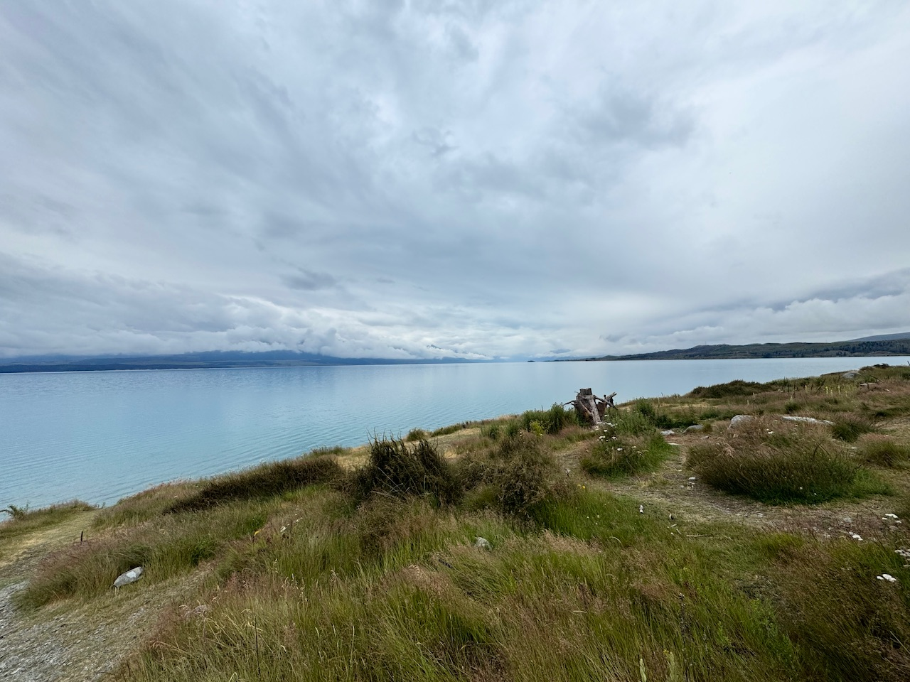

+++
author = "Sathyajith Bhat"
categories = ["Life"]
tags = ["weekly-notes", "travel"]
places = ["New Zealand", "Mangalore"] 
type = "post"
series = ["Weekly notes"]
url = "/weekly-notes-52-2024/"
title = "Weekly notes 52/2024"
date = 2024-12-28T12:00:00Z
summary = "Week 52 summary - vacation cut short and emergency travel back to India."
images = ["/weekly-notes-52-2024/thumb-lake-pukaki.jpg"]
+++

_Thumbnail image: Lake Pukaki is an alpine lake in New Zealand._

### What's been happening

What a week it's been. I thought I'd be publishing this from the fiords of Te Anau, but life has a way of turning things around in unexpected ways. Last week, we started our New Zealand vacation with a flight to Auckland. We had a glimpse of Auckland CBD, Sky Towers and a guided tour of Waitomo Glow Worm Caves and the Hobbiton Set where the town of Hobbiton in The Shire was filmed.



















From there, we took a flight to Christchurch, rented a car (got a brand new Ford Everest with less than 30kms driven) and started for Lake Tekapo. We reached Lake Tekapo at night about 09:30pm, checking into our Airbnb, unpacking clothes, groceries (we had bought a few days worth of groceries as the following day was Christmas and Boxing day - both fairly large holidays in Australia/New Zealand) and just chilling in the Airbnb. Both my sister-in-law and Jo were up till late night trying to setup their camera and tripods for some astrophotography as the place we were staying is a [Dark-Sky Reserve](https://en.wikipedia.org/wiki/Dark-sky_preserve) while I slept early as I was fairly tired from the long day of travel (while my brother-in-law rented the car in his name with me as an additional driver, he was more than happy to let me drive).







The next day morning we got a call from home explaining that Jo's father had a medical emergency. After letting the news sink in and taking stock of the situation, we figured the next step of action should be to head back to India the fastest way. However, the challenge was that it was Christmas day and we were in Lake Tekapo, about 300kms from either Christchurch airport or Queenstown airport and most of the flights we were looking at would have taken 32+ hours. Upon looking further, we realized it was the case because the flights were shown via Sydney (Sydney airport doesn't operate flights at night, incurring a +12 hour layover time) or via Dubai which is much further away and then have to come back this side. Sydney flight would have also required my sister-in-law and her husband to obtain a transit visa which would not have been possible due to the holidays. My brother-in-law found a flight which goes from Christchurch to Bangalore via Auckland, Singapore which is a lot of hops but would have been the shortest in terms of overall time (covering just over 22 hours). We booked these flights.

Once in Bangalore, we knew we could use the Indigo/Air India Express flights to Mangalore. We'd reach Bangalore at around 11am, with the next Indigo flights to Mangalore being at 1pm and 3pm. I booked the 3pm flights to Mangalore knowing that if we reach early we could try to switch to the 1pm flight rather than booking the 1pm flight and hoping to make it, only for us to miss both that and the 3pm flights. With the flights booked, we packed up, cancelled all subsquent Hotel/Airbnb bookings and other sightseeing we had booked via Viator (always book cancellable/modifyable reservations!) and started to head back Christchurch airport. By this time it was about 12pm, and our flight to Auckland wasn't till 8pm, knowing that we'd take about 3 hours or so to drive from Lake Tekapo to Christchurch, we decided to make use of the time available and drove about 64 km further south to have a quick stopover at Lake Pukaki and then head back to Christchurch airport. Amazingly enough, our flights from Christchurch => Auckland => Singapore => Bangalore went pretty smooth with no hiccups or delays, landing in Bangalore at about 10:45am. This gave us just enough time to pick up our checked baggage from Terminal 2, rush to the Indigo counter at Terminal 1 and get the flight change done to 1pm. While all of this was happening, we kept getting steady updates about my father-in-law's condition and knowing that he was geting better made us feel better too.

It's been a few days now and my father-in-law's condition has improved quite a bit. A few hours after we had finished the Hobbiton Movie Set tour, I had posted a [photo on Instagram](https://www.instagram.com/sathyabhat/p/DD8PTBYTxIS/) with the caption - "We're going on an adventure!" - didn't think this would be the kind of adventure. For now we're back in Mangalore and we wait to see the next steps.

### Music of the Week

I came across this fabulous cover of Mazzy Star's "Fade Into You" by Iron and Wine, Samuel Beam's solo project. Give it a [listen](https://youtu.be/ui3EKqSa5ps)


### Link of the week

Fascinating story of how Aaron Krause, the founder of [Scrub Daddy](https://en.wikipedia.org/wiki/Scrub_Daddy) invented, built and scaled out the business, while 3M was absolutely clueless and completely ignored what was in their backroom storage. As someone who had no idea about Scrub Daddy and has seen how awesome it is for cleaning, it's a great watch.



### Subscribe to my posts

Till next week. If you enjoyed reading this post, please consider sharing it via the links below and subscribing to the blog. You can subscribe via email using [Substack](https://sathyabhat.substack.com/). If you prefer RSS/news readers, you can [click here](https://sathyabh.at/index.xml) for the feed link. If you prefer to follow only my weekly notes, here's [the RSS feed](https://sathyabh.at/series/weekly-notes/index.xml) for the Weekly Notes series.
