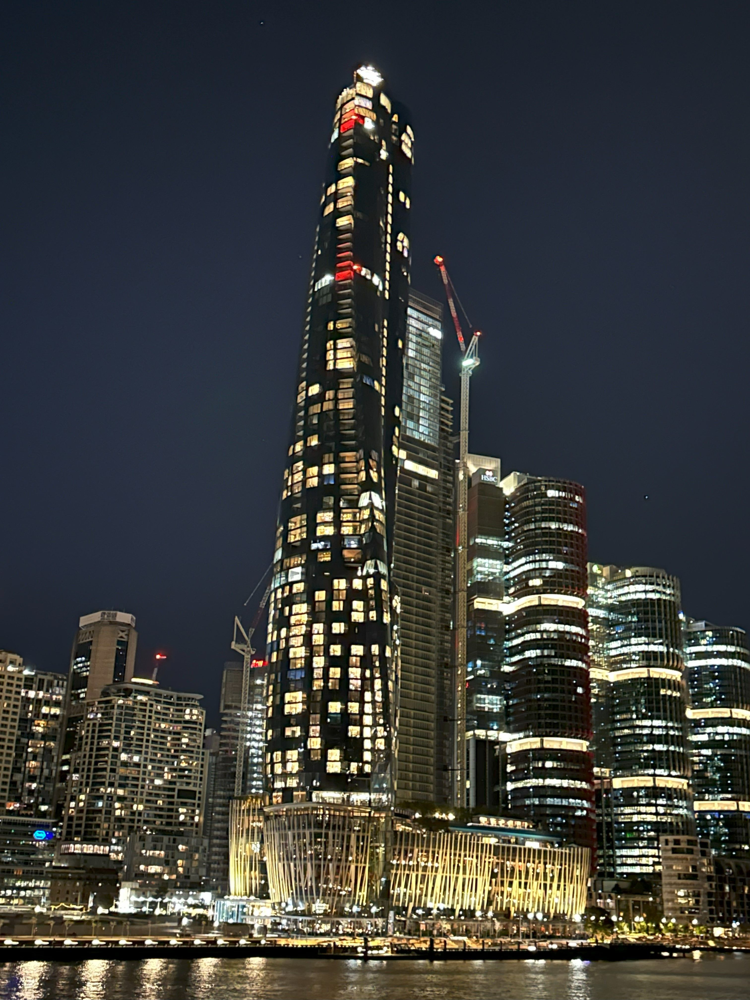

+++
author = "Sathyajith Bhat"
categories = ["Life"]
tags = ["weekly-notes",  "gaming", "Diablo III"]
places = "Sydney"
type = "post"
series = ["Weekly notes"]
url = "/2023/09/24/weekly-notes-38-2023/"
title = "Weekly notes 38/2023"
date = 2023-09-24T12:00:00Z
summary = "Week 38 summary - a new meetup, some smart plugs, upcoming travel plan and more."
images = ["/2023/09/24/weekly-notes-38-2023/thumb-crown-sydney.jpg"]
+++

_Thumbnail image: [Crown Sydney](https://en.wikipedia.org/wiki/Crown_Sydney) is a skyscraper in Barangaroo, New South Wales, Australia. It is the tallest building in Sydney and 4th tallest building in Australia and has a hotel, residential apartments, and a casino_. 

### What's been happening

* It's been a slow week. I've been mostly engaged with work, trying to wrap up couple of long running projects before Q4 starts.
* I attended the Sydney Technology Leaders meetup. It was nice, met some good people. 
* I bought couple of Tuya-based smart plugs which have energy monitoring. I looked at using [Tasmota custom](https://tasmota.github.io) firmware for these [but that requires some extra hardware](https://tasmota.github.io/docs/Getting-Started/). I have dropped the idea for now. I might pick up the custom firmware idea at a later time when I'm not so occupied.
    * These devices, however, do report to Tuya Cloud with the details of power, voltage and current consumed so I might consider writing (or finding one, if exists) a Prometheus exporter for these smart plugs so I can export the power data to the Prometheus instance that is running on my [NAS](/2023/01/21/asustor-lockerstor4-as6604t/).
* I haven't played Baldur's Gate 3 since couple of weeks now. My Diablo 3 season is coming along nicely - just hit paragon 350 and starting to go higher in to the Greater Rifts. The season mechanic, Visions of Enmity is quite rewarding from a crafting materials point of view and went from badly needing materials to not having to worry about them in no time.
* After more than a year, I'll be back in India from October 13th to October 29th. I'll be splitting my time - a week each in Mangalore and Bangalore. I'll be on vacation, so no work stuff but do look forward to meeting a few people. 

### Music of the Week

I'm still blown away by my discovery from [last week](/2023/09/17/weekly-notes-37-2023/) and have been listening to Martin Miller session band obessively all week. Every single recording of theirs is top notch. Check out their amazing [rendition of John Mayer's Neon](https://www.youtube.com/watch?v=X6Y89WIa1Q4) with Martina Blazeska. Do check out [their playlists](https://www.youtube.com/@MartinMillerGuitar/playlists).



### Link of the week

For this week's link, I came across this blog post from Valve on how they built the soundproof booths that are seen in The International series of Dota championships. Lots of good insights into the engineering that goes into [building a soundproof booth](https://www.dota2.com/newsentry/3675555405719286536). 

### Subscribe to my posts

Till next week. If you enjoyed reading this post, please consider sharing it via the links below and subscribing to the blog. You can subscribe via email using [Substack](https://sathyabhat.substack.com/). If you prefer RSS/news readers, you can [click here](https://sathyabh.at/index.xml) for the feed link. If you prefer to follow only my weekly notes, here's [the RSS feed](https://sathyabh.at/series/weekly-notes/index.xml) for the Weekly Notes series. 
