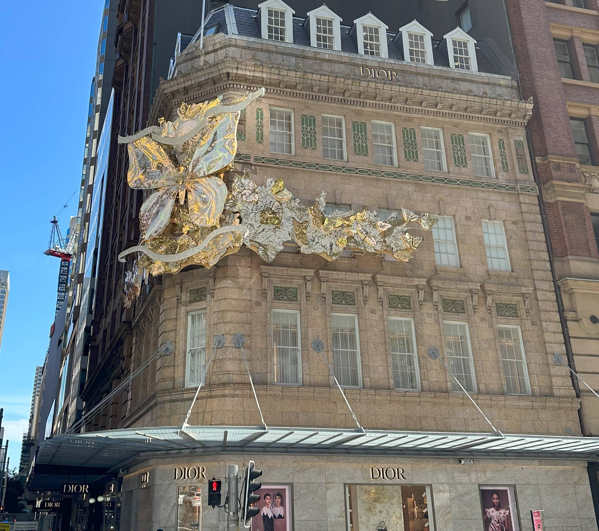

+++
author = "Sathyajith Bhat"
categories = ["Life"]
tags = ["weekly-notes",  "concert"]
places = "Sydney"
type = "post"
series = ["Weekly notes"]
url = "/2023/11/12/weekly-notes-45-2023/"
title = "Weekly notes 45/2023"
date = 2023-11-12T12:00:00Z
summary = "Week 45 summary - a major nationwide outage, and an awesome concert."
images = ["/2023/11/12/weekly-notes-45-2023/thumb-dior.jpg"]
+++

_Thumbnail image: Dior boutique is wrapped up for Christmas._ 

### What's been happening

-  My second dry run happened earlier this week. It went pretty well - I think I could have done better, but that's something I need to work on. The feedback from AWS has been pretty helpful and useful in improving my talk and the overall delivery.
- We had no mobile and Internet for over 9 hours! Unbelievable for 2023.. but it is true. Optus, Australia's second-largest telco had a [major nationwide outage](https://www.smh.com.au/business/companies/inside-optus-day-from-hell-20231110-p5eiz0.html) for over 9 hours. I noticed this when I woke up at about 7 am, my phone had no signal and my broadband was down as well. My broadband router has a backup 4G SIM, but that's from Optus as well (the router is a device from Optus, part of my Internet package) so the backup failed. Jo's mobile has a Telstra connection, so I was able to search and find out about the outage. The outage lasted all morning, and by mid-afternoon, it was restored. 
- The season of concerts is starting, and the first one was The World Tour by Def Leppard & Mötley Crüe. I'd been waiting to watch Def Leppard live for a long time and this was a dream come true. Def Leppard performed first(I was expecting Mötley Crüe to go first), and Mötley Crüe had large shoes to fill in. I've not heard any of Mötley Crüe's songs (except Kickstart My Heart, and Girls, Girls, Girls) but had a good time nonetheless. I have some videos of the performances, I'll create a mash-up video and publish it soon. For now, enjoy the photos.







### Music of the Week

NPR's Tiny Desk Concerts are amazing and no words can describe [how awesome this](https://www.youtube.com/watch?v=Cx8AaSvH4EQ) Tiny Desk Concert featuring Shakti is. 20 minutes of bliss. 



### Link of the week

Last week when we went for a brunch, I noticed a rather large Lego store in Sydney CBD. When we went there, the doors were still closed. I found out this week that the store is now the [world's largest Lego store](https://www.timeout.com/sydney/shopping/lego-store-sydney). The lines for the opening were rather large, per post on the Sydney subreddit. We'll visit it, probably in a week or so once the hype has died down a bit. 

Another bit of Sydney anecdote is about the Jacaranda trees - you'll see a bunch of these in/around Sydney. Apparently, [certain hospitals gave](https://old.reddit.com/r/sydney/comments/17shjrx/sydneys_jacarandas_from_the_air/k8q5p2u/) new mothers a gift pack including a jacaranda seedling to plant, and that's why some areas have more Jacaranda trees than others.

### Subscribe to my posts

Till next week. If you enjoyed reading this post, please consider sharing it via the links below and subscribing to the blog. You can subscribe via email using [Substack](https://sathyabhat.substack.com/). If you prefer RSS/news readers, you can [click here](https://sathyabh.at/index.xml) for the feed link. If you prefer to follow only my weekly notes, here's [the RSS feed](https://sathyabh.at/series/weekly-notes/index.xml) for the Weekly Notes series. 