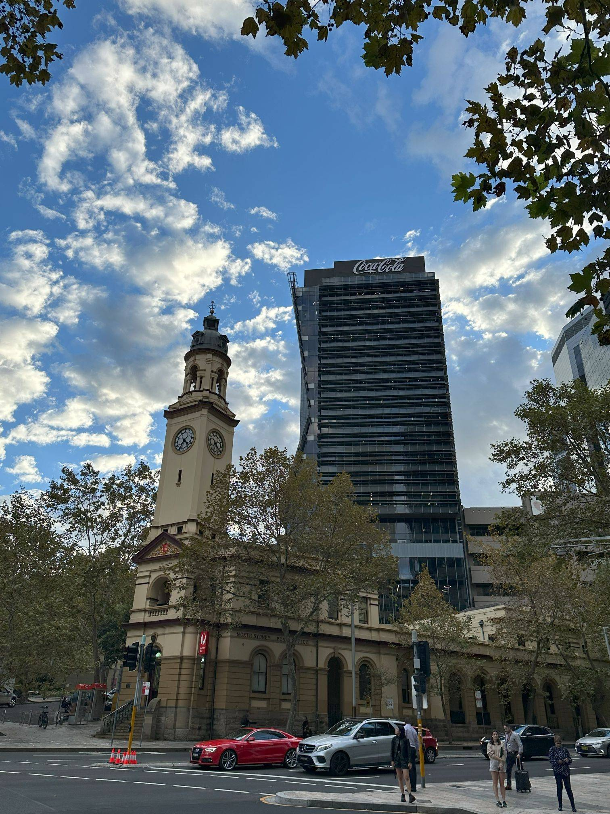

+++
author = "Sathyajith Bhat"
categories = ["Life"]
tags = ["weekly-notes", "guitar-classes"]
places = "Sydney"
type = "post"
series = ["Weekly notes"]
url = "/weekly-notes-17-2024/"
title = "Weekly notes 17/2024"
date = 2024-04-28T12:00:00Z
summary = "Week 17 summary - learning something new."
images = ["/weekly-notes-17-2024/thumb-north-sydney-post-office.jpg"]
+++

_Thumbnail image: The North Sydney Post Office flanked by the Coca-Cola Place._ 

### What's been happening

* My GPU, the RTX 2080Ti that [my colleague gave away to me](/2023/07/09/weekly-notes-27-2023/) died unexpectedly. I'm still not sure what led to this, as it was working fine the previous day. As soon as I turned my computer on, it started BSOD-ing and showing artifacts on the screen. Now quite a few people believe that BSODs happen because Windows sucks but running into a BSOD is primarily due to a hardware failure, at least in the past decade or so. That with the artifact patterns was a sure shot indicator that the GPU was dying. I tried my best to resort to software checks just in case:
    * used DDU to remove the existing drivers (got BSOD a couple of times here)
    * rolled back to the driver before the most current release (another couple of BSODs)
    * tried underclocking, and under-volting the GPU core and memory clocks to see if it was due to temperature or other issues
  None of these helped keep the system stable and it kept crashing regardless of whether I was playing or just keeping it idle. 

      

      

  * I got annoyed and frustrated with the crashes and decided to swap out the RTX 2080TI and put in my older Geforce 1080 (installed in Jo's desktop, but her desktop comes with an APU so the external GPU isn't required) to see if it was due to the GPU and so far, it's been pretty stable with the older 1080 GPU. Well, guess it's time to get onto the 4xxx series. I'd been planning for a 4xxx series for a while now but with the 2080TI arrival, I put it on the backburner. With the newer Super refreshes the prices have stabilized and will look to get a new one.

    

* Last week, I mentioned signing up [for a guitar class](/weekly-notes-16-2024/). Jo joined me for the class as well and we had our first session - and it went pretty well! There were only two more people besides us, so we had plenty of attention from our tutor. He was very helpful in getting our posture right - not just from how to sit, but also how to hold the fingers on the fretboard and when strumming. We also got introduced to some basic stretching and warm-up exercises, and the E-minor chord, and using that to strum the rhythm of Queen's We Will, We Will Rock You - that was fun. Towards the last half hour, we were joined by the people from the intermediate/advanced level class, and watching them play was good. Jo has been busy strumming away the notes and the chords. We both look forward to the second class. 
* A few months back, I had written a [Prometheus](https://prometheus.io/) exporter for [YNAB](https://www.ynab.com/), a budgeting application I use. The goal of the exporter was for me to understand how to write exporters (I've consumed a lot of metrics, but never produced them) and help me get familiar with Typescript better. As a side benefit, I've also managed to get some nice data about my expenses as a historical trend. I was not happy with the first iteration of the exporter, and rewrote it and I think it's in a much better state. Here's the [Github link for the project](https://github.com/sathyabhat/ynab-exporter).
    * I also [wrote a small script](https://github.com/SathyaBhat/ynab-validate) that goes through my Amex card statement, fetches the YNAB transactions, and flags the transactions that I've not entered in YNAB, duplicate transactions, as well as transactions that are incorrectly entered - this helps cut down the time that I spend reconciling the transactions. 

### Music of the Week

They say every performance of ["Yellow Ledbetter" by Pearl Jam](https://www.youtube.com/watch?v=2cyp1g7idYc) is different, and listening to it, you'll know why. Been on a Howard Stern show binge the past few days and this is what started it all.



### Links of the week

* [Passkeys: A Shattered Dream](https://fy.blackhats.net.au/blog/2024-04-26-passkeys-a-shattered-dream/): This is a long-ish rant (and one that I largely agree with) about how passkeys have failed to get us out of the password pains.
* [When Do We Stop Finding New Music? A Statistical Analysis](https://www.statsignificant.com/p/when-do-we-stop-finding-new-music): This is an interesting post that looks into the statistical analysis of why every generation thinks the music of their gen was the best, and why many people's audio selection doesn't change much. 
* [Google Won’t Pull Cookies In 2024](https://www.adexchanger.com/online-advertising/google-wont-pull-cookies-in-2024/): This has been the hottest news in the AdTech world and one that hasn't [surprised many](https://www.thecurrent.com/google-chrome-cookie-deprecation) in the industry.

### Subscribe to my posts

Till next week. If you enjoyed reading this post, please consider sharing it via the links below and subscribing to the blog. You can subscribe via email using [Substack](https://sathyabhat.substack.com/). If you prefer RSS/news readers, you can [click here](https://sathyabh.at/index.xml) for the feed link. If you prefer to follow only my weekly notes, here's [the RSS feed](https://sathyabh.at/series/weekly-notes/index.xml) for the Weekly Notes series. 