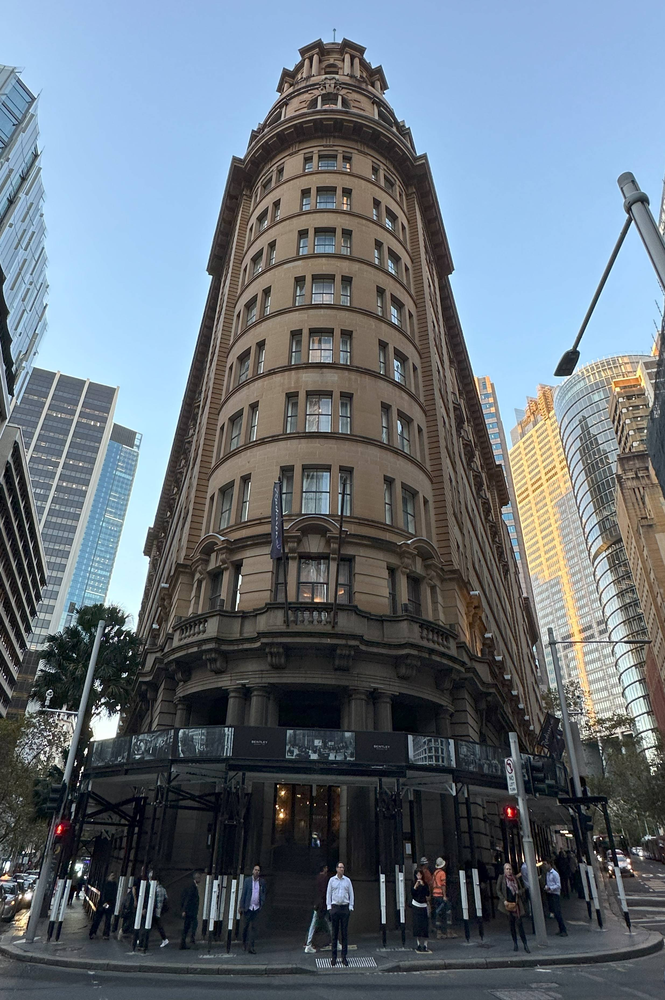

+++
author = "Sathyajith Bhat"
categories = ["Life"]
tags = ["weekly-notes", "gaming", "diablo-iv"]
places = "Sydney"
type = "post"
series = ["Weekly notes"]
url = "/weekly-notes-20-2024/"
title = "Weekly notes 20/2024"
date = 2024-05-19T12:00:00Z
summary = "Week 20 summary - new season of Diablo IV, the next edition of Barcamp and more."
images = ["/weekly-notes-20-2024/thumb-radisson.jpg"]
+++

_Thumbnail image: [The Radisson Blu Hotel on O'Connell](https://blog.radissonblu.com/the-architectural-evolution-of-the-radisson-blu-plaza-hotel-sydney/) St was the home to Fairfax & Sons, the publishers of Australia’s oldest surviving newspaper, The Sydney Morning Herald._ 

### What's been happening

* The winter cold has started giving us problems with condensation on the windows in our bedroom. More concerning is the possibility of mold as more water remains on the window/window sills. I need to keep the windows open for ventilation. I'm also considering getting a de-humidifier to see if it will improve things. 
* Our guitar class is progressing well. In our 4th class, we focused a bit on the essential chords and strumming techniques. We also learned how to play the chords for Ben E King's Stand By Me and The Cranberries' Zombie,  Dreams, and Linger. If this seems like a lot of songs for one session - the key is that all of these songs feature the same set of chords, known as [the chord progression](https://www.justinguitar.com/guitar-lessons/5-common-chord-progressions-bg-1011). 
* Diablo IV's Season 4 started this week and I've started a Sorcerer with what I call the "Kylo Ren" split-Incinerate build. Season 4 brings in a lot of new changes that improve the quality of life of the game, especially the endgame. I noticed the leveling was much faster. I'll continue with my split-Incinerate build and might switch to Frozen Orb at some point when the split-Incinerate build doesn't do enough damage, or it gets too cumbersome to play. 
  * I've been streaming my gameplay on a fairly regular basis on Twitch. Now and then someone joins in for a view and we end up having a nice conversation. Do check out [my Twitch profile](https://twitch.tv/sathyabhat) and follow me there.
* [Barcamp Bangalore](https://barcampbangalore.com/bcb/) is happening on June 8th, 2024. I've been a planner for Barcamp Bangalore since 2012, and since I moved out of Bangalore I've been helping with the planning virtually. This is the first time that I'm not helping with the planning (apart from some very minor tech support) and the new planners - Shreyas, Darsh, Bhavika, Rayan, and Tharang have been doing a great job of organizing everything. 

### Media Watch

Jo & I started watching two TV shows - both Korean drama

* Vagabond - A stuntman involved in a tragic airplane crash ends up discovering a national corruption scandal in the process.
* Signal - A mysterious walkie-talkie connects two detectives from different eras. Together, they decide to solve and prevent crimes in their respective time periods.

We've seen the first episode of each, and it looks quite promising.

### Music of the Week

Earlier this week, Incubus did a re-release of their "Morning View" album, titled [Morning View XXIII](https://open.spotify.com/album/7klngx9L0dt47tEgiNFY0Z?si=AFjbmisvQnWovJZlgoMznQ). It's a re-recording, so there are some subtle changes to the songs, and some not-so-subtle changes like Brandon Boyd's voice being noticeably different. Check out their album on [Spotify](https://open.spotify.com/album/7klngx9L0dt47tEgiNFY0Z?si=AFjbmisvQnWovJZlgoMznQ).

I was reminded of Keane earlier this week and searching for "[Somewhere only we know](https://www.youtube.com/watch?v=MlXyFIHzYR8&t=14s)" brought up this video of them performing in a tram. So cool!

 

### Links of the week

* [Fossil](https://x.com/Fossiloflife) shared this great [video of James Hoffman](https://www.youtube.com/watch?v=IkssYHTSpH4) talking about "What Does A Great Cup Of Coffee Taste Like?". Love the production quality of the video, though I'm still not quite sure of the answer. 

  

* I saw this post on Reddit about a [guy still holding LAN parties](https://www.reddit.com/r/pcmasterrace/comments/1crado5/in_our_forties_and_still_hosting_our_annual_lan/). What a sight! I always dreamed of organizing and being part of LAN parties. While I could never be part of one, I still play quite a bit of online games with my friends.

* [Glance](https://github.com/glanceapp/glance) is a self-hosted dashboard that puts all your feeds in one place. I will give this project a try soon. 

### Subscribe to my posts

Till next week. If you enjoyed reading this post, please consider sharing it via the links below and subscribing to the blog. You can subscribe via email using [Substack](https://sathyabhat.substack.com/). If you prefer RSS/news readers, you can [click here](https://sathyabh.at/index.xml) for the feed link. If you prefer to follow only my weekly notes, here's [the RSS feed](https://sathyabh.at/series/weekly-notes/index.xml) for the Weekly Notes series. 