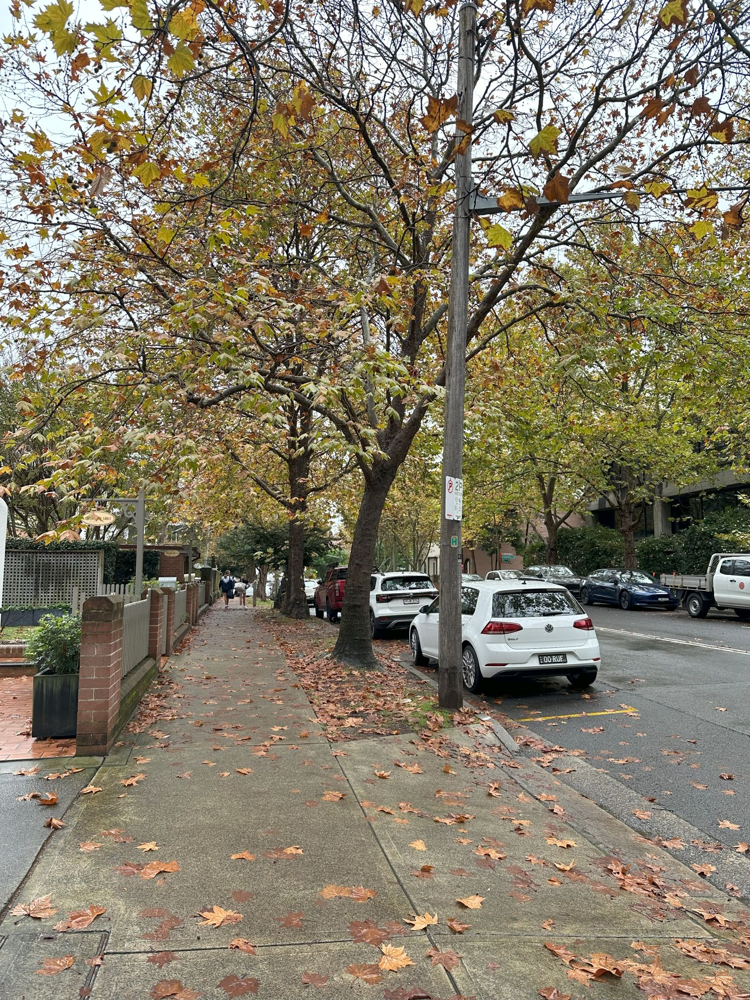

+++
author = "Sathyajith Bhat"
categories = ["Life"]
tags = ["weekly-notes", "gaming"]
places = "Sydney"
type = "post"
series = ["Weekly notes"]
url = "/weekly-notes-21-2024/"
title = "Weekly notes 21/2024"
date = 2024-05-26T12:00:00Z
summary = "Week 21 summary - panel member at a conference, trying out a LLM application and more."
images = ["/weekly-notes-21-2024/thumb-winter-2024-north-sydney.jpg"]
+++

_Thumbnail image: Leaves on a tree withering and falling off in North Sydney._ 

### What's been happening

* I attended ServerlessDays ANZ earlier this week. It's always good to learn what people are working on. I submitted a talk on AWS App Runner but that did not get selected. However, I did get invited to be part of a panel discussion on all things Serverless, Multi-Cloud, and Security and I enjoyed that. 
    * The talks were pretty OK - generative AI being shoved in is what annoys me, and it was no different here as well. Some talks stood out and personally for me the best of the lot was [Ben Boyter](https://boyter.org/)'s talk about "Abusing Go, AWS Lambda, and bloom filters to make a true Australian serverless search engine". Go [check out his post](https://boyter.org/posts/serverlessdays-anz-2024-content/) which has links to the slides and other reference material.  

* I recently found out that NVIDIA has a demo app called [ChatRTX](https://www.nvidia.com/en-us/ai-on-rtx/chatrtx/) that lets us personalize an LLM connected to our content. I gave it a try and to be honest, I wasn't very impressed. NVIDIA claims that it can use our content and I tested this by pointing to my meticulously organized files. It failed to parse several documents and skipped those files completely. For the documents that did get parsed, I had to be very explicit about my questions. Unlike what the [user guide suggests](https://nvidia.custhelp.com/app/answers/detail/a_id/5542), I didn't see a option to select new models - not sure why this is the case since I installed it just last week and was certain it was up to date. Regardless, I will try out reinstalling to see if it's any better and will have a detailed write-up on my [tech blog](https://sathyasays.com).

* We're onto our 5th class Guitar class. We've been practicing a little and we've seen gradual improvements. This week's class focused on strumming techniques, and practice on chord progression. I've also realized how difficult it is to change chords - especially since we're new! We've also been practicing how to do melodies, reading the tablature while handling chord changes and moving across strings/frets. It can be quite difficult to do all at once but hopefully, with more practice, we will get better. 

* I've been playing a lot of Diablo IV Season 4 and enjoying quite a bit. My Sorcerer is now nearly at level 80 and I've been playing quite a bit of Helltides and Nightmare Dungeons. I also played a bit with Sharath, and since I've progressed quite a bit since I last played with him, I decided to create a new character - trying out the rogue.

### Music of the Week

We're in winter but this song popped up in my chillout mix and is a great song to kick back and relax to. Check out [The Lovers by Blank & Jones feat. Cathy Battistessa](https://www.youtube.com/watch?v=n6Ig2f6PXlk)



### Link of the week

Simon Aubury has a [great blog post](https://simonaubury.com/posts/202405_fridgebot/) about how he uses a RaspberryPi along with GPT-4o model to monitor the fridge contents and add items to the shopping list when he runs out of something. 

### Subscribe to my posts

Till next week. If you enjoyed reading this post, please consider sharing it via the links below and subscribing to the blog. You can subscribe via email using [Substack](https://sathyabhat.substack.com/). If you prefer RSS/news readers, you can [click here](https://sathyabh.at/index.xml) for the feed link. If you prefer to follow only my weekly notes, here's [the RSS feed](https://sathyabh.at/series/weekly-notes/index.xml) for the Weekly Notes series. 