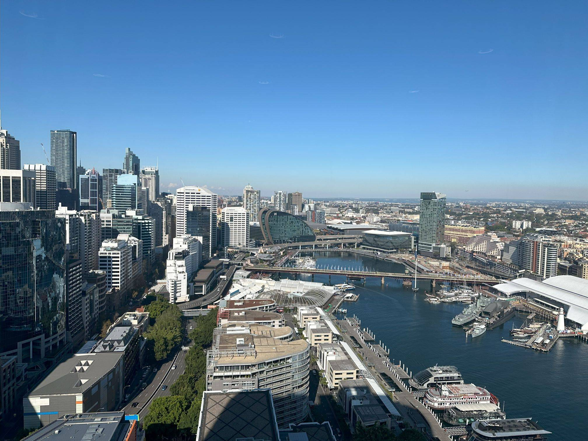

+++
author = "Sathyajith Bhat"
categories = ["Life"]
tags = ["weekly-notes", "gaming", "concert", "Diablo IV"]
places = "Sydney"
type = "post"
series = ["Weekly notes"]
url = "/weekly-notes-22-2024/"
title = "Weekly notes 22/2024"
date = 2024-06-02T12:00:00Z
summary = "Week 22 summary - visitors from the US leading to a busy work week, another concert, and more."
images = ["/weekly-notes-22-2024/thumb-pyrmont-bridge-2024.jpg"]
+++

_Thumbnail image: A view of the Pyrmont Bridge and bay from The Trade Desk Barangaroo office._ 

### What's been happening

* We almost made a month without going to a concert. *Almost*. Luckily, Jo found out [Boy & Bear](https://en.wikipedia.org/wiki/Boy_%26_Bear) was performing at the State Theatre and couldn't bear to miss one of Australia's most iconic bands. And the concert did not disappoint - it was the 10th anniversary of the release of the [Harlequin Dream album](https://open.spotify.com/album/6gUIDfKhqEk9Bezw7tlubB?si=1dOhhJWVTlWrt1d8AzhdHw), and they played the album, and a few more. Highly recommend watching them live if you get a chance.

  
  
  
  
  
  
* This was a busy work week as I had my teammates from the US visiting us here in Sydney. Besides the fully booked meeting days where we talked about our plans, looked back at the past year, had some laughs, and went out for some nice activities
    * One of the activities we did was axe throwing at Maniax Axe Throwing in Marrickville. We went against each other, one-on-one throwing axes (at the target board, not _at_ each other, of course). I think it's fair to say everyone enjoyed it. It was also a lot harder than it looked! Getting the angle, the placement, and the power all need to be just right, or else the accuracy goes for a toss, or the axe is likely to hit the wrong edge and bounce back. We were in for about two hours and have to say the time flew by so fast.
      
      
      
      
      
      
    * We had a 10th-anniversary party celebrating 10 years of The Trade Desk being in Sydney. This was done in the office itself. It's nice to meet other colleagues, especially over on the business side - since engineering and business are in two separate offices, we don't get to interact often. This is set to change with a consolidation of the offices that is going to happen in a few months.
* Having some geeky teammates means that we find out that we have usually the same way of tackling problems - especially for home servers. I found out my teammate uses Tailscale to control who can connect to his home server, similar to what I do on my [NAS](https://sathyabh.at/nas).
* I've been trying to find a decent local/self-hosted alternative to photo sharing, similar to Google Photos. Previously, I had tried [PhotoPrism](https://www.photoprism.app/) but that was too heavy for my NAS. [Immich](https://immich.app/) looked promising, but Immich could not import images that existed in a separate directory from where its library was pointed to, thus meant a copy of the images to Immic's library, and I didn't like this. Recently, Immich added support for [External Libraries](https://immich.app/docs/features/libraries/#external-libraries), and this meant that I could try it out. Immich imported my library of about 105,000 photos pretty fast, but subsequent operations such as parsing metadata, running the ML operations for face detection, and object detection have been pretty slow since my NAS has slow hard disks, and that the NAS doesn't have a GPU for hardware acceleration of the ML operations. Immich is still chewing through my assets, and once it's ready, I'll give it a spin.
* My Diablo IV season has been progressing reasonably well. I rerolled my Sorcerer from the Incinerate build to the popular Frozen Orb build, and suddenly I'm flying since with the Frozen Orb build, you're essentially throwing orbs around, instead of the incinerate build's play style of teleport in, stand still, cast incinerate, wait for incinerate damage to ramp up. Overall, the season has been pretty fun to play.
    * This reminds me, it's been a year since Diablo IV launched. Can't believe time's gone by so fast! You can read my [initial thoughts](/2023/06/04/weekly-notes-22-2023/) from my previous [weekly notes](/2023/07/09/weekly-notes-27-2023/).

### Music of the Week

Between You & Me's cover of Smash Mouth's All Star is very refreshing. Go [check it out](https://www.youtube.com/watch?v=lrxbcsWQYKk).



### Links of the week

* A few shoutouts:
    * Check out [Chandni's newsletter](https://cookreja.substack.com/about) about food, easy recipes, and a punny URL to her Substack.
    * Tejovanth (aka TJ) has started his newsletter about various topics. I've known TJ for quite some time now and I look forward to [reading his posts](https://teejofalltrades.substack.com/). 
    * Vishnu Gopal is another Twitter friend that I've been following for quite some time. Vishnu has been writing his weekly notes that you can follow on [his blog](https://vishnugopal.com/tag/weekly-notes/),
    * [Allan Helton](https://twitter.com/AllenHeltonDev), a fellow AWS Hero has set up a [GoFundMe](https://www.gofundme.com/f/help-olivias-fight-against-leukemia) for his daughter who has been diagnosed with Leukemia. 
* John Graham-Cumming has a [fascinating blog post](https://blog.jgc.org/) about the wristbands that are used in large concerts, how they light up, how they are controlled, and how he uses Flipper Zero to control them. 

### Subscribe to my posts

Till next week. If you enjoyed reading this post, please consider sharing it via the links below and subscribing to the blog. You can subscribe via email using [Substack](https://sathyabhat.substack.com/). If you prefer RSS/news readers, you can [click here](https://sathyabh.at/index.xml) for the feed link. If you prefer to follow only my weekly notes, here's [the RSS feed](https://sathyabh.at/series/weekly-notes/index.xml) for the Weekly Notes series. 
