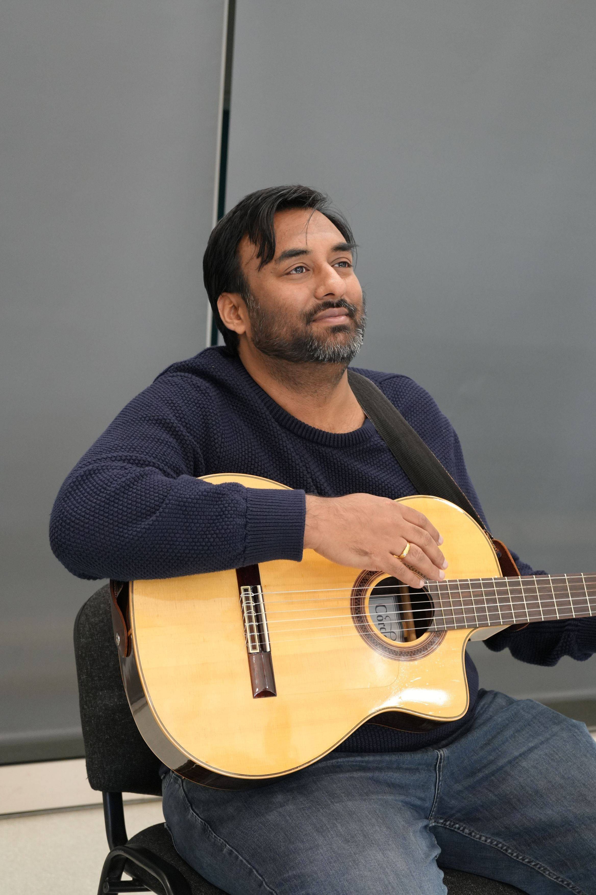

+++
author = "Sathyajith Bhat"
categories = ["Life"]
tags = ["weekly-notes", "concert"]
places = "Sydney"
type = "post"
series = ["Weekly notes"]
url = "/weekly-notes-24-2024/"
title = "Weekly notes 24/2024"
date = 2024-06-16T12:00:00Z
summary = "Week 24 summary - another concert, exploring new cuisine and an upcoming AMA and more."
images = ["/weekly-notes-24-2024/thumb-guitar.jpg"]
+++

_Thumbnail image: Me waiting for our guitar tutor to ask me a few questions._ 

### What's been happening

* It's been a year of going to a lot of concerts - and last Saturday, we went to a concert by [The Paper Kites](https://www.youtube.com/@thepaperkitesband). They are an Australian indie/folk rock band that I first heard back in 2016. I was excited to know they were performing in Enmore and it was a great concert.

  
  
  
  

* We wrapped up the first term of our guitar class. Over the past 8 weeks, we've been learning slowly on different aspects - the technique, the stretches, reading tabs, strumming patterns and this culminated today with a small recording of the class with us performing the chords of "Dreams" by The Cranberries, and the more advanced folks doing the melody for dreams and a couple of more recordings. I look forward to our next term starting in July.

* We have tried many different restaurants, but this week we tried a new cuisine - West African! We wanted to have dinner before The Paper Kites concert and I was looking for good restaurants near Enmore. While searching for options, I found this place that has West African cuisine called "[Little Lagos](https://maps.app.goo.gl/t7e6brKRe46GhvC87)". It was a bit expensive, but the food was good. The cuisine was it was quite similar to Indian - we had Jollof Rice (similar to our pulav), Goat Stew, and Fried Plantains that were so similar to Mangalorean Banana Podi, heh. 

  
  
  
  

* I've started working on a small Discord bot that records the food we have ordered in and my goal is to use it to provide a suggestion for food to order, based on the recorded data. It's a nice excuse to improve my Typescript and Serverless skills. It's in decent shape for anyone who wants to get started with a Lambda function with a function URL, so I will make a template repo out of it so it might help others (and me!) in the future. Here's the [Github repo](https://github.com/SathyaBhat/hungrycat) for the same.

* I'll be doing an Ask Me Anything (AMA) [on the developersindia subreddit](https://www.reddit.com/r/developersIndia/comments/1dgchur/join_sathyajith_bhat_author_aws_container_hero/). Come drop by if you have any questions on Cloud, SRE, DevOps, or anything else!

  

### Music of the Week

Earlier this week The Raghu Dixit Project announced his new song, and I was blown away that he collaborated with Béla Fleck. Give the song [Sakkare Chakori](https://www.youtube.com/watch?v=-YcMJXzxG40&list=PL4an4gce7LuPwDKdwmVCpFgVlBkges-fF&pp=iAQB8AUBk) a listen - what's amazing is that the song is also released in [Hindi](https://www.youtube.com/watch?v=-YcMJXzxG40&list=PL4an4gce7LuPwDKdwmVCpFgVlBkges-fF), [Tamil](https://youtu.be/b24-58a0g-A?si=tX-ZIdFGtKC0iedF), and [Telugu](https://youtu.be/KTl9EoN9R9s?si=8qzFbpLy4VunU74k). 



I came across a full symphony orchestra by a Korean group FLASIC, [who have performed close](https://www.youtube.com/watch?v=fZA7ARptg0M&list=PL777F6F97DC4ADD07) to two hours of music from Sid Meier's Civilization VI. This is an amazing listen if you want something pleasing to be playing in the background. Props to everyone for a fantastic orchestra - it truly lifted my mood.



### Links of the week

Couple of links:

1. I came across [this repo](https://github.com/johnalanwoods/maintained-modern-unix) which has a collection of modern alternatives to Unix commands. 
2. Karan has a [great blog post](https://mrkaran.dev/posts/gullak/) on how he built his expense tracker using an LLM to generate a JSON representation of plain text and save that to a database. He goes into full details so be sure to give it a read. 

### Subscribe to my posts

Till next week. If you enjoyed reading this post, please consider sharing it via the links below and subscribing to the blog. You can subscribe via email using [Substack](https://sathyabhat.substack.com/). If you prefer RSS/news readers, you can [click here](https://sathyabh.at/index.xml) for the feed link. If you prefer to follow only my weekly notes, here's [the RSS feed](https://sathyabh.at/series/weekly-notes/index.xml) for the Weekly Notes series. 