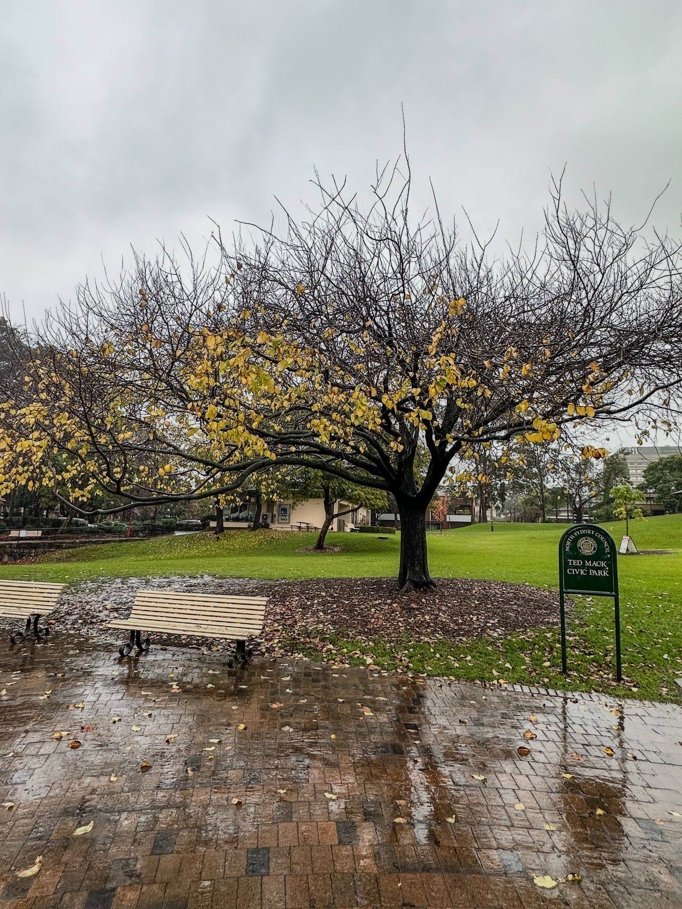

+++
author = "Sathyajith Bhat"
categories = ["Life"]
tags = ["weekly-notes", "ama"]
places = "Sydney"
type = "post"
series = ["Weekly notes"]
url = "/weekly-notes-25-2024/"
title = "Weekly notes 25/2024"
date = 2024-06-21T12:00:00Z
summary = "Week 25 summary - winter solstice, AMA session at Reddit, and more."
images = ["/weekly-notes-25-2024/thumb-ted-mavic-park-2024.jpg"]
+++

_Thumbnail image: Ted Mack Civic Park is an urban park in the heart of North Sydney. It hosts regular public events such as the North Sydney Produce Market_. 

### What's been happening

* While the rest of the world welcomed Summer Solstice - the longest day of the year, here in Australia we welcomed Winter Solstice - the shortest day of the year. It's been pretty cold and I've had to use the heater for 3-4 days at least. 

* I had a dentist visit this week. Earlier in the week, I was eating some _nippat_ and when biting into it felt a sharp pain in my teeth. Since the pain didn't go away, I booked a dentist appointment. Fortunately for me, the pain went away the next day but it had been a while since went to the dentist so decided not to cancel the appointment and went for a check-up anyway. The best part of the appointment was knowing that the teeth that hurt were in the best shape, and it seemed the pain was being bit into something too hard hit at the wrong angle. oh well.

* For a while now, I've been using a program that parses my credit card statement, compares the entries against the entries that are present in my [You Need A Budget (YNAB)](https://ynab.com/referral/?ref=qN3LcdZWyMfXKkyz&utm_source=customer_referral) budget, and flags any missing, incorrect, or duplicate entries. Last week, when I ran the script it broke and I was wondering why - I haven't done any code changes. Looking at the CSV file, I see that the date format has changed. Re-downloading the statement file barely 10 minutes later and I see it's correct and the script works 😂😂 Must have caught a bad node or during an update or something. 

  

* I did an AMA over at the r/DevelopersIndia subreddit, and I think it went pretty well. The full transcript is [available in the thread](https://old.reddit.com/r/developersIndia/comments/1dlpooi/hi_im_sathyajith_bhat_staff_software_engineer_ama/?sort=qa). Do you have any questions for me? Send [me an email](mailto:contact@sathyasays.com) or one of the [many places I'm reachable](/about).

### Music of the Week

I love the [theme song from Top Gun](https://www.youtube.com/watch?v=xeQUxNf3G6k) and when I came across this performance from Massed Bands of HM Royal Marines, I was mind blown. The Royal Marine Sergeant with the aviator and Les Paul look pretty cool, and the ending bit is the icing on the cake. [Go watch](https://www.youtube.com/watch?v=M9CZUEy89Ng)!



### Link of the week

* [NVIDIA's Project G-Assist](https://www.nvidia.com/en-au/geforce/news/g-assist-ai-assistant/)
> Project G-Assist takes voice or text inputs from the player, along with a snapshot of what’s in the game window. The snapshot is fed into AI vision models that provide context awareness and app-specific understanding for the Large Language Model (LLM), which is connected to a database of game knowledge such as a wiki. The output of the LLM is an insightful and personalized response—either text, or speech from the AI —based on what’s happening in-game.

This is a pretty interesting mix of gaming and LLM. Being able to bring up an item in my inventory and ask "What builds I can play with this" can potentially save a lot of alt-tab-bing 

### Subscribe to my posts

Till next week. If you enjoyed reading this post, please consider sharing it via the links below and subscribing to the blog. You can subscribe via email using [Substack](https://sathyabhat.substack.com/). If you prefer RSS/news readers, you can [click here](https://sathyabh.at/index.xml) for the feed link. If you prefer to follow only my weekly notes, here's [the RSS feed](https://sathyabh.at/series/weekly-notes/index.xml) for the Weekly Notes series. 