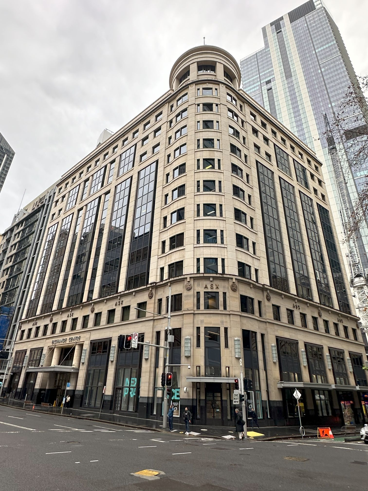

+++
author = "Sathyajith Bhat"
categories = ["Life"]
tags = ["weekly-notes", "gaming", "travel", "Civilization VI"]
places = "Sydney"
type = "post"
series = ["Weekly notes"]
url = "/weekly-notes-28-2024/"
title = "Weekly notes 28/2024"
date = 2024-07-14T12:00:00Z
summary = "Week 28 summary - test results are out, and another couple of weeks of travel."
images = ["/weekly-notes-28-2024/thumb-exchange-centre.jpg"]
+++

_Thumbnail image: The Exchange Center used to house the Australian Securities Exchange (ASX), but the building was sold in 2017._ 

### What's been happening

It's been an exciting week! 

* I mentioned giving my PTE Academic test last week. I've been waiting eagerly and anxiously for this and finally on Friday, both Jo and I got our results - and we both got 90. Jo got hers first and she asked me if I wanted to know how much she got knowing how anxious I was. Jo needed at least 30 in one area, I needed 50 in all four (ie reading, writing, speaking, and listening) and we both got 90. I didn't think we'd get that much but it's a huge relief. Here's a brief about [what the scores mean](https://www.pearsonpte.com/pte-academic/scoring/understand-your-score).

* I picked up Sid Meier's Civilization VI Anthology in the recent Steam sale, completing my entire collection of all of Civ 6 DLCs and Leader Packs. With this purchase, I also restarted my quest to win a game with every leader present in Civ 6, and in the past week completed two games - one playing as Peter (achieving a Religious Victory with Russia) and the other as Sejong (achieving a Science Victory with Korea). I also enabled the new game modes that were unlocked with the Anthology purchase - namely Heroes and Legends, Secret Societies and Monopolies and Corporations. These three add some extra depth to the already deep game, but in many ways, the Heroes and Legends and Secret Societies make the game much easier. 

* I've been looking at alternatives to Google Maps Timeline given that the Timeline web app is going away and found out about OwnTracks. I [wrote about my experience](https://sathyasays.com/2024/07/13/self-hosting-owntracks-google-maps-timeline-alternative/) in setting up and running OwnTracks. I kinda pushed for this to happen since I wanted this to be ready before I started my travels. 

* I'll be traveling to the US this weekend, flying over to Seattle for a week-long AWS event and then flying over to Boulder where I'll be meeting some of my colleagues. 

### Music of the Week

Another chance discovery - [Bahamas' Lost In The Light](https://www.youtube.com/watch?v=jPJNt1eTVNY) is incredibly soothing to listen to, especially with the backing vocals. 

  

### Link of the week

The talk of the town (well, Sydney anyway) is the Sydney Metro. Sydney Metro's newest line is all set to open on August 4th, and this should make transport across Sydney even better than before. Sharath from Building Beautifully has a fantastic video diving deep into what makes the Metro so good and a rundown of the various new stations. Give [it a view](https://www.youtube.com/watch?v=Q4xWMl7321U) - it's a long watch but worth it! 

  

Another hot topic has been the Intel CPUs - but not in a good way. Reportedly the Intel 13900K, 14900K and others in the generation have been seeing an increase in instability reports. Wendell of Level1 Techs has reported that such CPUs are also failing in enterprise and server/data center deployments (makes me wonder which provider is using consumer-grade processors in a data center world, but here we are). Steve of GamersNexus talks to Wendell of Level1Techs [in this interview](https://www.youtube.com/watch?v=oAE4NWoyMZk) about the situation.
 
  

### Subscribe to my posts

Till next week. If you enjoyed reading this post, please consider sharing it via the links below and subscribing to the blog. You can subscribe via email using [Substack](https://sathyabhat.substack.com/). If you prefer RSS/news readers, you can [click here](https://sathyabh.at/index.xml) for the feed link. If you prefer to follow only my weekly notes, here's [the RSS feed](https://sathyabh.at/series/weekly-notes/index.xml) for the Weekly Notes series. 