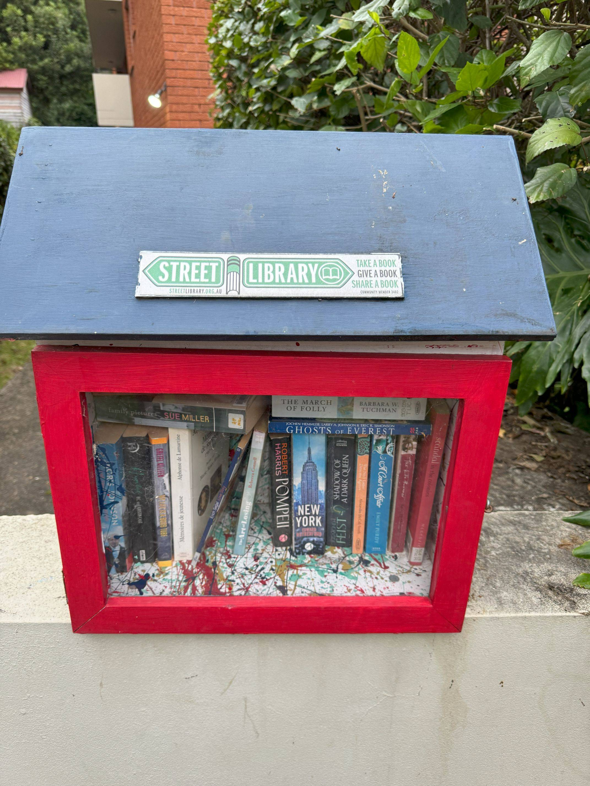

+++
author = "Sathyajith Bhat"
categories = ["Life"]
tags = ["weekly-notes", "gaming", "beach", "Diablo IV"]
places = "Sydney"
type = "post"
series = ["Weekly notes"]
url = "/weekly-notes-35-2024/"
title = "Weekly notes 35/2024"
date = 2024-09-01T12:00:00Z
summary = "Week 35 summary - back to the beach, end of term for guitar classes and more."
images = ["/weekly-notes-35-2024/thumb-street-library.jpg"]

+++

_Thumbnail image: I noticed a few of these along the streets of Sydney. [Street Libraries](https://streetlibrary.org.au/) are boxes where people can take a book, or keep them in. There's usually no need to check in/out and anyone can take a book._ 

### What's been happening

I mentioned in last week's [notes](/weekly-notes-34-2024/) that it's getting warmer and this week it was like the oven had been turn on. The temperature ramped up quite a bit.

* I had some colleagues from my extended org come down from the US this week and it was good to meet up with them. We had a harbour boat cruise arranged for them and I joined them. Given my tendency to get seasick (or any kind of motion sickness) I wasn't inclined to go for the cruise but decided to take a tablet and go anyway. Unfortunately that didn't go so well - a combination of taking the tablet a bit too late plus a different boat which was a lot lower, smaller and less stable along with the fact that the sea was quite rough meant that I quickly retreated to my 'quiet' corner quite fast. And although I did not throw up, I wasn't exactly my usual self. I spent a fair bit of the cruise time at the corner but as we started to head back, I started feeling better and talked a bit with the rest of the folks.
* I completed my re:Invent Attendee Guide for Reliability Engineers for re:Invent 2024 and have submitted it, and will wait for it to be published. I'm still not yet sure if I will be at re:Invent this year as the year's travels have been too much and Jo & I will be in India a week before flying out for re:Invent and I think I will be too exhausted to make this trip.
* We completed our second term for the guitar class this weekend. It's been a short term and I missed about half of it due to my travels but nonetheless I think I've made decent progress. I can now read basic guitar tablature, but playing them is still a challenge. My brain reads the fret numbers on the tablature as string numbers and tries to place the fingers there and that messes up things. Not to mention my chord changes are quite slow and often the chord position itself is not right. No shortcut but practice to improve on these things.
* With the temperatures rising this week, we decided to head to the beach. Balmoral Beach is just under 5km from here, so after completing our guitar class, we went back home, kept our guitar and headed for the beach. We took the bus to Balmoral and it took about half hour to reach there. Once at the beach, we grabbed some lunch first (we had an early class and we didn't have anything for breakfast). From there, we unfolded our beach towel and I had a nice relaxing snooze while Jo put her camera to use.

  

  

  

  

  

* Jo & I with a couple of friends from our guitar class decided to do a food outing to Harris Park. We met at North Sydney train station and took the train to Harris Park. After couple of hours of some nice food, we headed back to North Sydney, spent couple of hours at their house talking about a lot of different things. Truly enjoyed the time spent with them.
  * On a side note, I always thought the Sydney trains were fast, but just a week on the [Sydney Metro](https://sathyabh.at/weekly-notes-34-2024/) makes you realize how much slower they are compared to the Metro. 
* My Diablo IV season is progressing pretty well. I didn't get to play a lot this week but I've got my second character, the druid to level 80 and should be able to start pushing the infernal hordes soon once I get the druid to level 100.
* On the Civilization side, after multiple attempts to continue our existing game of Civ VI and it utterly failing to connect me to [Rush Vora's](https://mastodon.social/@rushvora@hachyderm.io) game, we finally gave up on Civ. Even with me trying to host the game, Rush ran into several lag spikes. Rush later realized the lag spikes were due to his autosync for Google Takeout causing bandwidth saturation, but we've been having connectivity issues for several weeks (months?) now, so we just gave up. We created a new Stardew Valley game and decided to be farmers 😂

### What we ate this week

As mentioned above, since we went to the beach without having any breakfast, we decided to have some early lunch. Jo in her last visit had been to the The Boathouse Balmoral and liked it, so we decided to eat there. We had the Spritz for drinks, and I had the fish and chips while Jo had the fish tacos. The fish was quite fresh and good, though the batter could have used some seasoning. 









At Harris Park, we first went over to Mitran Da Dhaba. Our friends told us that there's a food truck by them tucked a block away from the main restaurant and you don't get paratha in the restaurant. Since we wanted to try the parathas, we went over to the food truck. The food truck also had a bunch of other things, so we ordered a papdi chaat and Chole Bature for myself. 









From here, we went over to Taj Indian Sweets for dessert.



The food at both the places were really good and we enjoyed it.

### Music of the Week

Julia Gaspar's phenomenal [cover](https://www.youtube.com/watch?v=gssnZl62op4) on a 6-string guitar of a masterpiece that is [John Butler's "Ocean"](https://www.youtube.com/watch?v=jdYJf_ybyVo) (originally done on a 11-string guitar). Check both out:

  
  
### Link of the week

Sharath from Building Beautifully's publishing more awesome videos than ever. Enjoyed his blindfolded-IRL-geoguesser [episode](https://www.youtube.com/watch?v=M0B_hFBeIJY).



### Subscribe to my posts

Till next week. If you enjoyed reading this post, please consider sharing it via the links below and subscribing to the blog. You can subscribe via email using [Substack](https://sathyabhat.substack.com/). If you prefer RSS/news readers, you can [click here](https://sathyabh.at/index.xml) for the feed link. If you prefer to follow only my weekly notes, here's [the RSS feed](https://sathyabh.at/series/weekly-notes/index.xml) for the Weekly Notes series. 
