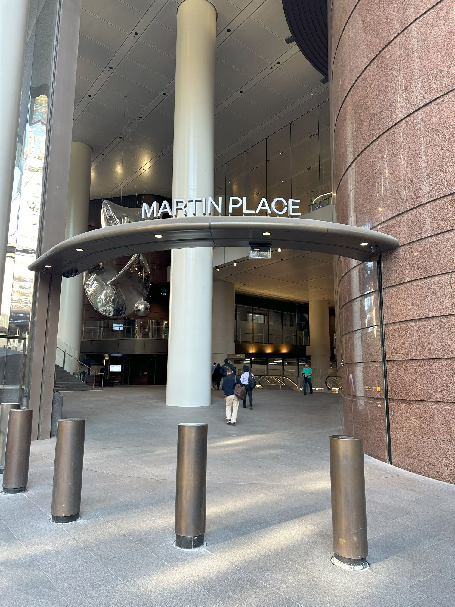

+++
author = "Sathyajith Bhat"
categories = ["Life"]
tags = ["weekly-notes", "gaming"]
places = "Sydney"
type = "post"
series = ["Weekly notes"]
url = "/weekly-notes-38-2024/"
title = "Weekly notes 38/2024"
date = 2024-09-21T12:00:00Z
summary = "Week 38 summary - the hippity-hoppity week."
images = ["/weekly-notes-38-2024/thumb-martin-place.jpg"]
+++

_Thumbnail image: The Martin Place Metro station entrance is just in-front of my office. Unfortunately, we are moving away from this office soon so I will have a longer commute._ 

### What's been happening

* After many, many weeks of procrastinating and dawdling around, Jo and I finally signed up at a gym. There's plenty of gyms around, but we selected [UBX](https://ubxtraining.com/) - a chain of boxing gyms. Why boxing gyms? One thing that differentiated UBX apart from mixing boxing and strength training is that they don't have specific batch timings - we can arrive anytime we want and run through a 12-round circuit. This along with the fact that Jo's friend has been visiting the same gym for many years and is quite happy also provided quite a bit of weight as we decided to go together. The first session went pretty decent - for all of 10 minutes before we realized how badly out of shape we are. We managed to complete 8 of the 12 rounds and slowly went back home. Of course now we're badly hit by Delayed Onset Muscle Soreness so we're going "ow, ow, ow" every time we move a muscle. Hopefully we'll recover soon and improve our fitness levels.
* Jo & her sister finally prepared an itinerary for our New Zealand trip. We had booked the flight tickets long back since they were going on sale but did nothing afterwards. We still need to apply for New Zealand Visitor's Visa - most of the documentation has been prepared and drafted - we need a photo to be uploaded. Since it's a visa application we will have to get a photo done as per their standards. We couldn't get it done on Saturday, so will head over to the photo studio on Monday and get it done and submit the visa application before the busy season
* I found out the next Yakuza spin-off game will have Majima as a protagonist and set in Hawaii. I have no idea how that happened but I look forward to finding out when the game launches later in Feb 2025. Check out the [trailer](https://youtu.be/nNg-YhkDT4c) 
  
* There's an Australian version of The Office. The [trailer](https://www.youtube.com/watch?v=MIEVoulYZM0) came up a few days ago and I.. am not sure how I feel about it. There's clearly a lot of influences from Michael Scott and Dwight Schrute's characters - a tad too much, maybe. The reaction hasn't been that great per [Sydney Morning Herald](https://www.smh.com.au/culture/tv-and-radio/is-the-office-australia-the-raygun-version-of-the-hit-franchise-20240918-p5kbg0.html) but let's see how the series unfolds.
  
* My re:Invent 2024 Attendee Guide for Reliability and resilience is now published on the [re:Invent portal](https://registration.awsevents.com/flow/awsevents/reinvent24/attendeeguide/page/reliabilityandresilienceheroguide)! 

### What we saw

The final episode of The Grand Tour was released last week and both Jo & I watched it over a span of two sittings. Spanning two hours, The Grand Tour's final episode titled One For The Road is a magnificent piece of cinematography and stunning landscapes of Zimbabwe. I think I enjoyed this episode more than any of the other Grand Tour specials. There's not a lot of flashiness, no extravagant stunts or explosions, no stupid gags - just the three folks driving across the span of Zimbabwe, reminiscing about the drive and their careers. The episode also features some music. I am so glad that it ended on a high note rather than crashing out. Even if you've never seen a episode of The Grand Tour, I would highly recommend a [watch](https://www.primevideo.com/detail/The-Grand-Tour/0IQGM9SJ1RI6EKXG6GPUFVI50P).

  

### Music of the Week

I was listening to some Spotify and out of nowhere Spotify recommended this song - [Identity Crisis by Girish And The Chronicles](https://www.youtube.com/watch?v=SyvFNM9wyv0). The riff is a bit familiar but love the overall arrangement and the vocals. Worthy of a listen.

  

### Link of the week

Dmitry boots a Debian Linux on a 4-bit Intel microprocessor - the 4004. It's a really, really long read including in-depth details of how the microcontroller works. Give it a read on how he tries to get the booting time from 9+days to about half of that. The second half of the post talks about how he tries to record the entire process which is another in-depth article in itself. Give it a [read](https://dmitry.gr/?r=05.Projects&proj=35.%20Linux4004).

### Subscribe to my posts

Till next week. If you enjoyed reading this post, please consider sharing it via the links below and subscribing to the blog. You can subscribe via email using [Substack](https://sathyabhat.substack.com/). If you prefer RSS/news readers, you can [click here](https://sathyabh.at/index.xml) for the feed link. If you prefer to follow only my weekly notes, here's [the RSS feed](https://sathyabh.at/series/weekly-notes/index.xml) for the Weekly Notes series. 
