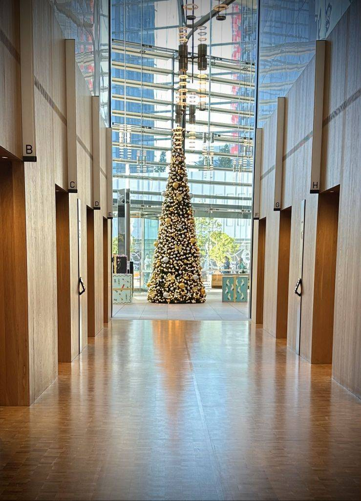

+++
author = "Sathyajith Bhat"
categories = ["Life"]
tags = ["weekly-notes", "concert"]
places = "Sydney"
type = "post"
series = ["Weekly notes"]
url = "/weekly-notes-50-2024/"
title = "Weekly notes 50/2024"
date = 2024-12-15T12:00:00Z
summary = "Week 50 summary - last concert of the year."
images = ["/weekly-notes-50-2024/thumb-tree-at-international-towers.jpg"]

+++

_Thumbnail image: Christmas Tree at the International Towers._

### What's been happening

We're just about two weeks away from the end of 2024. Feels like the year has gone by so fast. And as with end of year comes the lull period - lot of my colleagues have gone on vacation.

[Vinayak](https://x.com/vinayakh) was in Sydney this week, speaking at a Microsoft Azure AI conference. I met up with him for dinner (despite his tight schedule), and it was good to catch up with him after a really long time!

Jo & I can't wait till this Sunday - we fly off to New Zealand for a two-week trip with my Jo's sister and her husband joining us. We'll spend most of our time on the South Island but will stop by in Auckland for a couple of days for the [Hobbiton](https://www.hobbitontours.com/) tour. That potentially means that my weekly notes will be on hiatus till I return from my trip. I'll probably get one in for this weekend just before our flight to New Zealand but will be a bit of a short note.

With the New Zealand trip also comes a pause on the gym and personal training - I was just about getting back to my rhythm and started to hit my personal bests. My trainer has asked me to come in an extra day the upcoming week and the week after I return from New Zealand to make up for the deficit. Also, another nice thing is that I've hit my immediate weight goal that I had set when joining, so I am pretty excited about finally getting there.

The rest of the week was spent in trying to [solve Advent of Code](https://github.com/SathyaBhat/advent-of-code) (albeit very slowly). We also went to our final concert (and my 18th) of the year - Jack White. The concert was pretty good but again, bad sound engineering made it not the most enjoyable one. In this case, the sound engineers ramped up the volume all the way to 50 million just before Jack White started performing. Thus, not only was it _very_ loud, there was a lot of shrill feedback and made it less enjoyable than it would have been. It's a shame because when I listen to some of the videos I had taken, they sound so much better than what was in the auditorium. Oh well, reminder to always carry some earplugs when going to concerts.

  

  

  

  

  

  

  

### What I ate 

[El Jefe, North Sydney](https://maps.app.goo.gl/wjBHjQv1KRjc5jmMA): A Latin American restaurant that opened recently, El Jefe has nice decor and equally good food. I ordered crispy hard shell tacos, didn't think they would be deep fried but alas it was (and a bit bland). Jo's grilled chicken was much better though. They gave us a complimentary dessert which was sort of like peanut-butter laddoo.

  

  

  

  

[Kaiza](https://maps.app.goo.gl/VHVzYrzocYM6NNsJ8): A Japanese izakaya restaurant located in the heart of Newtown, right in front of Enmore Theatre. I was looking for a new restaurant to check out and have dinner before the Jack White concert - Kaiza and Colombo came up, but decided to go with Kaiza as it was closer to Enmore and less to walk to. And we were not disappointed! Kaiza had awesome food and service. Everything that we ordered - from renkon chips, wagyu nigiri, crispy eggplant, the barramundi and the pork belly - all were fantastic. Would definitely come back here to check out some of their other food!

  

  

  

  

  

  

  

[Cow and The Moon](https://maps.app.goo.gl/KUgMY3QkCaTr1KfB7): A busy cafe and gelato place - the lines were quite long for this and we had to wait about 15 minutes in the line before we could look at the available flavours. Given the holiday season, we picked up a gelato with a scoop o Christmas Pudding and Lime in the Coconut flavours. Good flavours and worth a revisit!

  

  

### Music of the Week

Firaxis premiered the main theme music of Civilization VII. [Titled "Live Gloriously"](https://www.youtube.com/watch?v=6yontgyLLSo), the piece is composed by Christopher Tin (who's won Grammy awards for Civilization VI and Civilization IV themes). Enjoy all three songs, for they are glorious.

  

  

  

### Link of the week

I came across this post on [Hacker News](https://news.ycombinator.com/item?id=42405046) about a person designing his own espresso machine and coffee grinder and it looks quite.. funky. But too many practical things missing from it to be useful to the average audience.

The Video Game Awards was earlier this week and while I don't really follow the awards, they are usually a place where lots of upcoming games are announced. Press Start has a nice article collecting all the announcements in a single link - give [it a read](https://press-start.com.au/features/2024/12/13/everything-announced-at-the-game-awards-2024/).

### Subscribe to my posts

Till next week. If you enjoyed reading this post, please consider sharing it via the links below and subscribing to the blog. You can subscribe via email using [Substack](https://sathyabhat.substack.com/). If you prefer RSS/news readers, you can [click here](https://sathyabh.at/index.xml) for the feed link. If you prefer to follow only my weekly notes, here's [the RSS feed](https://sathyabh.at/series/weekly-notes/index.xml) for the Weekly Notes series.
