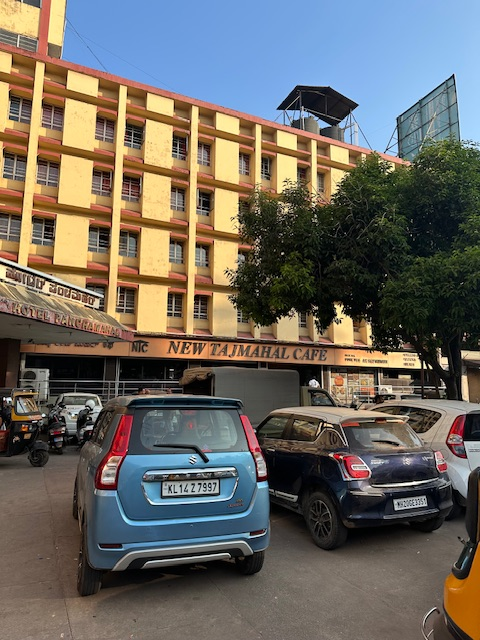

+++
author = "Sathyajith Bhat"
categories = ["Life"]
tags = ["weekly-notes"]
places = "Mangalore"
type = "post"
series = ["Weekly notes"]
url = "/weekly-notes-01-2025/"
title = "Weekly notes 01/2025"
date = 2025-04-01T12:00:00Z
summary = "Week 01 summary - hospital visits and back to Sydney."
images = ["/weekly-notes-01-2025/thumb-new-tajmahal-cafe.jpg"]

+++

_Thumbnail image: New Taj Mahal Cafe is one of Mangalore's iconic breakfast spots, known to have the best filter coffee. I can attest to that._

### What's been happening

Welcome to 2025! Hope you folks had a good New Year celebration. It's been a patient week for us. Since landing in Mangalore [last week](/weekly-notes-52-2024/), Jo's dad condition has improved quite a bit. Jo and her mother would stay evening/overnight at the hospital, while her sister & brother-in-law would cover most of the day time.

I assumed the driver duties of picking up Jo's mom/her from the hospital, drive them back to the house and then later drop them back at the hospital again. Last checked, I crossed about 190kms of driving. A drive to the hospital trip, pick up and return to home is about 5kms. So yeah, a fair bit of city driving in the past two weeks. The traffic wasn't too bad - exceptions being Friday afternoon at Aloysious Hill (due the presence of Mosque and Friday prayers) and Saturday afternoon/evening. Before we left Mangalore, I went to over to my sister's house to meet her and my niece for a short time.

We head back to Sydney this weekend. Usually, I book the Indigo flight from Mangalore to Bangalore and the Qantas flight from Bangalore to Sydney as two separate tickets. Last time when I was in Bangalore I realized Qantas/Indigo are codeshare partners and that I could book a single PNR ticket from Mangalore to Sydney - this saves us from having to handle the baggage ourselves after landing in Bangalore. We'll be reaching Sydney Monday mid-morning and I've already got my PT booked for Monday afternoon.

I thought I'd retain my weight or worse, put on more weight but it seems like the PT effects lingered on and I lost couple of kilos more (whether that is the effect of stress remains to be seen, heh).

While our holiday went in a way that we least expected, it's good to see Jo's Dad getting better. I am supposed to be heading to Denver, Colorado next week for [Palooza](/weekly-notes-05-2024/) but I'm still debating about it.

### What I ate

Usually, Mangalore visit for me is a lot of home cooked meals as we barely eat out. This time, since I was staying at my in-laws' place, we went to a few different places for breakfast and lunch as I didn't want to trouble my mother-in-law.
Here are the places we visited:

- [New Taj Mahal Cafe](https://maps.app.goo.gl/Ekqajx4Q3sJWsev87): one of Mangalore's oldest and most iconic breakfast spots, New Taj Mahal Cafe can get quite crowded especially during weekend mornings. We had idly, vada, theek rotti (similar to Poori Bhaji, but the pooris are done slightly differently), buns and coffee are highly recommended.
- [Janatha Deluxe, Pathmumudi Soudha](https://maps.app.goo.gl/9ZhiHhQiCPoCiGVD8): Another breakfast spot that's popular and can get quite crowded. I had the paper dosa here and was smacked by how big it was. Well worth a visit!
- [Woodlands Hotel](https://maps.app.goo.gl/maDs9ZCvtZxJyDpHA): Another iconic restaurant known for their car-side service (be lazy and don't step out of your car while you order and get your food delivered!). I have fond memories of visiting here with my parents for their sunday evening snack session, but we ended up being disappointed after the breakfast food was not quite up to par.
- [The Liquid Lounge](https://maps.app.goo.gl/QdRc9SCMdjUyVZUy7): One of Mangalore's most well known resto bars and a place that I have frequented quite a bit during my college days, Liquid Lounge still looks and feels exactly like how it was 18 years ago when I last visited. For food, the chicken steak with pepper sauce and cracking chicken are highly recommended.
- [Froth on Top](https://maps.app.goo.gl/496JnCy5GHSETPHM6): Another classic beer cafe by the same folks as Liquid Lounge, Froth on Top welcomes you with an amazing ambience with walls decorated with the caricature of Mangalorean culture/lifestyle. I've always loved that Froth was one of the few places back during my college days where beer was served in a chilled mug. As for the food, highly recommend the squid butter garlic and Chicken Keema rice.
- [Hao Ming](https://maps.app.goo.gl/jMK9RS9Yi4AFr3WW7): One of the two OG (Indo) Chinese cuisine restaruants of Mangalore (the other one being Hao Hao), Hao Ming still retains it's old-school charm and the menu from ages back. In terms of food, would highly recommend Thai Crunchy Chicken and the Chef's Special Noodles.

























### Music of the Week

David Bowie's Lets Dance is an iconic song from 1983, but I had no idea the music video was shot in Australia (you can see many familar sights of Sydney/Blue Mountains and around) and is a commentary on the treatment of [Aborginal Australians](<https://en.wikipedia.org/wiki/Let%27s_Dance_(David_Bowie_song)#Music_video>).



### Link of the week

Jason Cammisa from [Hagerty](https://youtu.be/YffShJxkUyU?si=lhTqux27ZOHaEQV8) has a fabulous video covering a drag race comparison of many cars. What caught my eye were the visuals and the cinematography of the entire video - incredibly well done that hooks you into the content even more.



I also found out about Soapbox Racing - a soapbox car is a motorless vehicle which is raced on a downhill road either against the clock or against another competitor. YouTube randomly recommended [some videos from Redbull Soapbox Race](https://youtu.be/xmOMpMRY3mg?si=8KpGDDD3gzt8Yxrw) and I spent a ridiculous amount of time watching them. Enjoy the mayhem. Special shoutout to the commentator who elevates the watching experience with his fabulous commentary! 



### Thanks for reading. 

Thanks for reading and have a great week ahead.

Subscribe to my weekly notes:

* [EMail newsletter](https://sathyabhat.substack.com/)
* [RSS feed for the weekly notes](https://sathyabh.at/series/weekly-notes/index.xml)
* [RSS feed for my site](https://sathyabh.at/index.xml)
