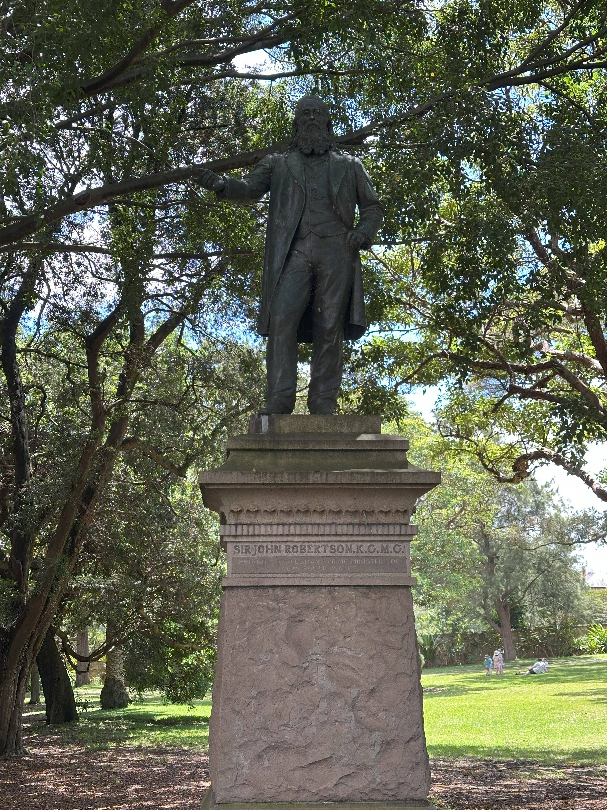

+++
author = "Sathyajith Bhat"
categories = ["Life"]
tags = ["weekly-notes", "gaming", "Path of Exile 2"]
places = "Sydney"
type = "post"
series = ["Weekly notes"]
url = "/weekly-notes-02-2025/"
title = "Weekly notes 02/2025"
date = 2025-01-11T12:00:00Z
summary = "Week 02 summary - preparing for work travel and meeting a former colleague."
images = ["/weekly-notes-02-2025/thumb-sir-john-robertson.jpg"]
+++

_Thumbnail image: A life-sized bronze statue of Sir John Robertson, an Australian politician and five-time Premier of New South Wales._

### What's been happening

It's been good progress since [last week](/weekly-notes-01-2025/). My father-in-law is now back at home and doing well. A full recovery is still quite some time away, but for now I'm happy to see he's back home and walking about. With that, my mind was more at ease and I decided to proceed with heading to Denver for The Trade Desk Palooza. Palooza is an annual, all-company event and is an excellent place to meet a lot of people who we've only interacted with over Slack/Zoom, as well as to meet teammates from across the globe. I will be flying to Denver via Houston as my layover airport. I'm looking forward to catching up with a lot of people, though I must admit I'm not looking forward to being in Denver in winter. That said, hopefully being indoors most of the time and wearing layers will help in keeping myself warm.

This week also marked a return to my PT sessions at BBB Gym. We started a bit lower in the first session, but the second session was pretty intense compared to what I've been doing. Since I will be away next week, he's asked me to get my steps in. It will be challenging at Denver's altitude and weather, but let's see what we can do.

This week I met a former colleague from Adobe Romania! She was spending her Christmas vacation here in Australia and asked if I could meet. Luckily, the week that she was free to meet was this week, which worked well for me. We talked for a couple of hours about different things - her vacation, things back in Romania, etc. I had a good time. Unfortunately for her, the week she was vacationing in Sydney was also one of the gloomiest weather weeks with heavy rains for the past few days. Thankfully, Sydney was not her only destination and she had good weather at the other places she visited.

With me back in Sydney, I picked up Path of Exile 2 where I left off - towards the end of Act 2. Act 2 is significantly more difficult - while most of the bosses were manageable, the final Act 2 boss is an absolute pain. I must have died at least 10 times trying to kill it. I'm all for tough fights - but this was ridiculous. The boss has a ginormous number of hit points and takes so long to whittle down, while having to dodge an increasingly high number of unavoidable damage hits and one-shot mechanics. Because the health pool is so large, it took a really long time for me to try each attempt, and I had several times where I was about one or two hits away from defeating it but died due to the unavoidable damage hits. Here are a couple of boss fight videos.

  

  

Jo wanted to give another try at getting back to blogging (weekly notes or not remains to be seen) and asked me for suggestions for blogging software, with the constraint that the solution must support custom domain. While I use Hugo and neovim to write these posts (and use the RSS import into Substack, for the newsletter), it's a fairly cumbersome process - especially since I don't like stuffing images into git and have a rather elaborate process to select, download the pictures, resize and convert to jpeg and then upload to S3, and then finally add references to the images. For her goal of easy writing, I think my workflow will be too much of a headache, so we signed up for a [Ghost account](https://ghost.org/) for her to give it a try and I will probably self-host ghost for her if she likes it. Meanwhile, go check out [Jo's Blog](https://blog.joshenoy.me/) and subscribe to it!

I took some time today to properly catalogue all the vinyl we collected over the year and enter them into Discogs. I was searching for a nice way to create a collage of the album art and found out [DisCovers](https://discovers.antisound.net/) as a simple, fast and easy way to do that. On Mastodon, I was made aware of Waxlog - another awesome way to display [my Discogs collection](https://www.waxlog.com/collection/josathya)
  

Finally, Jo wanted to explore the Art Gallery of New South Wales. We've been there [before](/2023/11/19/weekly-notes-46-2023/) but didn't visit the North building, so we decided to check that out. One interesting bit was a Ganesha statue from Indonesia that adorned the building entrance. 



The North Building features collection of work across Indigenous Australia. I found [Gordon Hookey's Cognative Frontier](https://www.artgallery.nsw.gov.au/collection/works/48.2014/)  one to be the most interesting, depicting the panic created by the media and the stereotyping of Indigenous Australians.

  

  

We only visited the Ground and Lower Level 1 - Jo was interested in lower level 2 but had a tiring start to the day (with a PT session) and we cut the visit short, went over to Terrace on the Domain for lunch.

### What we ate

Terrace on the Domain: A little dining room featuring Italian cuisine. An Italian restaurant always gets Jo to order an Arancini, this was no different. For mains, we ordered a chicken supreme for Jo and a pasta (Lumache with fennel sausage and squash) which I now realize that they made a mistake and sent a Casarecce with duck ragu instead. Oh well, the food was good and the quantity was higher than expected, so we ended up leaving some of the pasta. All in all, good visit!

  

  

### Music of the Week

[This week's featured song](https://www.youtube.com/watch?v=zS6i920KUMw) is from a Seattle based indie folk band Fleet Foxes called "Mykonos". Quite an earworm!



### Link of the week

A couple of months back, Elon Musk was in the news for gaming reasons as his character was ranked first in the unofficial Pit leaderboard. Many asked me if he actually does play that well - my response then was that I thought it was more of him to pilot his account (ie, get someone to play his account and farm all the god-tier gear) and him playing as a 'token'. 

Last week, he tried to the same with Path of Exile 2, only that his live stream went woefully bad and showed how much he was actually playing (read: little to none). I loved Quin's reaction to the stream and here's a [video of what happened](https://www.youtube.com/watch?v=FmEe3eUPWq4).

  

[AWS Hero Renato Losio](https://aws.amazon.com/developer/community/heroes/renato-losio/) picks up inspiration from Jules Verne's Around the World in 80 days and [tries to find how long](https://cloudiamo.com/2024/12/15/around-the-world-in-15-buckets/) it would take a file to circumnavigate the globe through AWS data centers. Fun read!

### Thanks for reading.

Thanks for reading and have a great week ahead.

Subscribe to my weekly notes:

- [Email newsletter](https://sathyabhat.substack.com/)
- [RSS feed for the weekly notes](https://sathyabh.at/series/weekly-notes/index.xml)
- [RSS feed for my site](https://sathyabh.at/index.xml)
