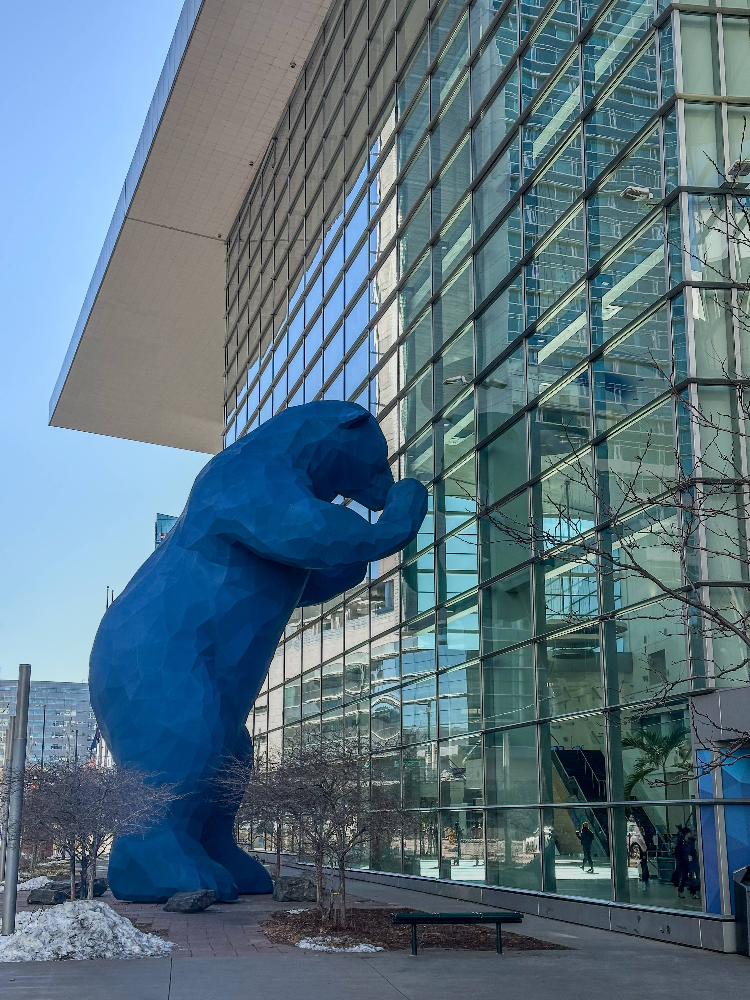

+++
author = "Sathyajith Bhat"
categories = ["Life"]
tags = ["weekly-notes", "palooza"]
places = ["Denver", "Sydney"]
type = "post"
series = ["Weekly notes"]
url = "/weekly-notes-03-2025/"
title = "Weekly notes 03/2025"
date = 2025-01-19T12:00:00Z
summary = "Week 03 summary - back from Denver"
images = ["/weekly-notes-03-2025/thumb-blue-bear.jpg"]
+++

_Thumbnail image: The Big Blue Bear is a 40-foot-tall sculpture and is actually titled "I See What You Mean"._

### What's been happening

I'm back from Denver. I had a good time at Palooza. I met my teammates and a lot of colleagues and spoke to them about many different things - work or otherwise. It was pretty cold in Denver - temperatures were below zero degrees Celsius, and while it did not snow, there were plenty of snow patches which kept the temperatures cold. Thankfully, most Palooza events and sessions were inside a convention center, so I didn't have to bundle up too much.

My flight to Denver this time around was an interesting path - via Houston. I haven't visited Houston for a long time, and Flighty says this is my longest flight distance ever, covering 13,835km. I wish I could have taken a Qantas flight, but I got a United flight instead. I had a 5-hour layover in Houston, and that helped as immigration took about an hour and 15 minutes. After this, I went over to United Lounge. United offers lounge access at $60 per person - it's not cheap, but it's good to get away from the crowd and charge your devices and grab some food.

Once I landed in Denver, a Sydney colleague asked me if I wanted to join for dinner - initially, I said I was up for it. Once I reached the hotel and checked into my room, travel exhaustion hit me all of a sudden, and I cancelled the dinner plan and went to sleep early. The next morning, I walked to a coffee shop (that was recommended in the coffee channel in our company's Slack) and had a cappuccino. The coffee was pretty good; I was glad to have visited here. I found another coffee shop much closer to the hotel, and for the rest of the days, I would walk over to the coffee shop, pick up a cappuccino and then walk to the convention center.

I also met up with fellow AWS Hero [Matthew Bonig](https://matthewbonig.com/). We had a nice chat about all things AWS, advertising, Expanse and more! I appreciate Matt making the time to come down to downtown Denver and meeting up.



My schedule was packed with sessions/talks during the day and we had dinner events at night, so there wasn't much to do. My teammate wanted to check out the Meow Wolf exhibit in Denver, and I wanted to escape the same old stuff, so I accompanied him to the exhibit, and I am so glad I did. Meow Wolf creates large-scale interactive and immersive art installations with multiple hidden stories, unreal light works and more.

The Convergence Station, as the installation is known, covers a large area over three storeys and is presented as an interdimensional transport hub of different planets. Each of the planets has different stories to unravel and secrets to discover. When you walk in, you're transported to a cyberpunk-ish area, and what initially looks like just a bunch of different exhibits gets you hooked in deeper with many secret doors/corridors, scavenger hunts, code unlocks and more. We ended up spending close to two and a half hours. I must admit by this time, I was nearly exhausted and couldn't have gone further (we had only uncovered about half the stories), but you can always get an unlimited pass if you wish to return multiple times (and I suspect if you want to make sense of everything, you'd probably require at least two visits). Just a note that the facility definitely can get you overstimulated (one of the reasons why I got exhausted, apart from the non-stop walks).



















Another fun event was Trader 99 and The Bad Impressions - our office band provided the instrumentals while many of my colleagues came about and performed some popular songs. The band played for a couple of hours and then switched over to karaoke for the rest of the night.







After the Trader 99 band performance was done, I went back to the hotel and found out my larger department had organized a private-room karaoke, so went over to the karaoke bar to join them. I did not sing any songs by myself, but I did join in singing along with many others, and it was quite fun.

As the week went by, the weather forecast indicated that a cold front was due to land in Denver on Saturday and there would be heavy snow. This Saturday snow forecast was then revised to Friday evening, and I was wondering if this would affect my return flight to Sydney via San Francisco. It did get very cold on Friday evening, and our flight was delayed by an hour so that the de-ice operation on the plane could be completed. Apart from this, we didn't have any problems. In San Francisco, we had a few hours' layover and I met some more colleagues from the Sydney office and stuck together.

We went to a Japanese restaurant at the airport, where I had a Spicy Tuna roll and pork dumplings for dinner. The food was pretty good, I must say. After this, we still had a few hours to kill before boarding would start. A colleague had a deck of cards and suggested we play [Big Two](https://en.wikipedia.org/wiki/Big_two). I had never heard of the game, but playing together is something I hadn't done in a while, so I joined the game. After a few missteps (mainly due to not being familiar with the rules), I picked up the game and won a round (beginners' luck). It was a nice game to play as a group, so I'm glad I did stick with them.

My return flight was terrible as I had a very active 3-year-old boy who kept kicking me before going to sleep, and after he slept off, moved around and used my tummy as his pillow. His mother was in the seat next to his and had slept off as well (the kid switched around after she put him to sleep), and as much as I hated having to wake her up, I didn't have much choice as the kid kept coming more and more towards me, and I could barely sit. Thankfully, she woke up and managed to get the kid to sleep in his own seat.

Once back in Sydney, I cleared immigration and biosecurity pretty fast and spent 45 minutes waiting for my Uber - previously, the Uber pickup was in a huge parking yard, and you could request for a ride like the usual way. Sometime last year, this was changed to a stand-in-queue-and-request-for-a-ride way. The advantage of this is that you can enter any Uber and provide the pin, and it translates to your drop-off point. However, the new place where the pickup happens is a single-file line of 5 bays, and on mornings where a lot of international flights land (Sydney has a night curfew for flights), this 5-bay, single-file line becomes such a massive bottleneck. It's clear that whoever changed this has never been to Sydney, and I hope this can be fixed soon.

Once I made it back to home, Jo & I went to Venn Cafe for brunch, and then to Stanton Library to pick up a few books - couple of Danganronpa: The Animation Manga and Hawking: The Man, the Genius, and the Theory of Everything





### What I Ate

For Palooza, we had breakfast, lunch and dinner provided. However, I hate conference food and went out to eat - often with other colleagues making for a good way to catch up with them. Here's some places that I visited

[Huckleberry Roasters, Denver](https://maps.app.goo.gl/KHTvL8btR7r8yzjh9): Considered as one of the best coffee roasters and coffee shops of Denver and I can see why. Just one sip of the cappuccino was enough to recommend these folks.





[West Saloon & Kitchen, Denver](https://maps.app.goo.gl/GngcADAPtMnmEnru6): An old-fashioned saloon style eatery with some amazing cocktails and food. This was the first restaurant I was eating at in Denver and ordered an Anejo Old Fashioned and Salmon salad.





[Sushi Den, Denver](https://maps.app.goo.gl/obNh1MphkoY3yVF26): I wasn't really expecting really good seafood in a mountain town, but this sushi place really surprised me both on the quality of the fish as well as the cost(though must admit, Jason covered the bill - thank you!)





[Venn Cafe, North Sydney](https://maps.app.goo.gl/UyqbUAgbbNuhXbym6): By the time I came back home from the airport, it was almost midday so we decided to head over to Venn and have some brunch and coffee. Jo had the iced long black (which was a bit too acidic) while I had a Iced Latte which came as deconstructed (to my surprise). The food was pretty decent as well - I had the bacon egg wrap while Jo had the Caesar salad. No pics were taken of the food as we were too hungry and gobbled it up.





### Music of the Week

Gorillaz' [On Melancholy Hill](https://www.youtube.com/watch?v=qGD-OmfQUbQ) gives me all sorts of feelings listening to it. This live version elevates it to the next level.



### Link of the week

Nintendo finally revealed the [next version](https://www.youtube.com/watch?v=itpcsQQvgAQ) of Switch, the Switch 2 this week. Dunkey's coverage of the reveal is hilarious (screaming alert!). Catch both the original video as well as [the reaction](https://www.youtube.com/watch?v=CD8uUWIhgNA).





### Thanks for reading.

Thanks for reading and have a great week ahead.

Subscribe to my weekly notes:

- [Email newsletter](https://sathyabhat.substack.com/)
- [RSS feed for the weekly notes](https://sathyabh.at/series/weekly-notes/index.xml)
- [RSS feed for my site](https://sathyabh.at/index.xml)
