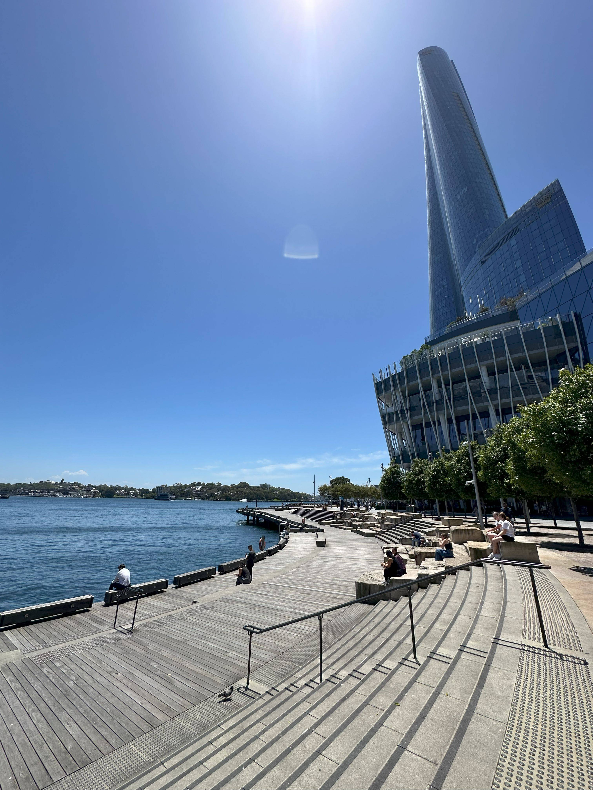

+++
author = "Sathyajith Bhat"
categories = ["Life"]
tags = ["weekly-notes", "gaming"]
places = "Sydney"
type = "post"
series = ["Weekly notes"]
url = "/weekly-notes-04-2025/"
title = "Weekly notes 04/2025"
date = 2025-01-25T12:00:00Z
summary = "Week 04 summary - a long weekend at home."
images = ["/weekly-notes-04-2025/thumb-barangaroo-wharf.jpg"]
+++

_Thumbnail image: Barangaroo ferry wharf is a ferry wharf located on the eastern side of Darling Harbour, in Sydney, Australia._

### What's been happening

I'm almost back in 100% work mode... almost because:

a. There's a long weekend coming up as we have [Australia Day](https://en.wikipedia.org/wiki/Australia_Day) holiday here on Monday
b. A few folks in office are out post [Palooza](/tags/palooza/) due to "Palooza Plague".

With that said, I've been working on charting out my team's roadmap for the year with my fellow leads and product manager. It will be interesting to see how it goes. It's also performance review season, so I've been occupied this week collecting data about what I did and writing a one-page document about it, and also providing feedback to my peers (anyone in the company can request for peer feedback, and that feedback goes directly to the requesting person's manager).

We have a long weekend coming up; we didn't plan for it, so no weekend road trip for us and we will chill at home.

I'm also back to my gym and given there are no holidays or work travel, I'm excited to be back at it and build some consistency. When I joined BBB, they asked me what my target weight was: I had given three numbers: an immediate short-term goal, an aspirational goal and a long-term ideal goal. I hit my immediate goal a few weeks ago and have been maintaining being under that target weight, despite the travels and whatnot, and as of this week, I'm very close to the aspirational goal. I'm quite happy as to how it's coming along - there were many weeks where my weight would remain steady despite the workouts and whatnot, and not seeing the drop was slightly frustrating. Big shout out to my trainer for keeping me motivated and getting my workouts designed just right so that I'm pushing myself but not dreading it.

I found out about [PikaPods](https://www.pikapods.com/), a low-cost platform as a service option to run open source web apps and figured it would be a good fit to host [Jo's Blog](https://joshenoy.me/), and I've been pretty pleased with it. PikaPods doesn't give you access to the underlying VM, but you do get access to the disk (via SFTP), access to the database (if the app requires any) and can configure backup to a S3-compatible service, so all in all, it's a pretty good service. PikaPods charges you on the basis of consumed resources, and billing is a prepaid credits system. If you're looking for a simple platform to host open source applications, PikaPods might be a good fit.

Migrating Jo's blog from Ghost Pro to PikaPods was fairly straightforward. Ghost comes with an export tool that exports all posts, settings as a JSON file. I had to re-upload the images since Ghost's exporter doesn't export the images. Since it was only a few images I didn't reach out to support and get them exported (I've read reports you can do that). Initially, Jo wanted a landing page on [joshenoy.me](https://joshenoy.me) while the blog would live on [blog.joshenoy.me](https://blog.joshenoy.me) and thus, I added DNS records to point to GitHub pages, while I did not claim the domain on GitHub. Unfortunately, this resulted in unexpected domain hijacking, pointing her root domain to a gambling page that was also hosted on Github Pages, with no access to any of domain records. Evidently, that's a pretty common exploit vector as seen in [these](https://rmoff.net/2024/01/16/hosting-on-github-pages-watch-out-for-subdomain-hijacking/) blog [posts](https://medium.rip/@jehy/hijacking-domain-using-github-pages-41c80ac57523). I deleted the Github Pages record, and Jo decided to have a custom landing page using Ghost itself. This means the blog itself now resides on the root domain and if you've subscribed to her blog, be sure to [subscribe again](https://joshenoy.me) (RSS [feed](https://joshenoy.me/rss)) (although I have put in a redirect from the old domain to the new).

Jo & I also met [Umesh](https://x.com/ooomz) & his wife this Saturday - he messaged me mentioning he would be in North Sydney side and since Jo & I were free, went over to Luna Park and had a nice chat for a couple of hours.

### What we ate

[Spit Roast, Kirribilli](https://maps.app.goo.gl/1SinNh2ruhNqmUfeA): We were returning from our walk to Kirribilli lookout and Jo wanted to have tacos at this Mexican restaurant we saw, but they had no vacancy so we ended up going to this BBQ place. We had the grilled chicken with gravy and salad and was quite good!

  

[Chico's Mexican Bar and Grill, Kirribilli](https://maps.app.goo.gl/7UoueN6q7cYZyqeb6): Still on a quest to go the taco place, unfortunately this time the restaurant had just closed for the day. I found Chico's nearby and we went here instead. We had couple of drinks, some tacos and nachos. We thought of ordering a quesadilla but decided against it - and was a good choice, the quantity was pretty good. The tacos could have been a bit better but oh well.

  

  

  

  

  

  

[Leible, North Sydney](https://maps.app.goo.gl/xEr15iJmfsaKnZa88): A chain of coffee-shops well known for their coffee. Jo had the cold brew while I stuck to my standard cappucion and we shared a ham & cheese toastie (Aussie for toasted sandwich).

  

  

  

### What I've been playing

I'm back to playing Path of Exile 2. I'm still struggling in Act 3 - a new act further adds resistance penalties and your character gets that much weaker. In Act 3 you get bombarded with a lot of poison damage and I haven't found decent source of resistance or mitigation against it. I defeated a couple of bosses and now have taken a break because - the new season of Diablo IV started this week. The new season has special powers that you can add and the powers are reminiscent of the Witch Doctor class. Will be interesting to see if they will continue adding other class-fantasy skills as seasonal powers as a way to satisfy fans without having to drop a new class altogether.

We're so close to the launch of Civilization VII (coming first week of Feb) and looking forward to playing with my usual Civ gang.

### What I've been watching

I came across a clip of [Taskmaster](<https://en.wikipedia.org/wiki/Taskmaster_(TV_series)>) on YouTube and I've been hooked on to the series. Taskmaster is a British comedy panel game show presented by both Horne and Greg Davies. In the programme, a group of five celebrities – mainly comedians – attempt to complete a series of challenges, with Horne acting as umpire in each challenge and Davies, the titular "Taskmaster", judging the work and awarding points based on contestants' performances. The UK edition is on their 18th season and they're on YouTube, so go give it a view. Highly recommend it.



I've also been re-watching The Expanse during my flights, and I am still amazed at how well the series built up. Expanse was something Jo made me watch and after a couple of episodes I was so hooked on to it, we ended up binge watching the entire series. I love how they keep layering the characters and the plots as it gets deeper in and the visual effects are amazing. Highly recommend it to any science fiction fantasy fan.

### Music of the Week

I came across Lola Young's Messy in the office and absolutely loved it. Jo tells me this song blew up on TikTok and has been popular for a while now. Oh well, better late than never. She made a performance on The Tonight Show Starring Jimmy Fallon even. Give it a view.



### Link of the week

[Nagarathna Memorial Grant](https://thejeshgn.com/projects/nagarathna-memorial-grant/) is an yearly, no strings attached grant from [Thejesh GN](https://thejeshgn.com). It's a micro-grant targeted at everyone. The reason for grant could be anything as long it's meaningful to you and the people around you. Thej has been issuing the grant for eight years now and this year's grant is open for [applications](https://thejeshgn.com/2025/01/15/nagarathna-memorial-grant-2025-open-for-applications).

### Thanks for reading.

Thanks for reading and have a great week ahead.

Subscribe to my weekly notes:

- [Email newsletter](https://sathyabhat.substack.com/)
- [RSS feed for the weekly notes](https://sathyabh.at/series/weekly-notes/index.xml)
- [RSS feed for my site](https://sathyabh.at/index.xml)
