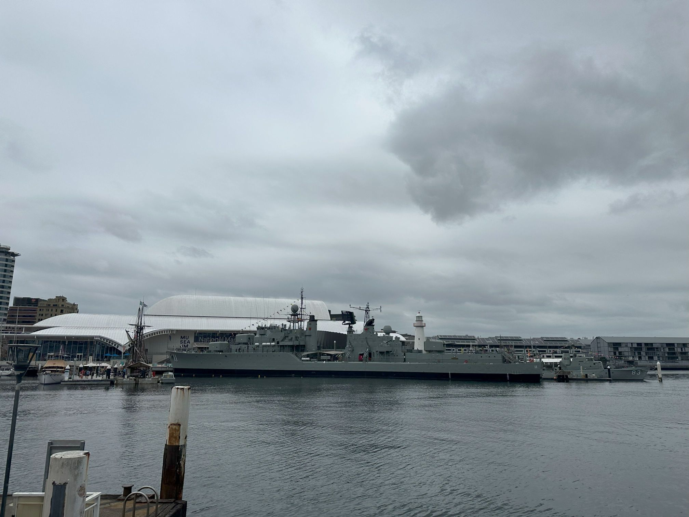

+++
author = "Sathyajith Bhat"
categories = ["Life"]
tags = ["weekly-notes", "gaming", "concert"]
  places = "Sydney"
type = "post"
series = ["Weekly notes"]
url = "/weekly-notes-05-2025/"
title = "Weekly notes 05/2025"
date = 2025-02-01T12:00:00Z
summary = "Week 05 summary - markets weekend."
images = ["/weekly-notes-05-2025/thumb-naval-museum.jpg"]

+++

_Thumbnail image: Australian National Maritime Museum is a maritime museum in Darling Harbour, Sydney._

### What's been happening

The week started with a holiday because of an in-lieu day for Australia Day. Jo's batch mate from college who lives in a nearby suburb asked if we'd like to meet. We were free, so we agreed to meet - we went over to Mosman - first stopping by Frenchy's Cafe for a quick coffee and brunch and then taking a small walk around George's Head Lookout. The original plan also involved a beach visit; however, with the Australia Day holiday crowd packed at Balmoral Beach combined with the heat, we decided against the beach visit - it was hard enough to drive by the beach, let alone find parking. All in all, it was a good few hours spent with some friends that made the day.

  

  

[Jo](https://joshenoy.me/) told me there's a live music performance by the String Quartet from the Australian Chamber Orchestra. Whenever Jo tells me of some concert or performance, it's quite likely that I am going to like it as well, plus this was a free performance and we didn't have any plans so decided to head to the Art Gallery of NSW to attend the performance. Prior to visiting, Jo told me they'd performing some works of Erik Satie, Igor Stravinsky, Gabriella Smith and more - having listened to [Erik Satie's Once Upon A Time In Paris](https://www.youtube.com/watch?v=b9WKC5sT9Z4), I was looking forward to it. The Art Gallery of New South Wales was quite packed with all the seats taken. Luckily, I noticed there were some foldable seats kept aside for overflow so I picked them up and got a nice place while waiting and frantically signaling Jo to come over (I was asked if the seat was occupied 4 times in a span of few minutes). Once the performance started, it was quite nice. Despite being an open floor event, the music sounded good. The musicians started with some Stravinsky and then playing some works of Satie. Most of the performances were pretty technical (read: quite complex and not something I'd appreciate) but seeing them perform you know it's not an easy piece to perform. Erik Satie's pieces are what I loved the most. I recorded them and have uploaded to my [Mastodon profile](https://mastodon.social/@Sathyabhat/113931902088862953). I suppose this officially starts our first concert of the year!

  

  

  

  

  

  

  

  

  <blockquote class="mastodon-embed" data-embed-url="https://mastodon.social/@Sathyabhat/113931902088862953/embed" style="background: #FCF8FF; border-radius: 8px; border: 1px solid #C9C4DA; margin: 0; max-width: 540px; min-width: 270px; overflow: hidden; padding: 0;"> <a href="https://mastodon.social/@Sathyabhat/113931902088862953" target="_blank" style="align-items: center; color: #1C1A25; display: flex; flex-direction: column; font-family: system-ui, -apple-system, BlinkMacSystemFont, 'Segoe UI', Oxygen, Ubuntu, Cantarell, 'Fira Sans', 'Droid Sans', 'Helvetica Neue', Roboto, sans-serif; font-size: 14px; justify-content: center; letter-spacing: 0.25px; line-height: 20px; padding: 24px; text-decoration: none;"> <svg xmlns="http://www.w3.org/2000/svg" xmlns:xlink="http://www.w3.org/1999/xlink" width="32" height="32" viewBox="0 0 79 75"><path d="M74.7135 16.6043C73.6199 8.54587 66.5351 2.19527 58.1366 0.964691C56.7196 0.756754 51.351 0 38.9148 0H38.822C26.3824 0 23.7135 0.756754 22.2966 0.964691C14.1319 2.16118 6.67571 7.86752 4.86669 16.0214C3.99657 20.0369 3.90371 24.4888 4.06535 28.5726C4.29578 34.4289 4.34049 40.275 4.877 46.1075C5.24791 49.9817 5.89495 53.8251 6.81328 57.6088C8.53288 64.5968 15.4938 70.4122 22.3138 72.7848C29.6155 75.259 37.468 75.6697 44.9919 73.971C45.8196 73.7801 46.6381 73.5586 47.4475 73.3063C49.2737 72.7302 51.4164 72.086 52.9915 70.9542C53.0131 70.9384 53.0308 70.9178 53.0433 70.8942C53.0558 70.8706 53.0628 70.8445 53.0637 70.8179V65.1661C53.0634 65.1412 53.0574 65.1167 53.0462 65.0944C53.035 65.0721 53.0189 65.0525 52.9992 65.0371C52.9794 65.0218 52.9564 65.011 52.9318 65.0056C52.9073 65.0002 52.8819 65.0003 52.8574 65.0059C48.0369 66.1472 43.0971 66.7193 38.141 66.7103C29.6118 66.7103 27.3178 62.6981 26.6609 61.0278C26.1329 59.5842 25.7976 58.0784 25.6636 56.5486C25.6622 56.5229 25.667 56.4973 25.6775 56.4738C25.688 56.4502 25.7039 56.4295 25.724 56.4132C25.7441 56.397 25.7678 56.3856 25.7931 56.3801C25.8185 56.3746 25.8448 56.3751 25.8699 56.3816C30.6101 57.5151 35.4693 58.0873 40.3455 58.086C41.5183 58.086 42.6876 58.086 43.8604 58.0553C48.7647 57.919 53.9339 57.6701 58.7591 56.7361C58.8794 56.7123 58.9998 56.6918 59.103 56.6611C66.7139 55.2124 73.9569 50.665 74.6929 39.1501C74.7204 38.6967 74.7892 34.4016 74.7892 33.9312C74.7926 32.3325 75.3085 22.5901 74.7135 16.6043ZM62.9996 45.3371H54.9966V25.9069C54.9966 21.8163 53.277 19.7302 49.7793 19.7302C45.9343 19.7302 44.0083 22.1981 44.0083 27.0727V37.7082H36.0534V27.0727C36.0534 22.1981 34.124 19.7302 30.279 19.7302C26.8019 19.7302 25.0651 21.8163 25.0617 25.9069V45.3371H17.0656V25.3172C17.0656 21.2266 18.1191 17.9769 20.2262 15.568C22.3998 13.1648 25.2509 11.9308 28.7898 11.9308C32.8859 11.9308 35.9812 13.492 38.0447 16.6111L40.036 19.9245L42.0308 16.6111C44.0943 13.492 47.1896 11.9308 51.2788 11.9308C54.8143 11.9308 57.6654 13.1648 59.8459 15.568C61.9529 17.9746 63.0065 21.2243 63.0065 25.3172L62.9996 45.3371Z" fill="currentColor"/></svg> 
Post by @Sathyabhat@mastodon.social
 
View on Mastodon
 </a> </blockquote> 

  <blockquote class="mastodon-embed" data-embed-url="https://mastodon.social/@Sathyabhat/113931931647575078/embed" style="background: #FCF8FF; border-radius: 8px; border: 1px solid #C9C4DA; margin: 0; max-width: 540px; min-width: 270px; overflow: hidden; padding: 0;"> <a href="https://mastodon.social/@Sathyabhat/113931931647575078" target="_blank" style="align-items: center; color: #1C1A25; display: flex; flex-direction: column; font-family: system-ui, -apple-system, BlinkMacSystemFont, 'Segoe UI', Oxygen, Ubuntu, Cantarell, 'Fira Sans', 'Droid Sans', 'Helvetica Neue', Roboto, sans-serif; font-size: 14px; justify-content: center; letter-spacing: 0.25px; line-height: 20px; padding: 24px; text-decoration: none;"> <svg xmlns="http://www.w3.org/2000/svg" xmlns:xlink="http://www.w3.org/1999/xlink" width="32" height="32" viewBox="0 0 79 75"><path d="M74.7135 16.6043C73.6199 8.54587 66.5351 2.19527 58.1366 0.964691C56.7196 0.756754 51.351 0 38.9148 0H38.822C26.3824 0 23.7135 0.756754 22.2966 0.964691C14.1319 2.16118 6.67571 7.86752 4.86669 16.0214C3.99657 20.0369 3.90371 24.4888 4.06535 28.5726C4.29578 34.4289 4.34049 40.275 4.877 46.1075C5.24791 49.9817 5.89495 53.8251 6.81328 57.6088C8.53288 64.5968 15.4938 70.4122 22.3138 72.7848C29.6155 75.259 37.468 75.6697 44.9919 73.971C45.8196 73.7801 46.6381 73.5586 47.4475 73.3063C49.2737 72.7302 51.4164 72.086 52.9915 70.9542C53.0131 70.9384 53.0308 70.9178 53.0433 70.8942C53.0558 70.8706 53.0628 70.8445 53.0637 70.8179V65.1661C53.0634 65.1412 53.0574 65.1167 53.0462 65.0944C53.035 65.0721 53.0189 65.0525 52.9992 65.0371C52.9794 65.0218 52.9564 65.011 52.9318 65.0056C52.9073 65.0002 52.8819 65.0003 52.8574 65.0059C48.0369 66.1472 43.0971 66.7193 38.141 66.7103C29.6118 66.7103 27.3178 62.6981 26.6609 61.0278C26.1329 59.5842 25.7976 58.0784 25.6636 56.5486C25.6622 56.5229 25.667 56.4973 25.6775 56.4738C25.688 56.4502 25.7039 56.4295 25.724 56.4132C25.7441 56.397 25.7678 56.3856 25.7931 56.3801C25.8185 56.3746 25.8448 56.3751 25.8699 56.3816C30.6101 57.5151 35.4693 58.0873 40.3455 58.086C41.5183 58.086 42.6876 58.086 43.8604 58.0553C48.7647 57.919 53.9339 57.6701 58.7591 56.7361C58.8794 56.7123 58.9998 56.6918 59.103 56.6611C66.7139 55.2124 73.9569 50.665 74.6929 39.1501C74.7204 38.6967 74.7892 34.4016 74.7892 33.9312C74.7926 32.3325 75.3085 22.5901 74.7135 16.6043ZM62.9996 45.3371H54.9966V25.9069C54.9966 21.8163 53.277 19.7302 49.7793 19.7302C45.9343 19.7302 44.0083 22.1981 44.0083 27.0727V37.7082H36.0534V27.0727C36.0534 22.1981 34.124 19.7302 30.279 19.7302C26.8019 19.7302 25.0651 21.8163 25.0617 25.9069V45.3371H17.0656V25.3172C17.0656 21.2266 18.1191 17.9769 20.2262 15.568C22.3998 13.1648 25.2509 11.9308 28.7898 11.9308C32.8859 11.9308 35.9812 13.492 38.0447 16.6111L40.036 19.9245L42.0308 16.6111C44.0943 13.492 47.1896 11.9308 51.2788 11.9308C54.8143 11.9308 57.6654 13.1648 59.8459 15.568C61.9529 17.9746 63.0065 21.2243 63.0065 25.3172L62.9996 45.3371Z" fill="currentColor"/></svg> 
Post by @Sathyabhat@mastodon.social
 
View on Mastodon
 </a> </blockquote> 

  <blockquote class="mastodon-embed" data-embed-url="https://mastodon.social/@Sathyabhat/113931982007713107/embed" style="background: #FCF8FF; border-radius: 8px; border: 1px solid #C9C4DA; margin: 0; max-width: 540px; min-width: 270px; overflow: hidden; padding: 0;"> <a href="https://mastodon.social/@Sathyabhat/113931982007713107" target="_blank" style="align-items: center; color: #1C1A25; display: flex; flex-direction: column; font-family: system-ui, -apple-system, BlinkMacSystemFont, 'Segoe UI', Oxygen, Ubuntu, Cantarell, 'Fira Sans', 'Droid Sans', 'Helvetica Neue', Roboto, sans-serif; font-size: 14px; justify-content: center; letter-spacing: 0.25px; line-height: 20px; padding: 24px; text-decoration: none;"> <svg xmlns="http://www.w3.org/2000/svg" xmlns:xlink="http://www.w3.org/1999/xlink" width="32" height="32" viewBox="0 0 79 75"><path d="M74.7135 16.6043C73.6199 8.54587 66.5351 2.19527 58.1366 0.964691C56.7196 0.756754 51.351 0 38.9148 0H38.822C26.3824 0 23.7135 0.756754 22.2966 0.964691C14.1319 2.16118 6.67571 7.86752 4.86669 16.0214C3.99657 20.0369 3.90371 24.4888 4.06535 28.5726C4.29578 34.4289 4.34049 40.275 4.877 46.1075C5.24791 49.9817 5.89495 53.8251 6.81328 57.6088C8.53288 64.5968 15.4938 70.4122 22.3138 72.7848C29.6155 75.259 37.468 75.6697 44.9919 73.971C45.8196 73.7801 46.6381 73.5586 47.4475 73.3063C49.2737 72.7302 51.4164 72.086 52.9915 70.9542C53.0131 70.9384 53.0308 70.9178 53.0433 70.8942C53.0558 70.8706 53.0628 70.8445 53.0637 70.8179V65.1661C53.0634 65.1412 53.0574 65.1167 53.0462 65.0944C53.035 65.0721 53.0189 65.0525 52.9992 65.0371C52.9794 65.0218 52.9564 65.011 52.9318 65.0056C52.9073 65.0002 52.8819 65.0003 52.8574 65.0059C48.0369 66.1472 43.0971 66.7193 38.141 66.7103C29.6118 66.7103 27.3178 62.6981 26.6609 61.0278C26.1329 59.5842 25.7976 58.0784 25.6636 56.5486C25.6622 56.5229 25.667 56.4973 25.6775 56.4738C25.688 56.4502 25.7039 56.4295 25.724 56.4132C25.7441 56.397 25.7678 56.3856 25.7931 56.3801C25.8185 56.3746 25.8448 56.3751 25.8699 56.3816C30.6101 57.5151 35.4693 58.0873 40.3455 58.086C41.5183 58.086 42.6876 58.086 43.8604 58.0553C48.7647 57.919 53.9339 57.6701 58.7591 56.7361C58.8794 56.7123 58.9998 56.6918 59.103 56.6611C66.7139 55.2124 73.9569 50.665 74.6929 39.1501C74.7204 38.6967 74.7892 34.4016 74.7892 33.9312C74.7926 32.3325 75.3085 22.5901 74.7135 16.6043ZM62.9996 45.3371H54.9966V25.9069C54.9966 21.8163 53.277 19.7302 49.7793 19.7302C45.9343 19.7302 44.0083 22.1981 44.0083 27.0727V37.7082H36.0534V27.0727C36.0534 22.1981 34.124 19.7302 30.279 19.7302C26.8019 19.7302 25.0651 21.8163 25.0617 25.9069V45.3371H17.0656V25.3172C17.0656 21.2266 18.1191 17.9769 20.2262 15.568C22.3998 13.1648 25.2509 11.9308 28.7898 11.9308C32.8859 11.9308 35.9812 13.492 38.0447 16.6111L40.036 19.9245L42.0308 16.6111C44.0943 13.492 47.1896 11.9308 51.2788 11.9308C54.8143 11.9308 57.6654 13.1648 59.8459 15.568C61.9529 17.9746 63.0065 21.2243 63.0065 25.3172L62.9996 45.3371Z" fill="currentColor"/></svg> 
Post by @Sathyabhat@mastodon.social
 
View on Mastodon
 </a> </blockquote> 

The Twilight Food Fair is back at the Ted Mack Civic Park. The Twilight Food Fair features live music, variety of food stalls and a bunch of other events for everyone. Lot of families come over with their kids and picnic blankets and spend a chunk of time there. We went over to check it out and grab some food. We spent about an hour listening to the performers and grabbed some empanadas and a paella.

  

  

  

  

Our Saturday morning started with a walk over to St Leonards Park - Jo was doing her training run for her Couch to 5k program while I did a casual walk. The North Side Produce market was on as well, so we went over to the Produce market, grabbed some fruits and veggies and came home. And then on Sunday we went over to Kirribilli as Jo wanted to check out the Kirribilli Markets. Jo got a small pendant there.

  

  

  

  

  

I've been lurking in [svs' discord](https://discord.gg/8WSrUSKVxn) for a while now, watching and learning from the conversations that pop up. This Saturday, there was a conference-talk-watch-a-long followed by discussion. I missed most of the talk and discussions but did stick around for a short while to [answer couple of questions](https://x.com/_svs_/status/1885597466994540857). 

### What we ate

[Frenchy's Cafe, Mosman](https://maps.app.goo.gl/UJWdM13qYYfH9GVc6): A nice cute little cafe with lots of open space for pets and kids to play. This place has pretty nice view of Sydney Harbour but the food was pretty average.

  

  

  

[Sidano Cafe, Milsons Point](https://maps.app.goo.gl/oK5FZ4WSdz4cdrPS9): Jo asked me to find a place nearby the Kirribilli Markets so that we can grab some breakfast first. I picked place without takign a deeper look and this experience is a warning sign to check the menus first before visiting. They had decent iced latte but my cappuccino was pretty bad and could barely taste the coffee. They're in the middle of food revamp so barely had any food options and ended up getting a cheese toastie for me & a ham and cheese toastie for Jo - and both weren't that good. I hope with the new menu they can turn this around.

  

  

  

  

### What I've been playing

The new season of Diablo IV started this week and I've been playing quite a bit of it. I've built a new Barbarian and having quite a bit of fun with a leapquake Barbarian. The new witch powers are pretty interesting but have trivialized the game quite a bit. I've got about 25 hours in this season and already clearing Pit level 90. I'll continue playing till this Thursday after which I will switch over to Civilization VII. 

Come follow me on [Twitch](https://www.twitch.tv/sathyabhat) as I will be live streaming our launch day game and see how the new Civ plays! At launch Civilization VII will lack quite a bit of things that we currently use in our Civilization VI games such as the ability to rename towns (Kush's names are always a riot), customizable victory conditions, no large maps, no teams in multiplayer and I hope Firaxis can add these features in soon.  

### Music of the Week

I came across Marlene Cummins when someone mentioned on [Twitter](https://x.com/JJKALE2/status/1882595850226131066) she was busking in Sydney and listened to [Feels Like Rain](https://www.youtube.com/watch?v=2iXQYe9xhu4). I ended up playing her album for an hour straight. As someone who doesn't listen to a lot of jazz, I really loved her saxophone, the vocals and the occasional didgeridoo that comes every now and then. If you haven’t listened to her I think you will love her.

  

### Link of the week

Railway has a nice blog post on how they set up their [data center](https://blog.railway.com/p/data-center-build-part-one). At work, we run our own data centers as well and while I don't work on data centers, I talk to the data center and metal provisioning engineering team every now and then and it was a very relatable read.

### Thanks for reading.

Thanks for reading and have a great week ahead.

Subscribe to my weekly notes:

- [Email newsletter](https://sathyabhat.substack.com/)
- [RSS feed for the weekly notes](https://sathyabh.at/series/weekly-notes/index.xml)
- [RSS feed for my site](https://sathyabh.at/index.xml)
