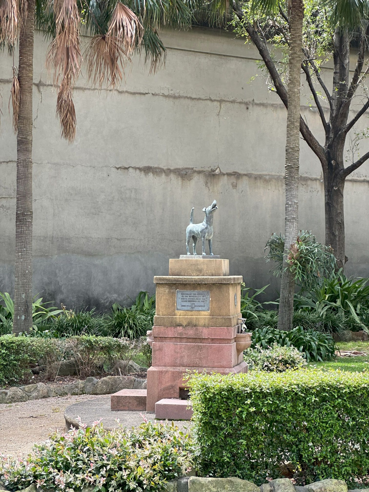

+++
author = "Sathyajith Bhat"
categories = ["Life"]
tags = ["weekly-notes", "gaming"]
places = "Sydney"
type = "post"
series = ["Weekly notes"]
url = "/weekly-notes-07-2025/"
title = "Weekly notes 07/2025"
date = 2025-02-16T12:00:00Z
summary = "Week 07 summary - a sunny, stormy week."
images = ["/weekly-notes-07-2025/thumb-bradfield-park.jpg"]

+++

_Thumbnail image: Bradfield Park is a small park just off Milsons Point train station featuring a statue of a dog. Occasionally, the dog is known to carry sticks or frisbees._

### What's been happening

It's been another hot and humid week. On Tuesday, we had a massive storm - something to the tune of getting a month's worth of rain in an hour and half. It was incredibly windy as well - I had gone to the gym to train when it was just about to start raining and by the time I was done, the storm was in full swing. I had to wait for a while before I could leave the gym. Looking at the forecast, more rain was on the horizon so I decided to walk back - there's ample awning on the buildings so I thought I wouldn't get wet. I was wrong. The wind was so strong that it was blowing the rain sideways and I got drenched. We didn't have rain for the rest of the week though.

I found out that Hans Zimmer is coming to Sydney in April and I was pretty excited about it. I've always wanted to see him live and glad that I managed to get tickets for the concert and can't wait for it.

My workouts have been going well. I hit some personal bests, managing to do 65kg barbell deadlift, 15kg on dumbbell bench press and 12.5kg on a dumbbell shoulder press. I'm happy with the progress I'm making. I'll probably work with the same set of weights for a couple of weeks before I increase them. My trainer also got me to do tempo squats - 3 seconds down, 1 second pause and 3 seconds up. It unlocked a new pain in my legs that I didn't know existed. My trainer believes it will help me with my squat form and strength.

Work was busy this week - as the scrum master I had to work to get the next sprint planned out while running the rest of end-of-sprint ceremonies. I also had to work on some things that came up unexpectedly.

Our guitar classes started this week. I'd barely practiced in the past few weeks, so I wasn't hopeful of doing well! We started our class with [PIMA movements](https://www.fender.com/articles/techniques/what-is-pima) and then did some practice for some basic chords. Luis, our instructor, taught us about [blues structures](https://happybluesman.com/introduction-12-bar-blues/), the chord progressions of a blues song and we also played a blues song. Our class has overlap with Luis' advanced guitar class students and with the combined class, we played Eric Clapton's Wonderful Tonight couple of times - once with the chords and the other with just the melody. My fingers still hurt after this class - need to practice some more and maybe get the guitar tweaked a bit.

  

After the classes, [Jo](https://joshenoy.me) and I picked up some fruits from the North Sydney Produce Market and were wondering what to do for lunch. We initially thought of going to a cafe near the North Sydney train station but I asked Jo if she'd want to walk a bit further towards Kirribilli and check out the taco place and she agreed. After lunch, we walked a bit more towards the Kirribilli Lookout and then walked back home. It was a nice walk and we got some good views of the city.

  

  

### What I've been playing 

I've been playing a lot of [Civilization VII](https://store.steampowered.com/app/289070/Sid_Meiers_Civilization_VII/) this week. I completed and won my first solo game - getting a science victory with [Himiko](https://en.wikipedia.org/wiki/Himiko), Queen [of Wa](https://civilization.2k.com/civ-vii/game-guide/leaders/himiko/) as my leader. I also started another multiplayer game with Kush and Abhay. I'll have a longer post on my thoughts on Civilization VII. I'm having fun with it, but there's a lot of [papercuts that Firaxis](https://mastodon.social/@Sathyabhat/114011340045904407) needs to address.

<blockquote class="mastodon-embed" data-embed-url="https://mastodon.social/@Sathyabhat/114011340045904407/embed" style="background: #FCF8FF; border-radius: 8px; border: 1px solid #C9C4DA; margin: 0; max-width: 540px; min-width: 270px; overflow: hidden; padding: 0;"> <a href="https://mastodon.social/@Sathyabhat/114011340045904407" target="_blank" style="align-items: center; color: #1C1A25; display: flex; flex-direction: column; font-family: system-ui, -apple-system, BlinkMacSystemFont, 'Segoe UI', Oxygen, Ubuntu, Cantarell, 'Fira Sans', 'Droid Sans', 'Helvetica Neue', Roboto, sans-serif; font-size: 14px; justify-content: center; letter-spacing: 0.25px; line-height: 20px; padding: 24px; text-decoration: none;"> <svg xmlns="http://www.w3.org/2000/svg" xmlns:xlink="http://www.w3.org/1999/xlink" width="32" height="32" viewBox="0 0 79 75"><path d="M74.7135 16.6043C73.6199 8.54587 66.5351 2.19527 58.1366 0.964691C56.7196 0.756754 51.351 0 38.9148 0H38.822C26.3824 0 23.7135 0.756754 22.2966 0.964691C14.1319 2.16118 6.67571 7.86752 4.86669 16.0214C3.99657 20.0369 3.90371 24.4888 4.06535 28.5726C4.29578 34.4289 4.34049 40.275 4.877 46.1075C5.24791 49.9817 5.89495 53.8251 6.81328 57.6088C8.53288 64.5968 15.4938 70.4122 22.3138 72.7848C29.6155 75.259 37.468 75.6697 44.9919 73.971C45.8196 73.7801 46.6381 73.5586 47.4475 73.3063C49.2737 72.7302 51.4164 72.086 52.9915 70.9542C53.0131 70.9384 53.0308 70.9178 53.0433 70.8942C53.0558 70.8706 53.0628 70.8445 53.0637 70.8179V65.1661C53.0634 65.1412 53.0574 65.1167 53.0462 65.0944C53.035 65.0721 53.0189 65.0525 52.9992 65.0371C52.9794 65.0218 52.9564 65.011 52.9318 65.0056C52.9073 65.0002 52.8819 65.0003 52.8574 65.0059C48.0369 66.1472 43.0971 66.7193 38.141 66.7103C29.6118 66.7103 27.3178 62.6981 26.6609 61.0278C26.1329 59.5842 25.7976 58.0784 25.6636 56.5486C25.6622 56.5229 25.667 56.4973 25.6775 56.4738C25.688 56.4502 25.7039 56.4295 25.724 56.4132C25.7441 56.397 25.7678 56.3856 25.7931 56.3801C25.8185 56.3746 25.8448 56.3751 25.8699 56.3816C30.6101 57.5151 35.4693 58.0873 40.3455 58.086C41.5183 58.086 42.6876 58.086 43.8604 58.0553C48.7647 57.919 53.9339 57.6701 58.7591 56.7361C58.8794 56.7123 58.9998 56.6918 59.103 56.6611C66.7139 55.2124 73.9569 50.665 74.6929 39.1501C74.7204 38.6967 74.7892 34.4016 74.7892 33.9312C74.7926 32.3325 75.3085 22.5901 74.7135 16.6043ZM62.9996 45.3371H54.9966V25.9069C54.9966 21.8163 53.277 19.7302 49.7793 19.7302C45.9343 19.7302 44.0083 22.1981 44.0083 27.0727V37.7082H36.0534V27.0727C36.0534 22.1981 34.124 19.7302 30.279 19.7302C26.8019 19.7302 25.0651 21.8163 25.0617 25.9069V45.3371H17.0656V25.3172C17.0656 21.2266 18.1191 17.9769 20.2262 15.568C22.3998 13.1648 25.2509 11.9308 28.7898 11.9308C32.8859 11.9308 35.9812 13.492 38.0447 16.6111L40.036 19.9245L42.0308 16.6111C44.0943 13.492 47.1896 11.9308 51.2788 11.9308C54.8143 11.9308 57.6654 13.1648 59.8459 15.568C61.9529 17.9746 63.0065 21.2243 63.0065 25.3172L62.9996 45.3371Z" fill="currentColor"/></svg> 
Post by @Sathyabhat@mastodon.social
 
View on Mastodon
 </a> </blockquote> 

  

  

  

  

  

  

And of course, I have to give a shout out to [Kush](https://bsky.app/profile/kushu.bsky.social) for this amazing meme he made to my comment on "We should get [Patali's](https://x.com/sharathpatali) headshot in game"

  

  

### What we ate

[El Classico Tacos, Kirribilli](https://maps.app.goo.gl/5iXkwdRtgvpEYkMYA): A taco place that Jo has been meaning to go since [a while now](/weekly-notes-04-2025/), but never got to.  We ordered the pork tacos, chicken quesadilla and jalapeno poppers. The food was pretty OK, nothing awesome. Mexican food in Australia still manages disappoint us. We will probably not return to the place.

  

  

  

  

  

[Bon Pollo, North Sydney](https://maps.app.goo.gl/9ft8iSK8oqxg1EVm8): Came across this small Lebanese place when we were on our evening walks, we visited the place first last week and really loved the food and wanted to go back. The Adana Kebab is probably the best lamb kebab I've had, and the grilled chicken and hummus was pretty good as well.

  

  

  

### Music of the Week

I love it when YouTube throws recommendations from a decade ago out of nowhere. This live performance from MGMT covering their [Electric Feel](https://www.youtube.com/watch?v=yjzuInKBxY0) is pretty good.

  

### Link of the week

I came across this nice series of articles from [Adrian Cockcroft](https://mastodon.social/@adrianco) on how he built his career. The series is called [What Adrian Did Next](https://adrianco.medium.com/what-adrian-did-next-part-1-starting-out-e256e04db50d) and makes for a good read.

### This week last year

One of the reasons I started writing weekly notes was because it was nice to know what I was doing last year around the same time. Last year's weekly notes reminds me we had just moved over to North Sydney and were busy packing/unpacking. Here's the [weekly notes from last year](/weekly-notes-07-2024/).

### Thanks for reading.

Thanks for reading and have a great week ahead.

Subscribe to my weekly notes:

- [Email newsletter](https://sathyabhat.substack.com/)
- [RSS feed for the weekly notes](https://sathyabh.at/series/weekly-notes/index.xml)
- [RSS feed for my site](https://sathyabh.at/index.xml)
