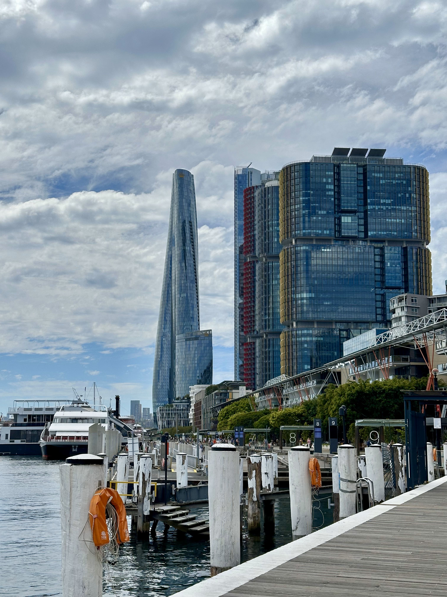

+++
author = "Sathyajith Bhat"
categories = ["Life"]
tags = ["weekly-notes", "gaming", "Civilization VII", ]
places = "Sydney"
type = "post"
series = ["Weekly notes"]
url = "/weekly-notes-08-2025/"
title = "Weekly notes 08/2025"
date = 2025-02-23T12:00:00Z
summary = "Week 08 summary - planning for Easter holidays, guitar class and a walk across the Sydney Harbour Bridge."
images = ["/weekly-notes-08-2025/thumb-crown-international-towers.jpg"]
+++

_Thumbnail image: Crown Sydney is the tallest building in Sydney and is flanked by The International Towers._

### What's been happening

It’s been a pretty good week. We've got some holidays coming up in April for Easter. We decided to take a trip to Canberra. Why Canberra? Well, it was one of the few places we hadn’t visited yet and as a bonus, I had some points thanks to Marriott Bonvoy so decided to use them. For now, we've only booked the hotel, we'll figure out things to do at a later point. I have some points from my employer as part of anniversary milestones, so we probably will use them to figure out if there's something interesting and book it.

Jo's cousin sister is visiting us - they're coming over to see the [Andrea Bocelli performance](https://en.wikipedia.org/wiki/Andrea_Bocelli). Jo had mentioned she was interested in the concert, and with her cousin coming over, we got tickets for the concert as well. It's nice to have them visit us - last time they were here was [last year](/weekly-notes-13-2024/) and we did a road trip to Bowral and Jervis Bay. This time around they're here for a couple of days so we'll do something local.

We continued our guitar class. We learnt a variation of the blues song we learnt last week as well as practicing Coldplay’s Yellow, Eric Clapton's Wonderful Tonight & Cranberries' Zombie. Of all the songs, Yellow messes my brain the most because we start with chord, switch to melody and back to chords again. There’s sections where we repeat, sections where we jump back and repeat and seeing the chords, and coda symbols confuses me so much that my brain just gives up. Hopefully I’ll get better at it.

Jo asked if we could do walk across the Sydney Harbour Bridge walk last week and I wasn't feeling up to it. On Saturday evening, the weather was nice and since we had nothing planned, we decided to do the walk. We started off with a Bus to Milsons Point (and while we were walking halfway to the bus stop, I realized I left my phone home). Once at Milsons Point, we took the lift to the bridge level and had a nice walk across the bridge. The walk across the bridge was only about 1.8kms and took about half hour. Granted we stopped at different points to take some photos and videos - but it was a really nice walk. Also worth mentioning it was incredibly breezy and we thought we would get blown away a few times! As we got off the bridge, we went walking over to The Rocks and had dinner at a German restaurant. Post dinner, we walked over to Circular Quay (another 500 meters away) and took a ferry back to McMahons Point and took the bus home. It was a lovely evening.

  

  

  

  

  

  

  

This Sunday morning, I saw a mention [on Mastodon with](https://aus.social/@web_goddess/114045054750878262) a blog challenge from [Kris](https://www.web-goddess.org/archive/54805) and I thought it would be a good idea to take it up. The blog post is now live on my blog - [A challenge of blog questions](/blogging-challenge-blog-questions/) - it was fun to write and I hope you enjoy reading it. I also encourage you to take it up as well and send me a link to your post.

### What we watched

[NCIS Sydney](https://trakt.tv/shows/ncis-sydney): A spin-off of the popular NCIS series. The series features NCIS agents working together with Australian Federal Police working on investigations on crimes involving American Naval personnel. The series starts off a bit slow and uninteresting but doesn’t take long to develop a season-wide ongoing plot. The plot is fairly generic and doesn't take long for you to start predicting what's going to happen next. The series is set in Sydney and it's nice to see familiar places being shown on TV. To be honest, one of the reasons why Jo and I continued watching NCIS because it's fun to see places we've been to being shown on TV. We finished watching the first season - which ends on a cliffhanger. I am really annoyed when series do that. We haven't yet seen the second season yet but we should be watching them next week.

### What we ate

[POPO Gourmet, North Sydney](https://maps.app.goo.gl/crLLYfT64ejK8FVP9): A relatively new Malaysian restaurant. Jo wanted something light and thought of getting Mee Goreng Instant Noodles. I was more interested in the Char Kway Teo and asked Jo if she was ok with that and she said yes. I’m pretty glad we ordered the Char Kway Teo because it was really good. The noodles were light, had just the right amount heat, the chicken was grilled nicely as well. It actually reminded me of some of the Chinese food we’d have back in India. I was feeling a little hungry as we’d shared this one, but I’d also ordered a curry puff and that was pretty good too- good pastry and the filling was great. Will definitely revisit.

  

  

  

  

  

[Munich Brauhaus Sydney, The Rocks](https://maps.app.goo.gl/5bBWuKDWwTnGKR5Y6): A German beer hall in The Rocks. We had dinner here after our walk across the Sydney Harbour Bridge. They had some some live performers who really good and I decided to walk in to listen to them - only for for them to go indoors as we got an outdoor table 😑 Being at a German beer hall, I had to order some beer - and we ended up getting a 1L Franziskaner Hefe Weissbier beer. For food, we ordered the platter which had crackling pork belly, frankfurter, kielbasa, cheese kransky, chicken
schnitzel, sauerkraut, red cabbage and creamy mash. Barring the crackling pork belly(which wasn't quite as cracking), we enjoyed the food. We also had a cheesy jalapeno pretzel as a side which was pretty average. The service was good and the staff were friendly. We had a nice time here.

  

  

  

  

  

  

### What I’ve been playing

I'm on my second game in Civilization VII, this time taking on Ashoka as the leader. I've done the age transitions into the Modern era - starting with the Mauryan Empire for Antiquity age, Cholas for the Exploration age and Mughals as the Modern age. I've been playing couple of hours every day for the past week and while I still have a lot of gripes with Civilization VII, I've found many of the new changes quite welcome. There are also some nice touches - for example snow lying on the ground when there was a blizzard, or the wonder completion celebration showing Holi colours when you complete the Red Fort (as compared to the usual confetti) and these are a nice touch.

  

  

  

  

I also noticed some nice free games in Amazon Prime:

- [Hardspace: Shipbreaker](https://gaming.amazon.com/hardspace-shipbreaker-epic/dp/amzn1.pg.item.ed98da68-f035-4553-96ab-1049277a5751?ingress=amzn)
- [The Outer Worlds](https://gaming.amazon.com/the-outer-worlds-gog/dp/amzn1.pg.item.538ee4d5-dbf8-48d9-a835-44062e2acec0?ingress=amzn)
- [Bioshock Infinite Complete Edition](https://gaming.amazon.com/bioshock-infinite-complete-edition-gog/dp/amzn1.pg.item.f69e4c99-25ab-43d9-9ad8-393c9f19eb1e?ingress=amzn)
- [Elite Dangerous](https://gaming.amazon.com/elite-dangerous-epic/dp/amzn1.pg.item.26dc4db5-9ad6-4a58-bd73-276adf5411bb?ingress=amzn)
- [Deus Ex: Game of the Year Edition](https://gaming.amazon.com/deus-ex-game-of-the-year-edition-gog/dp/amzn1.pg.item.ccd55f15-26b4-4e82-9531-af85e40a4045?ingress=amzn)

I am reminded that Deus Ex is now 25 years old. Jeez. I played a lot of it during my PU days 😅 What a masterpiece. It's not aged well but it's still a great game.

### Music of the Week

Was reminded of Dave Matthews Band and this fabulous rendition of #41 from 1999 is just [sublime](https://www.youtube.com/watch?v=oIQuQqhnLHw).



### Link of the week

Gina Trapani made a week-by-week map of her life, and I think it’s [fantastic](https://weeks.ginatrapani.org/). I love the idea of mapping out your life like this. I might try to do something similar. Gina's code to generate this uses [Hugo](https://github.com/ginatrapani/life-in-weeks), which is what I use as well.

### Thanks for reading.

Thanks for reading and have a great week ahead.

Subscribe to my weekly notes:

- [Email newsletter](https://sathyabhat.substack.com/)
- [RSS feed for the weekly notes](https://sathyabh.at/series/weekly-notes/index.xml)
- [RSS feed for my site](https://sathyabh.at/index.xml)
