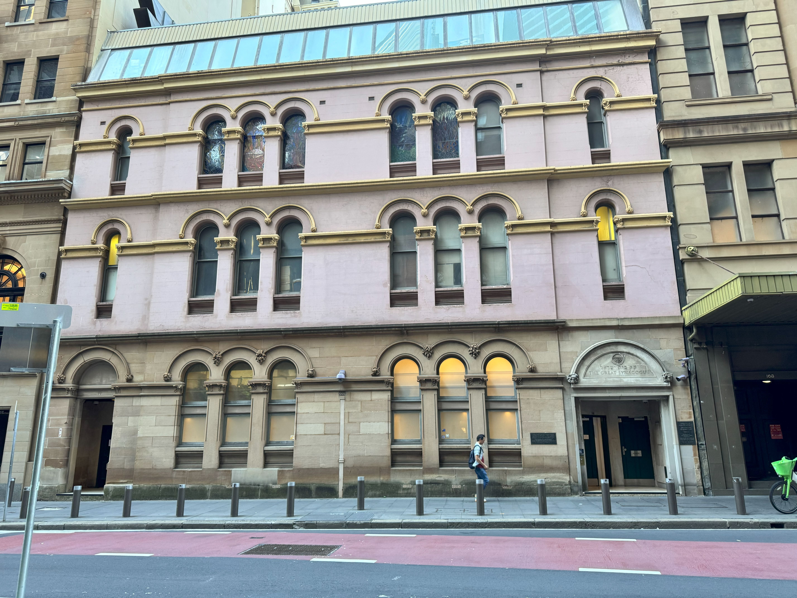

+++
author = "Sathyajith Bhat"
categories = ["Life"]
tags = ["weekly-notes", "gaming", "concert"]
places = "Sydney"
type = "post"
series = ["Weekly notes"]
url = "/weekly-notes-09-2025/"
title = "Weekly notes 09/2025"
date = 2025-03-02T12:00:00Z
summary = "Week 09 summary - first concert of the year, humid week, and more."
images = ["/weekly-notes-09-2025/thumb-great-synagogue.jpg"]
+++

_Thumbnail image: The Great Synagogue is an Orthodox Jewish congregation located in a heritage-listed synagogue in Sydney. The congregation is the oldest in the Sydney Jewish community._

### What's been happening

We're in March already. How has the time gone by so fast? March also means it's my birthday month. We usually don't celebrate big, so probably will have a small quiet dinner with Jo. Or as I'd like to call it - yet another day. Jo & I also picked up electric toothbrushes for ourselves. We've been using them for a few days now and it's been a good experience so far. It was kinda weird the first time I used it - felt like a massager on my teeth. After a couple of runs, I've gotten used to it now. Also not sure if it's just me but I feel like my teeth are cleaner now. Jo reports the same. We'll see how it goes but so far, so good.

This week, however, has been rather humid. The temperatures haven't been that high but the humidity levels have been uncomfortably high. On most days, since I'm in the office it's not that big of deal. I've had to use the aircon at home a few times this past week.

This week's workout has been pretty good, with another set of personal bests - 70% of body weight on the deadlift. However, those two sets where I hit my PB really wrecked my lower back for the next couple of days. It's doing a lot better today and hopefully, it'll be back to normal by tomorrow - which is when my next session is. I'll let my trainer know about this and see if we can do something about it - probably reduce the weight and focus on form till I get it right.

Work wise, it's been a pretty busy week. We started another sprint, my third as a scrum master. I'm still trying to figure out how much stories I should queue up for the sprint ahead. My Jira duties as a scrum master has taken over a lot of my coding time. I'm in meetings most of the day and by the time I'm done with them, I'm too tired to code. I'll try to carve out some time to get some coding time in. 

Earlier in the week, I had a problem with a change that I authored - post the change, [Temporal.io](https://temporal.io/) workers went on a crashloop while trying to bundle my temporal JavaScript function. I'm not sure why the change caused, this as it's a fairly straightforward change. I had to rollback my change and take a look next week to see what's causing the trouble.

On Friday afternoon, just as I was about to sign off, I saw a message from one of the Principal Engineers on the bidding team asking if there was anyone around related to a test we were running. It turned out we were having an incident with out bidding systems and he wanted to check if the test we were running had an effect to the bidding systems. When one of the team members explained what was happening, I realized it might be due to Client IP Preservation on the AWS Network Load Balancer being disabled. I updated the target group configuration to enable it and we started seeing an immediate recovery. In my previous role at Adobe, I've worked on migrating our ingress load balancers to NLB and this helped me realize what might be going wrong. It was a good feeling to be able to help out in a situation like this.

On Friday evening, we went to our first concert of the year - it was Stone Temple Pilots performing at the ICC Sydney with Wolfmother supporting them. I've been listening to both artists for a while now and didn't want to miss them. Wolfmother set the tempo for the show, belting out popular hits like "Another Dimension", "Woman" and "Joker and the Thief". Stone Temple Pilots came next and this was their 30th anniversary of "Purple" tour. The Purple album starts a bit slow and this was evident with the crowd reaction, but as the band moved on getting to their popular songs, "Vasoline", "Interstate Love Song",  the crowd started to get into it. Post the "Purple" album, they played a few more popular songs including "Plush" and "Dead & Bloated". "Creep" was the most conspicuous absence from the setlist. The band was awesome, ICC always has good sound, and we enjoyed the concert.

  

  

  

  

  

  

  

  

  

  

  

Our guitar classes have been progressing well. In this week's class, we practiced more of the "Cruising in Blues" tunes, as well as well as practice of Tightrope, Coldplay's Yellow, Eric Claptop's Wonderful Tonight and a new song this time - The Beatle's Eleanor Rigby. Her's some clips from our class this week.

  

  

On Sunday morning, we went over to Crow's Nest - Jo wanted to buy some running shoes and wanted to check out a running store there. Before we went over there, we stopped by Double Cross Dining Room for breakfast. Brunch done, we walked over to the store and Jo was able to pick up a shoe that suit her. We then walked over to the nearby music store to check out some guitars. I wasn't looking to buy one but now that we've been playing for a bit, I figured I'd be in a better spot to see if I can find differences between different guitars. Unfortunately, the shop was closed so we decided to head back home.

### What we ate

[Doodee King, Darling Quarter](https://maps.app.goo.gl/AN29yRzR9eYkqZkD8) - A Thai restaurant that Jo wanted to checkout - we stopped by here for dinner prior to the Stone Temple Pilots concert. We ordered the Pad See Ew and Chicken Wings. I had also ordered a pork appetizer that I cannot remember the name for. The food was pretty good. The Chicken Wings were bland by themselves but the sauce gave them a nice flavour. The Pad See Ew had a nice smoky flavour it. Overall, we enjoyed it.

  

  

  

  

  

[63 Degrees Cafe, North Sydney](https://maps.app.goo.gl/qFvnqGRgQ44kp7Sb9) - A favorite cafe of ours and one that we visit fairly regularly - 63 Degrees has some really good coffee which is the primary reason to visit here. They also have some seats outside by the road, in the cafe as well as a few backyard tables. I ordered an Iced Mocha for change while Jo experimented with a funky Oat Strawberry Matcha Latte. She said it was pretty good - I'm not used to hearing "good" and "strawberry" in the same sentence from her. For food, I ordered a Massaman curry which with rice _and_ roti while Jo ordered a Satay Chicken as she wasn't very hungry. The curry was nice and the roti was really nice and crispy. Always a good place to visit. 

  

  

  

  

[Double Cross Dining Room, Crow's Nest](https://maps.app.goo.gl/7Q6ZQ6Q7Q6ZQ6Q7Q6) - We stopped by here for breakfast on Sunday morning. I ordered the triple-egg crab omelette while Jo got the Fried Chicken Waffles. We chose this place as it was reviewed to have good coffee but we didn't find it that great. The omelette was nice but a bit bland - and it seems to balance it out the crap was a bit salty. Jo's Fried Chicken Waffles was nice but the waffles were a bit dry. The lines for the cafe were pretty long, so it seems to be a popular place. There's a few more good cafes around this area so might not be a while since we come back here.

  

  

  

### What I've been playing

It's been another week of Civilization VII - This week, I won my second game - an Economic victory. I took Ashoka as my leader, taking on India as my Civilization of choice - starting with Maurya for Antiquity age, Cholas for Exploration age and Mughals for Modern age. I wanted to try to get the Economic victory and much like the Science victory, it was fairly easy to achieve, arguably even easier than science victory. I have started yet another game with Tecumseh as my leader. With over 60 hours of gameplay in Civilization VII, I've got a decent hang of things in it. I will devote less time to it and will go back to completing Path of Exile 2 campaign and then back to Diablo IV as there's a mid-season Goblin event starting this week.
There's couple of major balance patches coming in for Civilization VII at the end of the month and I'll wait till these are out before I start another game.

### Music of the Week

Anthony Vincent has been doing a lot of covers of popular songs in different styles since quite some time, and I came across his version of Seal's Kiss from A Rose in the style of Metallica.  I think it just might be some of his best work yet. Check it out [below](https://www.youtube.com/watch?v=IRgQld2sJ9Y) 

  

### Link of the week

[Barcamp Bangalore](https://barcampbangalore.com/bcb/) is happening on March 8th, 2025. I'm quite fond of Barcamp Bangalore - for it's where I made a lot of friends, got my career a second life and met so many interesting people.

If you're in Bangalore on March 8th, head over to The Takshashila Institution (2nd floor) and Samagata Foundation (4th floor), Cobalt Building
Church Street and you can register/RSVP for the event [here](https://barcampbangalore.com/bcb/).

### Thanks for reading.

Thanks for reading and have a great week ahead.

Subscribe to my weekly notes:

- [Email newsletter](https://sathyabhat.substack.com/)
- [RSS feed for the weekly notes](https://sathyabh.at/series/weekly-notes/index.xml)
- [RSS feed for my site](https://sathyabh.at/index.xml)
