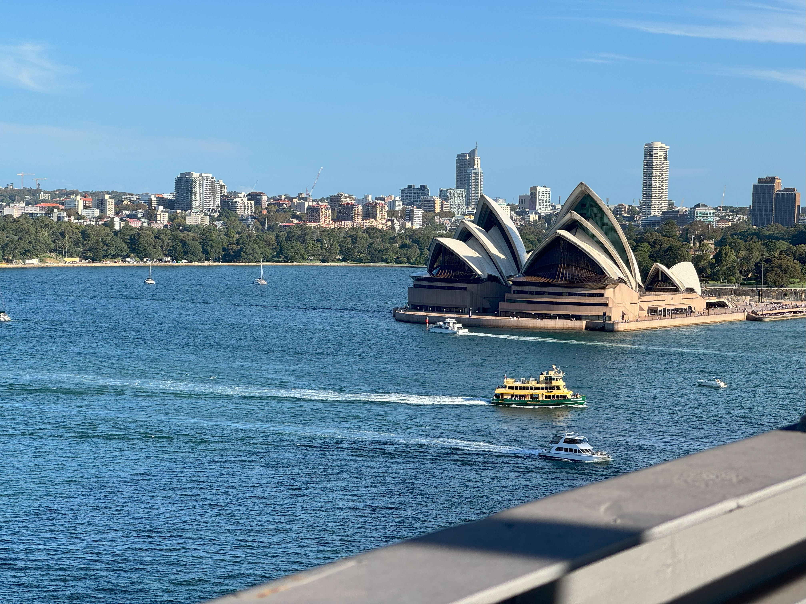

+++
author = "Sathyajith Bhat"
categories = ["Life"]
tags = ["weekly-notes", "gaming", "motorsport"]
places = "Sydney"
type = "post"
series = ["Weekly notes"]
url = "/weekly-notes-10-2025/"
title = "Weekly notes 10/2025"
date = 2025-03-08T12:00:00Z
summary = "Week 10 summary - vroom, vroom, vroom, and some good food."
images = ["/weekly-notes-10-2025/thumb-sydney-opera-house-harbour-bridge.jpg"]

+++

_Thumbnail image: A view of the Sydney Opera House from the Harbour Bridge._

### What's been happening

It's been a fairly cloudy week. Parts of Brisbane and Gold Coast have been hit by Cyclone Alfred which prompted cyclone warnings and evacuations. Jo's cousin, who lives near Brisbane, had to move their furniture and other large breakables away from windows and doors. Thankfully, by the time the cyclone hit, it had weakened and downgraded to a tropical storm. There's still a lot of damage done, especially to the coast line and the beaches. I'm glad the cyclone weakened; it would have been devastating, especially with the weakened storm being [destructive](https://www.9news.com.au/national/tropical-cyclone-alfred-live-updates-tracker-forecast-map-full-list-of-whats-closed-whats-open-mainland-crossing-nears-amid-flooding-risks/7815a981-0b89-4b40-b35b-41fe609e8413).

Earlier in the week, I found out that there's an auto show in Bathurst. Jo & I have been meaning to head back to Bathurst for a while now, and with this show along with the news from our guitar instructor that this weekend's class would not be happening, we decided to head to Bathurst. I booked the hotel, our rental car, tickets to the show and we were all set. Mid-week, I realized there's also Race of Champions happening in Sydney this weekend, which I had tickets for. Usually we add events to our shared calendar to prevent double booking like this; however I forgot to add this to the calendar and had completely forgotten about the event. In the end, we decided to cancel our Bathurst visit (the accommodation and the rental was refundable).

That said, the Race of Champions was a blast. The Race of Champions is a head-to-head competition featuring drivers from several different disciplines (Formula 1, Supercars, WRC etc.). I had bought the tickets long ago and wondered how they would have it at Accor Stadium - not a motorsport park. Well, they had a track setup inside the stadium! The event was spread over two evenings, with Friday evening hosting the Race of Nations (where drivers were competing based on the nationality) and Saturday was an individual head-to-head race. The event was a blast, we had lots of fun watching the cars go against each other. There was a lot of action, some really close races and some nice jumps and drifts.

  

  

  

  

  

  

  

Since my guitar class was cancelled, I took time from Saturday morning (which is our guitar class time) to head to Manny's to get my guitar checked. I have been having trouble playing it - felt like no matter how I held the chords, I just couldn't get them right. At Manny's, I asked the guitar technician to take a look at it and suggest alternative strings (original plan was to get it restrung with some light strings). The tech suggested that I have the guitar set up right - the strings were way too high and a neck adjustment should correct this. If I'm still not happy with the changes post set up, to return to get it restrung. I got the guitar set up done and it's much easier to play now. While I'm still learning, I wanted to remove any bit of friction to prevent me from playing so I'm glad I got this done.

I mentioned last week that my PB for the deadlift [wrecked my back](https://sathyabh.at/weekly-notes-9-2025/). For Monday's workout I reported to my trainer and he changed the workout to a light one, focusing on recovery and stretching. I didn't lift any weights, just stretches and lunges. He also asked me to continue with the stretches for a few days and that really helped me with recovery. For Friday's session I wasn't 100%, but I felt good enough to do deadlifts at 60% bodyweight without affecting my back. I'm glad I'm back to lifting weights, even if it's at a lower weight.

### What I played

I completed my third Civilization VII game, this time taking on Tecumseh as my leader, with Mexico as my Modern era civ. I won the game building the World's Fair, instantly achieving a cultural victory. Of the three victories so far, the cultural victory was the easiest, hardest and the most boring - hear me out. The cultural victory consists of you sending Explorer units to specific sites to find out where the relic dig sites are and then sending the explorers to the dig sites. The problem is that the AI right now does an Explorer rush to get tens of Explorers and monopolize the relics, leaving you no way to get the relics and thus the cultural victory. Firaxis' new patch has sort of fixed this but with another patch due in couple of weeks, I'll wait it out before starting another game.

  

  

  

For now, I have returned to Path of Exile and lookign to complete the campaign - I'm the in the last few portions of Act III - just that the maps are ridiculously large taking a long time to get through it. Meanwhile, here's a [video of a mini boss fight](https://www.youtube.com/watch?v=eouRZBZzW3c).



### What we ate

[Layered Cafe, St Leonards](https://maps.app.goo.gl/we3VBSoZ4tNE29JB8) - When Jo was looking for cafes last week, Double Cross Dining and Layered Cafe were the two places that caught her eye. We decided to head to Layered Cafe this week for breakfast, since it's by Manny's. The cafe doesn't have an "appealing" front entrance, but had really nice reviews so we went there. Apart from our usual coffees, Jo ordered the savoury pancake (really it should be called scrambled egg with roti) and I had the pastrama hash. The pastrama hash came with some gravy that was so incredibly awesome. When paired with the roti, it was even better. I'm not the one for remembering favourite dishes, but this one is definitely up there. The coffee was really good too. I'd definitely recommend this place for breakfast and would come back again. Before we left, I talked to the person at the counter and suggested to her to include the roti as an option for the pastrama hash. Not sure if they'll take it up, but I hope they do.

  

  

  

  

  

  

  

  

[Myeongdong, Chatswood](https://maps.app.goo.gl/4QcZn5jEN283kzSYAa) - Jo felt the urge to have Korean food after watching some Korean shows where they were having a Korean BBQ and thus we went here for dinner. We were quite hungry (had skipped lunch), but didn't want to get the BBQ. We ordered the kimchi pancake, spicy pan fried pork, and boneless fried chicken. The kimchi pancake was really good - we were actually surprised by how large it was. The fried chicken was just a bit too sweet, but for me the star dish was definitely the spicy pan fried pork - it wasn't really too spicy and was incredibly amazing, just the right spice and heat levels and goes with the fried chicken perfectly. Definitely recommend this place for future visits.

  

  

  

  

  

### Music of the Week

I didn't realize that Creed was on a decade-long hiatus, but they're back. Thanks to YouTube's algorithm for recommending [Creed Reunited and Unplugged](https://www.youtube.com/watch?v=P7DWcyB9ElQ) video.



### What we watched

The Amazing Race Season 37 - The Amazing Race Season 37 is back, this time with two extra teams, a few extra twists and turns. The first episode was fairly alright - no surprises in the eliminations. The new "fork in the road" play that gets so hyped ends up being a damp squib to be honest. I love that the teams go on an inter-continental trip right away (and to Hong Kong, that too) but the two flights being an hour apart.. just kills any thrills. It seems like the party moves to Japan the next episode. Look forward to seeing it.

Clarkson’s Farm - Jo wanted to watch something together, I suggested this. She fell asleep in about 30 mins (or about the first half) of the first episode. Not sure if we will continue watching this together. I'll probably re watch this on my own.

The Good Detective - Jo insisted on me watching this, so I tagged along. The Good Detective is a Korean drama that follows the story of a death row inmate who is set to be executed, and there's now evidence showing up that he was framed. The lead detectors is a veteran who was the investigative officer who arrested the accused, while the other is a younger detective from an elite squad who also seems to be quite loaded. I will never understand why many of the South Eastern shows drag out the episodes so much. The 'twists' at the second of the second episode are probably something that could have been done in the first episode itself. That said, the premise is interesting, so lets see how it goes.

### Link of the week

A wonderful essay from Lars Wirzenius on [the early days of Linux](https://lwn.net/Articles/928581/)

> These are my memories of the earliest days of Linux, its creation, and the start of its path to where it is today... In 2023. Linux is running on every continent, on every ocean, on billions of devices, in orbit, and on Mars. Not bad for what started as two threads, writing streams of As and Bs on the screen.

### Thanks for reading.

Thanks for reading and have a great week ahead.

Subscribe to my weekly notes:

- [Email newsletter](https://sathyabhat.substack.com/)
- [RSS feed for the weekly notes](https://sathyabh.at/series/weekly-notes/index.xml)
- [RSS feed for my site](https://sathyabh.at/index.xml)
