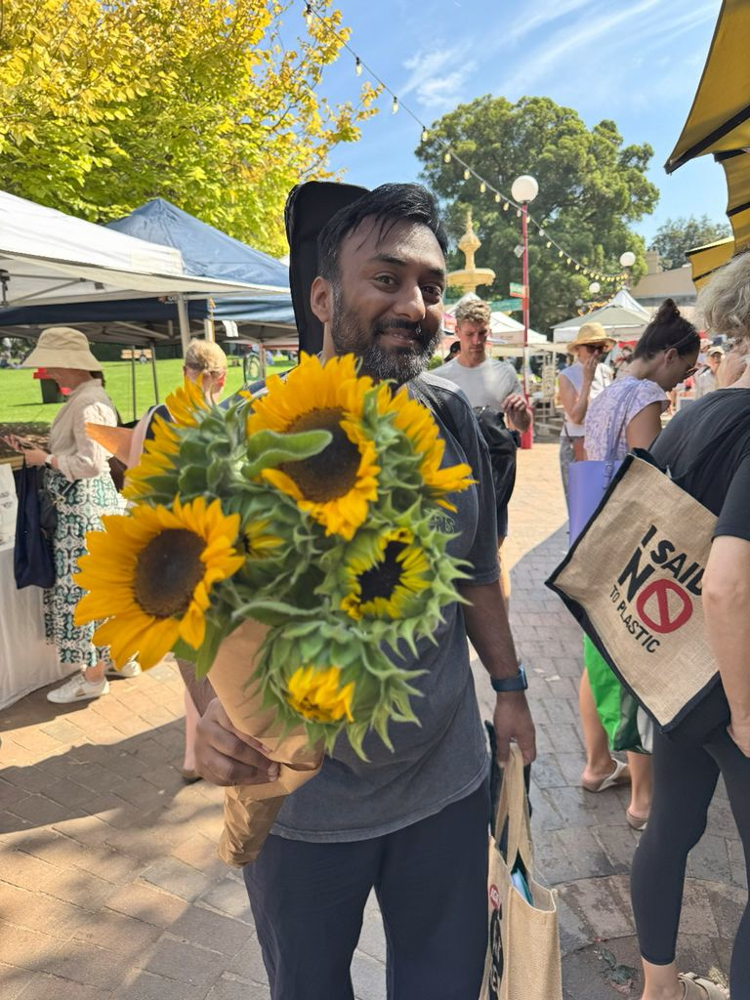

+++
author = "Sathyajith Bhat"
categories = ["Life"]
tags = ["weekly-notes", "gaming", "Path of Exile 2", "concert"]
places = "Sydney"
type = "post"
series = ["Weekly notes"]
url = "/weekly-notes-11-2025/"
title = "Weekly notes 11/2025"
date = 2025-03-16T12:00:00Z
summary = "Week 11 summary - a hot week in Sydney."
images = ["/weekly-notes-11-2025/thumb-sunflowers.jpg"]
+++

_Thumbnail image: The North Sydney Produce Market brings fresh produce and artisan food goods and is held on the first and third Saturday of every month ._

### What's been happening

It's been a pretty terrible week. Work was a bit meh. After last week's cloud cover, it's been a hot and humid week here in Sydney. There's a heatwave warning issued and even a fire ban for the weekend.

As I get older, I'm firmly moving away from my tinkering mindset into the “if it ain't broken, don't fix it” mindset.

I decided to install Home Assistant on my [NAS](https://sathyabh.at/tag/nas). Home Assistant comes with widgets and control center shortcuts - something that I was missing in Google Home and having to open Google Home app to turn off the lights is just too annoying. Usually I run apps on the NAS using Docker, not by installing the app using Asustor's AppStore. Jo was preparing dinner and called me to help her, so I thought I'll install Home Assistant using Asustor's AppStore. Well that was a bad choice - that install ended up upgrading the Docker engine which generally hasn't been a problem thus far. This time, it wiped out all my running containers, custom networks, heck even the docker volumes. Thankfully I didn't lose most data since I had configured all containers to use bind mounts instead of docker volumes.

Some of the containers I was running didn't have docker-compose files so had I had to recreate the containers. I use Portainer for the container management that was installed via the Asustor AppStore and the data from Portainer was also wiped out. In the end, I spent a couple of hours trying to get everything back together. So much for saving time. I did lose about a year's worth of location history because [OwnTracks](https://sathyasays.com/2024/07/13/self-hosting-owntracks-google-maps-timeline-alternative/) was accidentally configured to use Docker Volumes instead of bind mount. Oh well, I might consider writing something to export data from Google Maps into OwnTracks at a later point.

There were a bunch of positives though. I'm back to my usual weights while doing lifts & squats at the gym. My back doesn't have the niggle any more. I beat my PB when doing dumbbell bench press (17.5 kilos) and dumbbell shoulder press (12.5 kilos). I got my Internet plan upgraded to 780 Mbps down/40 Mbps up connection. I still don't understand why NBN and Australian ISPs refuse to offer symmetric connections, even for those on Fiber unless you go for business/enterprise plans. It's absolutely idiotic. I will switch at some point to Aussie Broadband once my modem's contract is complete (another ~4 months to go) - but for now I got my ISP to offer the upgraded plan (previously at 100 Mbps down/40 Mbps up) for the same price as the current for 6 months.

We're back to our guitar class and it was a bit of a tough one - we learnt and played [Smile](<https://en.wikipedia.org/wiki/Smile_(Charlie_Chaplin_song)>) - which is fair bit more technical and challenging than what we've done before. Post the guitar class, we went over to the fortnightly North Sydney Produce market, picking up our usual staple groceries. 

  

We also met Jo's friend who lives nearby and after the grocery shopping and dropping the produce back home, we went over to 63 degrees Cafe. After spending couple of hours at the cafe, we came back home to watch the Melbourne Grand Prix races.

Sunday was a bit of chill day, we watched more of the Melbourne Grand Prix. The rains came in heavy in Melbourne and the safety car was involved quite a few times. We watched the race till about halfway - post that we stepped out to head to St Leonards Park as the North Sydney Symphony Orchestra was performing. The Orchestra performed quite well and thankfully the cloud cover plus our place by the tree gave us respite from the heat. The Orchestra played some great music including Johann Strauss' Tritsch-Tratsch-Polka, Tchaikovsky's Polonaise from Eugen Onegin and also a surprise inclusion of Bella Ciao (as made famous by Money Heist/La Casa De Papel).

  

  

  

  

### What I've been playing

Been another week of Path of Exile 2 for me. I'm very close to finishing the final Act but getting here has been a huge slog. The map sizes are ridiculously large, lots of places where enemies overwhelm you, or you have to backtrack or champions stun-lock and one-shot you. When you die, you're resurrected at the last checkpoint which so far hasn't been a problem but given how long the maps are plus with the enemies overwhelming you, it's been a real slog and in many ways a case of one step forward, two steps back. Here's couple of boss fights

  

  

### What we watched

Wheel of Time, Season 3 - We started watching the previous season with a weird sense of Deja vu and me telling Jo “we've seen these episodes!” After a few minutes of trying to recall what exactly we should be watching, catching up on the events of season 2, we started watching the new season. After the first two episodes, I'm still quite confused about what the heck is happening. There's a lot of fighting, bunch of spells, some merrymaking (!?) when they are supposed to remain hidden, a bunch of jibber-jabber dialogue, double/triple-crossing all makes for one very befuddled story telling. We'll have to wait and watch and see how this progresses.

The Amazing Race, Season 37 - Second episode of Season 37 is pretty decent. The teams travel to Osaka, Japan where they take on choices of sumo wrestling or pounding rice to form mochi. The “intersection” forces teams to wait for second team and perform the task together. Overall, good watch and should be interesting to see how the race progresses.

### What we ate

[Sakura, North Sydney](https://maps.app.goo.gl/6ka7hR2dyvh8JydKA?g_st=com.google.maps.preview.copy) A nice little Japanese restaurant right next to Saravana Bhavana, Sakura's got nice cozy interiors as well as some nice outdoor seating. We ordered some Sake and after seeing the size of the bottle we realized we made a big mistake. The food was really good - we ordered the Renkon chips, chicken roll for Jo and teriyaki wagyu stir fry for myself. After downing the entire bottle split among ourselves and somehow not managing to fall over, we went over to the Twilight Food Fair and grabbed couple of Salted Caramel & White Chocolate gelato!

  

  

  

  

  

  

  

  

### Music of the Week

I started listening to Blackstrat Blues quite late (only about a few years ago) but I'm glad I did - they have some amazing songs, and watching them perform live in [the GearHouse sessions](https://www.youtube.com/watch?v=vvnHNoJoGXI) are even better.

  

### Link of the week

Ben Boyter [writes about](https://boyter.org/posts/searchcode-bigger-sqlite-than-you/) how he ended up building quite possibly one of the largest SQLite databases for a public facing website. Fabulous post which dives into the history of his product, [searchcode.com](https://searchcode.code) and all the changes that have been done since inception.

### Thanks for reading.

Thanks for reading and have a great week ahead.

Subscribe to my weekly notes:

- [Email newsletter](https://sathyabhat.substack.com/)
- [RSS feed for the weekly notes](https://sathyabh.at/series/weekly-notes/index.xml)
- [RSS feed for my site](https://sathyabh.at/index.xml)
