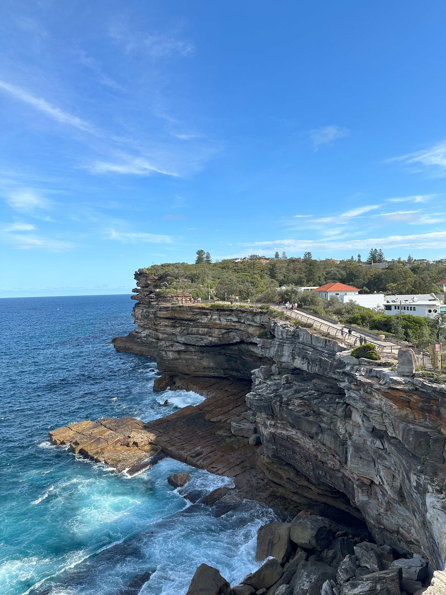

+++
author = "Sathyajith Bhat"
categories = ["Life"]
tags = ["weekly-notes", "gaming", "concert", "birthday"]
places = "Sydney"
type = "post"
series = ["Weekly notes"]
url = "/weekly-notes-12-2025/"
title = "Weekly notes 12/2025"
date = 2025-03-23T12:00:00Z
summary = "Week 12 summary - the big 4.0 upgrade."
images = ["/weekly-notes-12-2025/thumb-the-gap-bluff.jpg"]
+++

_Thumbnail image: The Gap is an ocean cliff at South Head, Watsons Bay._

### What's been happening

This week, I entered into the new demographic. Surveys will now no longer record me in the 30-39 bucket. Yes, it was my 40th birthday. Gosh, I feel old already. I've mentioned previously I'm not one for [big birthday celebrations](/2023/03/20/weekly-notes-11-2023/) but [Jo](https://joshenoy.me/tag/blog/) was insistent on a big day out, so we both took the day off. She had a grand day planned for me. The day started with Jo playing [a small video](https://www.instagram.com/p/DHWoYk7z3iHHhifiCbHXN3_a4TFnNwVmaPGS_Q0/) she created for me. Soon, we got ready and stepped out to have brunch at the Wooden Whisk. After some good coffee and breakfast (it is really hard to find a coffee shop which doesn't do coffee well in Sydney!), we walked around Crows Nest, heading into Kurtosh to get a palmier and a small 100g cake slice. After picking these up, we came back home. We were 
pretty full from the brunch and the cake so didn't feel like having lunch. Plus we had a early dinner planned as post dinner, we had a musical planned. 

  

  

While relaxing in the afternoon, the coffee machine had ordered was delivered. I've had a Gaggia Magenta Prestige fully automatic bean to cup machine since quite some time and I've been looking to move to a full espresso machine. We've got an espresso machine at work and I've gotten quite comfortable using it, so decided to get the espresso machine. As for the specifics, after researching, I decided to pick up the Baratza Encore ESP grinder and the Breville Bambino Plus espresso machine. So far, I've been pretty happy with the devices. It takes me about 10 minutes or so to prepare a coffee (end to end, including grinding etc) so that's not too bad. 

  

  

  

In the evening, we went over to Darling Harbour for dinner at a Taiwanese restaurant and then the main event - MJ: The Musical. MJ: The Musical covers creative process behind Michael Jackson's 1992 Dangerous World Tour. The musical starts with the troupe doing a rehearsal of Beat It, following which we are introduced to the various characters and flashbacks to Michael Jackson's childhood and early adulthood. The flashback and current time are intermixed quite well, and the song selection matches the atmosphere and story incredibly well. The musical has a run time of 2 hours and 50 minutes (with a 20 minute interval) and I loved every minute of it. If you're a Michael Jackson fan or love music, this is definitely worth watching. 

  

  

  

  

The musical was at Sydney Lyric Theatre which is close to Pyrmont Bay wharf, so we took the night ferry back to our house, a perfect way to end the day. I'm so lucky to have Jo, she knows how to make my day. 

That was not the end of the music for the week - we had booked tickets for King Stingray concert for Thursday. King Stingray is an Australian rock band from Northeast Arnhem Land in the Northern Territory. They have some really nice songs, with lyics in English and Yolŋu Matha(a group of closely related languages spoken by the Yolngu people in northeast Arnhem Land). King Stingray were supported by The Belair Lip Bombs and Beddy Rays. Of the supporting acts, the Beddy Rays were really good and got the crowd really fired up. I found out that King Stingray had parted ways with their lead singer just hours before the concert but stand-in lead singer had been touring with them in previous tours and was pretty good well. Overall, the concert was really good and would love to go for another concert featuring them.

  

  

  

  

  

The rest of the week was pretty OK. Sydney's mood swings with weather continued with this week being a relatively cool and cloudy week.  Our Saturday guitar class went pretty well and we learnt another new song. I'm at the point where I definitely want to practice more, as that's hindering how I play in the class. In the evening, Jo wanted to go to the Chinese Garden of Friendship as she wanted to take some photos and videos. I figured I could use some time out as well so went with her. Built to symbolise the friendship between Sydney and Guangzhou, and inspired by the philosophy of Feng Shui, the Chinese Garden of Friendship is a nice quiet garden nearby Darling Harbour. There's a AUD $12 per person entry fee but it was worth going there at least once - there's quite a bit of benches available so you can just sit down and enjoy the peace. The garden closes at 5pm and we reached there at 4pm, so we didn't get to spend a lot of time there. After the garden closed, we decided to head to a Korean BBQ for dinner and went back home.

  

  

  

  

### What I've been playing

After many, many, many deaths I finally finished Act 3 and the end of the campaign Path of Exile 2 in early access. Amusingly enough, defeating the final boss was much, much easier than the mini bosses leading to it. While Path of Exile 2 campaign consists of 6 acts, the final 3 acts were not ready for early access and thus we go to the start of Act 1, but at a higher difficulty level. Call it better build that I have now, some previous experience, some better gear, or a combination of all of these, I've been flying through the "Cruel" difficulty of the game. I've about half way through Act 2, and this same progress took nearly a month when I played it the first time around. 

### What we watched

Wheel of Time, Season 3 - We watched the third and fourth episodes, and honestly I think the fourth episode does so much to explain a lot of things that have left me flabbergasted about what the heck is happening. If advancing the story and filling in details was not good enough, the cinematography depicting going back in time and looking at the potential things that might happen in future is so well done, might even end up making you a tad bit nauesous if motion sickness affects you. 

The Amazing Race, Season 37 - Another decent episode of the Amazing Race. This epsiode, the teams travel to Kyoto and the detour tests everyone's patience. I don't think I've seen an episode where nearly everyone tries to do a task thinking it would be pretty straightforward and have had to give up because of how strict the task outcome was. 

### What we ate

[The Wooden Whisk, St Leonards](https://maps.app.goo.gl/dhvqcnPcnQUkYUty8) - We spotted The Wooden Whisk last week when we went to Layerd, and this week decided to visit here. The Wooden Whisk is a pretty nice cafe with lots of table space and seems like a good place if you'd want a quiet cafe to work out of. The coffee was pretty good, and we ordered the Croque Madame for myself and Jo had the Falafel Scotch Eggs. The Croque Madame was pretty good, quite filling and also came with fries which was not expected. Would recommend for another visit!

  

  

  

  

  

  

[Blue Eye Dragon, Pyrmont](https://maps.app.goo.gl/KYbMXmtnDqimuaTj6) - We were looking for a resturant for early dinner before the musical and this restaurant was closest to it, so we paid a visit. The restuarant looks a bit upscale with all the white tablecloth but was pretty empty when we were there. We ordered the Spicy Chicken Bites and Spring rolls for entrees. For mains, I had the prawns with dry chilli & peanuts in GongBao Sauce while Jo got the sizzling chicken with Basil in San-Bei sauce. The food was really good and the heat levels on the spicy food was pretty on point. We usually don't order desserts these days but given it was my birthday, we ordered the Double Trouble - two petite cakes and two ice creams. No complaints on the desserts either - the ice cream was not overtly sweet and the cakes were not dry. Overall good dinner!

  

  

  

  

  

  

  

  

[Yang San Park, Darling Harbour](https://maps.app.goo.gl/Wuaso3ijM1gQik9g6) - A nice Korean BBQ restaurant just outside of the Chinese Garden of Friendship. This place is pretty popular and had a lot of people. We ordered the set menu for $40 per person which came with a variety of meat - plain as well as marinated. One nice thing about this place is unlike the other Korean BBQ restaurants, the staff will cook the food for you, flipped the meat, changing the grill plates quite regularly so you don't have to worry about over or undercooking the food. With good value, hard not to recommend this place!

  

  

  

### Music of the Week

Kfir Ochaion takes Pink Floyd's Comfortably Numb solo and extends it to a 10-minute [masterpiece with an](https://www.youtube.com/watch?v=zd8jBZjM8F4) acoustic guitar. Just magical. 

  

### Link of the week

Simon Tatham writes about the [Iconography of the PuTTY tools](https://www.chiark.greenend.org.uk/~sgtatham/quasiblog/putty-icons/) - a very nice read that looks at the design and technical aspects of icons.

### Thanks for reading.

Thanks for reading and have a great week ahead.

Subscribe to my weekly notes:

- [Email newsletter](https://sathyabhat.substack.com/)
- [RSS feed for the weekly notes](https://sathyabh.at/series/weekly-notes/index.xml)
- [RSS feed for my site](https://sathyabh.at/index.xml)
