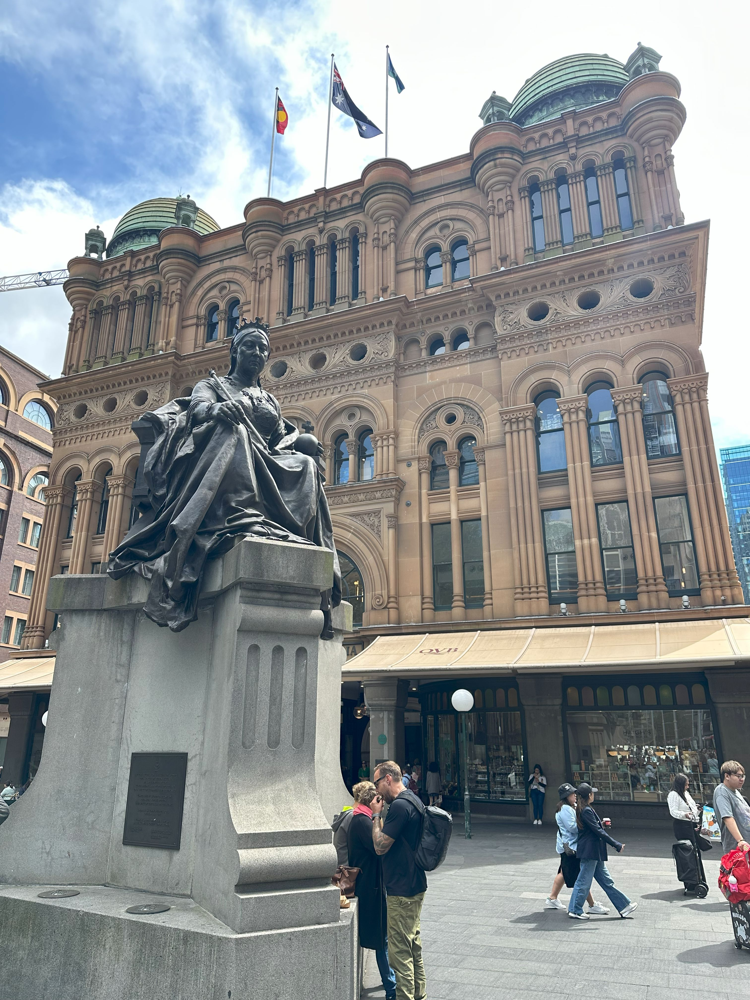

+++
author = "Sathyajith Bhat"
categories = ["Life"]
tags = ["weekly-notes", "gaming"]
places = "Sydney"
type = "post"
series = ["Weekly notes"]
url = "/weekly-notes-13-2025/"
title = "Weekly notes 13/2025"
date = 2025-03-30T12:00:00Z
summary = "Week 13 summary - a rainy week and an upcoming long weekend."
images = ["/weekly-notes-13-2025/thumb-qvb.jpg"]
+++

_Thumbnail image: The Queen Victoria Building (abbreviated as the QVB) is a heritage-listed late-19th-century building in George Street, Sydney CBD._

### What's been happening


It's been another dreary week. The weather has been quite gloomy and cloudy, with a few sunny days in between. The past couple of days have been quite rainy. Jo is complaining about not being able to go out for walks and has been asking to get a walking pad. I've asked her to find a suitable one so we can get it. I'm back to doing heavy deadlifts (relatively - I am back to doing 70 kg now). This time my trainer was more stricter than ever about getting my form right and forced me to hinge properly rather than having a flat "table top" while lifting to ensure I don't stress my lower back. The margin wasn't much but the difference it made was pretty incredible. I couldn't feel any pain at all and was going through the reps with ease. I set a personal best with dumbbell bench press as well, hitting 17.5kg on multiple sets.

Mid of the week, we had a false positive on the fire alarm in the apartment. It started with Jo messaging me that the fire alarm is going and soon enough there was an evacuation notice. As people evacuated the building, the fire brigade was not to be seen till some one called them and the Fire and Rescue services came over. Thankfully, it was a false positive. It was also determined that the fire department wasn't notified of the alert at all and thus they didn't come. This is kinda odd given that we recently had the fire alarms tested couple of weeks ago. 

From work point of view, our sprints have been going pretty ok. For the next few weeks, I will be on a secondment to a different team. The team had been requesting for people to help them out with some infra projects and I'm happy to have a new set of challenges.

With the weekend being drowned with rains, we stayed at home and cleaned the house for an upcoming property inspection from our real estate agent. We also have Jo's cousin coming over from Brisbane for a few days - they're coming here for an Andrea Bocelli concert. Jo was also interested in watching him live, so we booked tickets for that and are looking forward to having some family over. There's also a long weekend coming up the week after and we will be spending the weekend in Canberra.I haven't figured out what I will be doing yet but will be looking for things to do in Canberra.

### What I've been playing

I finally completed the campaign of Path of Exile 2 in Early Access and started the end game, ie maps. Since the game is still in early access, the latter half of the campaign was running the first three acts in cruel difficulty. With a more optimized build thanks to Maxroll, I was able to breeze through the campaign and get to maps in a few hours.

The mapping endgame, however, is a whole another beast. Even at the easiest level i.e. in Tier 1, the maps are quite difficult. I had to run a few maps to get the hang of it and even then, I was dying a lot. To make matters worse, right now you only get one chance to die and if you die, you lose the map. The maps are also incredibly long and tiring, taking over 30 minutes to just to finish one map. And death in the map means not only do you lose the waystone (the key required to open the map) but you also lose the experience. After having died several times due to random one-shot mechanics, I got extremely frustrated and stopped playing the maps.

The developers, [had a preview](https://youtu.be/J6RGbL4MtBs) for what's coming up in the next patch (due for next week) and this includes changes to mapping and the map will not be lost on death, assuming it's not been "juiced' (read, you can use in-game currency to make the map harder). I will try playing a map or two and then just wait for the patch to drop. I might also consider playing a new class since they have mentioned that while there will be a economy reset, the characters will not be wiped.



### What we watched

Wheel of Time, Season 3 - We're now watching new episodes of this as it comes out. After the last episode which was quite action packed and moved the story quite a bit, I was hoping for something more but alas, it was quite for the most part a borefest. Just as I was beginning to get bored, it seems like they realized people are watching the show and advanced things a bit to get you engaged. And of course, it ends in a cliffhanger, so we'll have a long wait till the next episode is here.  

### What we ate

[Venn Cafe, North Sydney](https://maps.app.goo.gl/K3R3Sv7CdzC1wwEcA) - A perennial favorite, we went here for breakfast after out guitar class. I had the breakfast special with baked beans, fried egg, mushrooms, hashbrown and bacon with sourdough while Jo tried yet another Fish and Chips. Jo tells me her hunt for good fish and chips is still on. The food was good as always and the service was quick despite the crowd.

  

  

  

  

  

### Music of the Week

I was enjoying a lazy Sunday morning drinking some coffee and reading the [Sydney Morning Herald](https://www.smh.com.au/) when I came across [this lovely rendition](https://youtu.be/fuWq4RZnc6U) of Arctic Monkeys’ [Do I wanna Know](https://youtu.be/bpOSxM0rNPM). Highly recommended if you like the original.

 

### Link of the week

LLMs are becoming more and more useful especially in the developer space. I have been using Claude since a while now and it's been pretty handy to fire off questions like "Why isn't this working" or "How do I do this". I also use it to generate some code snippets, sample templates and it's been pretty good at that. Simon Wilson has a nice [post](https://simonwillison.net/2025/Mar/11/using-llms-for-code/) on how he uses LLMs to help write code and is worthy of bookmarking and reading multiple times on getting the best out of it m how to use Claude to write code.

### Thanks for reading.

Thanks for reading and have a great week ahead.

Subscribe to my weekly notes:

- [Email newsletter](https://sathyabhat.substack.com/)
- [RSS feed for the weekly notes](https://sathyabh.at/series/weekly-notes/index.xml)
- [RSS feed for my site](https://sathyabh.at/index.xml)
