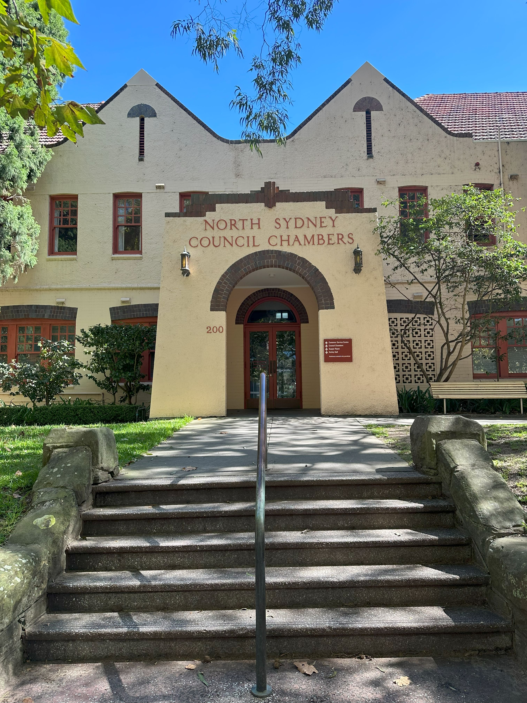

+++
author = "Sathyajith Bhat"
categories = ["Life"]
tags = ["weekly-notes", "gaming"]
places = "Sydney"
type = "post"
series = ["Weekly notes"]
url = "/weekly-notes-14-2025/"
title = "Weekly notes 14/2025"
date = 2025-04-06T12:00:00Z
summary = "Week 14 summary - a concert, a sad goodbye and some family time."
images = ["/weekly-notes-14-2025/thumb-north-sydney-council.jpg"]
+++

_Thumbnail image: North Sydney Council is a local government area on the Lower North Shore of Sydney, New South Wales, established on 29 July 1890._

### What's been happening

It's been a happy-sad week. We had some family over - Jo's younger sister and her husband were visiting Sydney. They were here to attend the Andrea Bocelli concert. The concert was at the Sydney Cricket Ground (SCG) - not the best place for a concert as stadium acoustics aren't the best, but Andrea Bocelli delivered and how. Listening to him live was really incredible, and the way he was projecting his voice starting with a low volume and pulling out those long, extended powerful ending notes was just incredible. I had goosebumps as he performed several of his songs. Joining him was his son Matteo Bocelli, several other opera singers and couple of ballet dancers as well. Overall, we had a great time at the concert. Getting to the concert was another adventure in itself - we almost missed the start, getting to our seats just a minute before Andrea Bocelli took to the stage.

And for that we have ourselves to blame - I initially told we should head to the venue by public transport - in Sydney usually public transport is the most efficient ways of getting to major events/venues. However, Jo's sister thought we'd get to the venue faster by Didi (and her initial ETA on the app showed less time as well). And since we were already running a bit late, I figured ok lets go for it. Just as we got onto the CBD entry roads, the traffic crawled to a stop. What was supposed to be a 20-minute ETA ended with us being in the car for close to 50 minutes. And as we got closer to the venue, we decided to get off the cab and walk over in effort to save time. So we requested our driver to drop us off somewhere safe, and the safest place was the lane we were in because we were stuck in traffic! We found out that there was a major accident up ahead that had caused the traffic to pile up.

The decision to get off, however, was a good call. As we rushed to the venue, we got there just in time for the performance to start. The performance was about 2 hours with a twwenty-minute break and I can't believe how it went by so fast. After the performance, we met up at a previously agreed point (Jo's cousin and us had tickets for different sections) and we met some more of Jo's cousins' friends from Brisbane who had also come down to Sydney. We went over to a nearby pub for a drink and went back home.

  

  

  

  

For the weekend, we had our usual guitar class, which brings to the sad news I mentioned - our guitar instructor Luis told us that he is heading back to Brazil for an indetermintate period of time. It's a shame, we were really beginning to get into it, particularly Jo. The Saturday morning ritual of picking up our guitar, heading to the community center and playing some tunes was quite nice, and we made some new friends too, as a bonus. I wish the best to Luis and know he will do well! After the guitar class, we went over to the North Sydney Produce Market, buying some meats, veggies, fruits and some dark chocolates. Jo's cousin also came back late afternoon, picking up some Malay food for a late lunch and we all just chilled in the living room. They were heading back to Brisbane on Saturday night, so after some last minute chit chat, we waived them good bye. I hope to visit them in Brisbane sometime later in the year.

  

  

It was a quiet Sunday. We got an extra hour of sleep in because New South Wales moved the clock back as we're no longer in daylight savings time. This means that the time difference between India and Sydney is one hour lesser, which is nice. The bad news is that we lose another hour of overlap with US, which makes it quite difficult for me as I work with fair amount of people in the US. But such is life. Jo felt like having the Sunday roast, so we went over to have lunch and then spent the afternoon with a small nap and then watching the Japanese Grand Prix.

### What I've been playing

The new league and patch for Path of Exile 2 dropped yesterday and it's been getting incredibly bad feedback. Grinding Gear Games packed a lot of nerfs to damage, cooldowns, and other mechanics in this patch but didn't apply the same nerfs to the enemies so it's been pretty brutal. The early game which was particularly hard and clunky has gotten slower and clunkier than ever before and this has resulted in that Path of Exile 2's review has swung from Mostly Positive to Mixed. 

I've started a new character with the Mercenery class - will see how this goes and whether I will end up dropping the class for a different one.

### What we watched

[That Sugar Film](https://www.imdb.com/title/tt3892434/) - A decade old documentary that we watched with Jo's cousin. The director Damon Gameau goes on a high sugar diet to document effects on a healthy body. Since I started my gym and [workouts back in October](/weekly-notes-43-2024/), I have been more mindful of what I eat - cutting down snacking, looking at the nutrition labels and then deciding on if I should really have it or not. This documentary is quite interesting and is well worth a watch.

[The Amazing Race Season 37, Episode 3 & 4](https://trakt.tv/shows/the-amazing-race-2001/seasons/37) - I couldn't watch last week's episode, so watched the two episodes while playing Path of Exile. The two episodes are set in Bali, Indonesia and both the episodes feature some twists - the "Driver's Seat" being introduced in episode and double U-turn (not W) in the fourth episode. The Driver's Seat lets the first team to decide how much effort the other teams must put in one of the tasks and the U-turn forces a team take complete both the tasks of a Detour (where teams get to choose one usually). As expected, the team with the Driver's Seat advantage got some heat where some of the teams took the "punishment" as personal, claiming to be friends who got backstabbed (in the third leg of the race?). The receipt was received in the double U-turn with the live voting resulting in every team being equalized on time and the double U-turn forcing both teams to complete both the tasks, and no surprise that one of them getting eliminated. A little sad that this happened this early on but no love lost for the team anyway.

In other Amazing Race news, I found out that Season 38 cast/crew was spotted in [Bucharest](https://medianetwork.ro/emisiunea-fenomen-the-amazing-race-cucereste-bucurestiul/) (note: article in Romanian) so I'm eager for the next season already!

The Wheel of Time Season 3, Episode 4 - Another slow episode of Wheel of Time, this time a little bit better than last few episodes. That said, there's some really well done scenes - especially, those featuring Moghedien and of course, Elayne's rendition of very catchy, "[The Hills of Tanchico](https://www.youtube.com/watch?v=NWkiGcVl8xk)".

  

### What we ate

[Library Cafe, North Sydney](https://maps.app.goo.gl/mGZhtsFogH9prjFD8) - We stopped by The Library Cafe after our grocery shopping at the Produce Market. The Library Cafe has nice outdoor seating at the rear and Sydney's weather this week has been perfect for any places that have outdoor seating. We ordered the scrambled Eggs with chilli for me and the Falafel & Kale Salad bowl for Jo. The food was really good, the scrambled eggs had couple of chilli pieces and also a little of the crispy chilli oil. I do wish there was more of it though. 

  

  

  

  

[Rag & Famish Hotel](https://maps.app.goo.gl/UWFYcNAeJ1yyWSaE9) - North Sydney's oldest pub (established in 1860) that is still operating, Rag & Famish has the usual assortment of pub food, drinks and lots of open space and TVs. Jo wanted to have the Sunday Roast for lunch, so we made our way here. I got the Chicken Parmigiana for myself and as the photos below show, there was a lot of food and it was very good. 

  

  

  

  

### Music of the Week

I was reminded of [Smokey Robinson's Cruisin'](https://www.youtube.com/watch?v=WlzY6cWpoMQ) and it took me back to a moment that I don't recall, but remember listening to the song. It's a really nice soul song!



### Link of the week

Bill Gates writes about the first piece of software written for Microsoft - the BASIC programming language for the [Altair 8800](https://en.wikipedia.org/wiki/Altair_8800), the first commerically produced computer. Do read it on the computer for a nicely done page as well as a link to the PDF scan of the original BASIC interpreter source code in assembly!

### Thanks for reading.

Thanks for reading and have a great week ahead.

Subscribe to my weekly notes:

- [Email newsletter](https://sathyabhat.substack.com/)
- [RSS feed for the weekly notes](https://sathyabh.at/series/weekly-notes/index.xml)
- [RSS feed for my site](https://sathyabh.at/index.xml)
