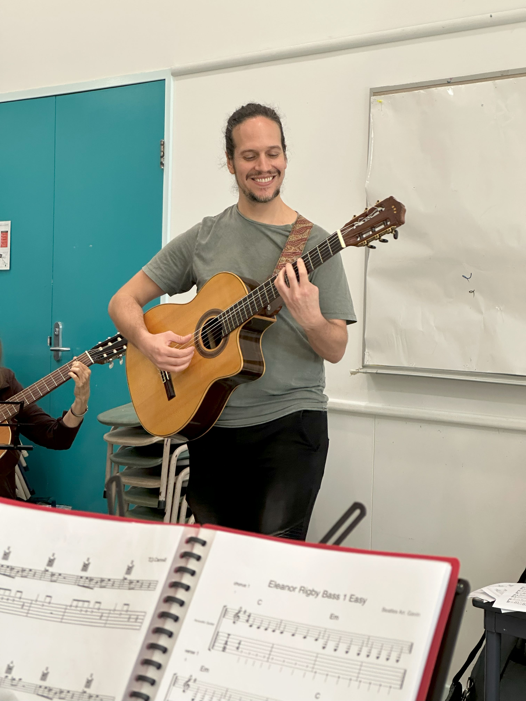

+++
author = "Sathyajith Bhat"
categories = ["Life"]
tags = ["weekly-notes", "gaming"]
places = "Sydney"
type = "post"
series = ["Weekly notes"]
url = "/weekly-notes-15-2025/"
title = "Weekly notes 15/2025"
date = 2025-04-13T12:00:00Z
summary = "Week 15 summary - our final guitar class, and an upcoming long weekend."
images = ["/weekly-notes-15-2025/thumb-luis.jpg"]

+++

_Thumbnail image: Luis Reys, our smiling guitar instructor._

### What's been happening

Last year this time, Jo and I [signed up for guitar classes](https://sathyabh.at/weekly-notes-17-2024/) and we had a great time. We both enjoyed the classes and the tutor, and it was a good way to spend time together. Through the last year, we've been signing up term after term, slowly improving our skills. As I mentioned last week, this was our last class from our instructor, Luis as he is moving back to Brazil. We had a celebration class on Sunday where his students from the North Sydney Community Center batches came together to celebrate his time with us. It was a great way to end the term and say goodbye to him. We had a lot of fun playing some songs together, played couple of new songs and it was nice to see how far we've all come since we started. Luis is a great teacher - since day 1, his patience, this teaching style and how approachable he has been has been a huge reason why we kept going back to his classes. We'll miss him for sure.

  

  

Luis tells us that the Community Center has hired a new instructor, so Jo and I will continue with the classes. We are looking forward to the new instructor and hope that he is as good as Luis.

The week otherwise has been pretty good. I started working with my new team at work, and identified a few areas where I can help them out. This includes some cost optimizations and reviewing auto scaling & disaster recovery strategies. It's compensation season at work and my manager informed me of my salary increase as well a RSU refresher. I'm pretty happy with the increase and the RSU refresher, and hope to keep at it.

I also met up with a friend from my college days. He works near my office and we met for a post-lunch coffee walk. It was great to catch up with him after a long time. We talked about work, his family, his upcoming trip and a few other things. It was nice to meet up after long.

We've got a long weekend coming this weekend for Easter holidays and looking forward to it. We'll be driving down to Canberra for a couple of days and looking forward to it. The next week will be a short week as well due to Anzac day. My gym instructor told me that he plays "Two Up" on Anzac day, and encouraged me to find a local pub and play there. Two Up is a gambling game played in Australia, and is traditionally played on Anzac day. I'm not big on gambling, but it might be fun to check out a local pub and see how mad the crowd gets. On the topic of gym, I'm back to my personal best of 75kg on the dead lift. I had hit this weight [about a month back](/weekly-notes-09-2025/) and then I had to drop down immediately due to it affecting my back. After a few weeks of slow conditioning, improving my form and working on my stance, this time I was able to hit it with relative ease and I didn't feel any pain. I'm looking to holding this weight for a few weeks before I try to increase it again.



### What I've been playing

I've been playing the new league of Path of Exile 2 with the Mercenary class. Grinding Gear Games got a lot of flak for this league and due to the various changes implemented by them and they've had to do severe damage control, with a patch to change things almost every day for the past week.

While the negative reviews keep pouring in, Grinding gear Games' response has been incredibly amazing. And from a reliability engineer's point of view, it is quite a sight to see their breathtaking velocity and imagine how they are handling the releases there, especially that every patch is likely to involve a server side change and client changes for PC and consoles. Maybe someday we will find out via a GDC talk or a blog post.

### What we watched

The Amazing Race Season 37, Episode 5 - In this week, the racers travel from Bali to Dubai. The episode features some usual Dubai features such as Sky Dive from the Palm Jumeirah, the Burj Khalifa (humorously misheard as Wiz Khalifa by one of the teams). The episode felt more like an ad for Dubai with Phil's dialogues being close to brochure readout. That said, the episode had some good racing and ended with a close finish between the last two teams.

Wheel of Time Season 3, Episode 7 - This week's episode is an unusual episode focusing only on Two Rivers’ Battle against the Trollocs. The episode again starts slow but has all the usual suspects of a “standard” battle sequence - training, early victory, setbacks, betrayal from within, loss of popular characters and of course the honourable exit. Despite the slow start and the cliched aspects of the battle, it was still a good episode.

### What we ate

[Myeongdong, Chatswood](https://maps.app.goo.gl/4QcZn5jEN283kzSYAa) - Jo wanted to try out a Japanese BBQ restaurant at Chatswood and when we reached there, Jo was not a big fan of the meat options. Since Myeongdong was just next to this restaurant, we ended up going here and got the BBQ option this time along with the kimchi pancake. The meat cuts were good and it was a nice spectacle to do the BBQ by ourselves.

  

  

  

### Music of the Week

I came across this amazing cover band featuring musicians from Adelaide called The Hindley Street Country Club and they are pretty good! This [medley of hits](https://www.youtube.com/watch?v=TS0N8Rf4X4M) is a great way to dig into them.

  

### Link of the week

Dave Plummer, a former Microsoft engineer, has a great YouTube channel where he shares his experiences and insights from his time at Microsoft. I came across this video from him talking about the history of Microsoft Operating System codenamed Longhorn (which ultimately became Vista), and how it was a huge failure for Microsoft. The video is a great watch and gives you a good insight into the challenges of software development and the importance of good design and planning, and how it can all go wrong even for a major company like Microsoft.

  

### Thanks for reading.

Thanks for reading and have a great week ahead.

Subscribe to my weekly notes:

- [Email newsletter](https://sathyabhat.substack.com/)
- [RSS feed for the weekly notes](https://sathyabh.at/series/weekly-notes/index.xml)
- [RSS feed for my site](https://sathyabh.at/index.xml)
