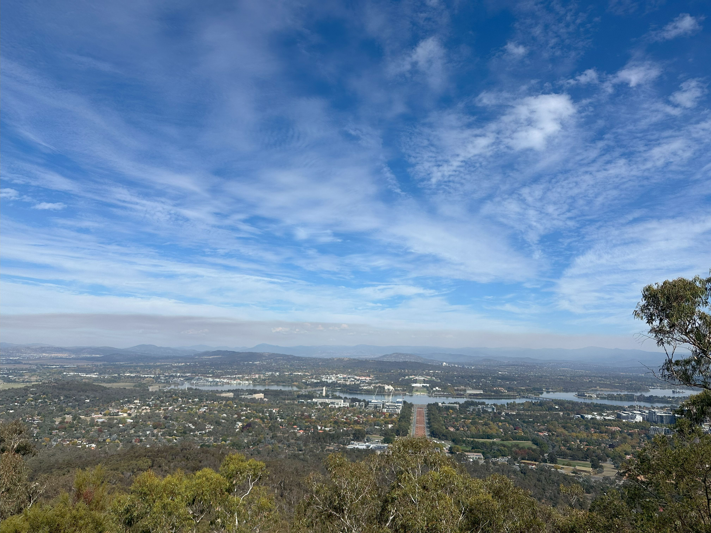

+++
author = "Sathyajith Bhat"
categories = ["Life"]
tags = ["weekly-notes", "gaming", "travel"]
places = ["Sydney", "Canberra"]
type = "post"
series = ["Weekly notes"]
url = "/weekly-notes-16-2025/"
title = "Weekly notes 16/2025"
date = 2025-04-16T12:00:00Z
summary = "Week 16 summary - a long weekend and a trip to Canberra."
images = ["/weekly-notes-16-2025/thumb-canberra.jpg"]
+++

_Thumbnail image: A bird's eye view of Canberra from Mount Ainslie Lookout._

### What's been happening

Ah the week went by so fast. I was eagerly waiting for the weekend as we've got a long weekend with a few holidays back-to-back starting from Good Friday all the way to Easter Monday. Work was ok, spent a lot of time reviewing a bunch of design documents from our cross-org team for some future improvements. We started a new sprint this week and with the number of holidays and people on leave, I probably will extend the current sprint by another week as the upcoming Friday which is also a day off. 

The North Sydney Community Center sent us more details about our new guitar instructor, [Joseph Zarb](https://www.discogs.com/artist/6806399-Joseph-Zarb) and he looks like a really nice person. We haven't yet signed up but will sign up tomorrow as the first class is scheduled to start the upcoming weekend. 

  

  

The highlight of the week, however, was our two-day road trip to Canberra. It was fun. Canberra was quieter than I thought it would be (despite the crowd). We went to a lake where Jo tried to do some astro photography, a bunch of lookouts, saw a dam, an abandoned observatory, a garden with tons of miniature representations of popular buildings of the world & way too many Kangaroo/Wombat roadkills (20+ for sure). I'll have a separate post on my Canberra roadtrip that I will publish and link in the upcoming weekly notes, but suffice to say Canberra was really good and we look forward to heading back to Canberra. 

  

  

  

  

  

  

  

  

As usual, on our return to Sydney, I took a wrong turn in the underground tunnels that bypass the overhead suburban traffic and reached the other side of Sydney. Navigating the underground tunnels is a pain because the phone cannot get the GPS signal, so Google Maps stops updating directions. As per New South Wales' driving laws, I cannot touch the phone while driving, so I cannot scroll and look for upcoming directions and I have to 'wing' it. Since I don't drive enough, I end up in random places. In today's case, I was supposed to reach North Sydney over Harbour Bridge but missing the exit meant I ended up in Drummoyne over on the western side about 15kms away. Ah well, at least we got back without other issues. 

### What I've been playing

I continued with the new league of Path of Exile 2 with the Mercenary class which has been going pretty ok. I didn't get to play a lot so I still haven't finished the campaign. Meanwhile another ARPG, Last Epoch launched their new season with a whole of new changes which have been getting really good feedback, so I will be playing that for the next couple of weeks. I've previously completed the [Last Epoch](/weekly-notes-08-2024/) and didn't find the endgame too compelling, but this has reportedly been updated so I'll try it out. 

### What we watched

The Amazing Race Season 37, Episode 6: I think this week's episdoe might have been the best that I've seen in the recent past. The teams make it to Bulgaria and start driving by themselves. The episode has everything that makes it so good: self driving, people getting lost, unexpected comebacks, and team losing because of one minor mistake that snowballed. Woud love to see how the next episode goes!

Wheel of Time Season 3, Episode 8: This is the season finale, and another really well done episode. The pacing was just right, and there are several surprises even for the hardcore fans. Though there were several sections which didn't make a lot of sense especially for someone like me who's not familiar with the lore, the way it's portrayed is pretty well done and you sort of guesstimate that's what's happening and of course, the "review" of the episode by YouTubers like [Daniel Greene ](https://www.youtube.com/@DanielGreeneReviews/videos) reinforce your understanding. 

### Music of the Week

I came across this amazing acoustic cover of Breaking Benjamin by Neo Acoustix and absolutely loved it. Give it a [listen](https://www.youtube.com/watch?v=AFmpvVaPr8M). 

  

### Link of the week

Jeff Geerling builds a LAMP stack in a literal lamp rack. This is a [fun video](https://www.youtube.com/watch?v=CE6MTBxDSpE)! 

  

### Thanks for reading.

Thanks for reading and have a great week ahead.

Subscribe to my weekly notes:

- [Email newsletter](https://sathyabhat.substack.com/)
- [RSS feed for the weekly notes](https://sathyabh.at/series/weekly-notes/index.xml)
- [RSS feed for my site](https://sathyabh.at/index.xml)
