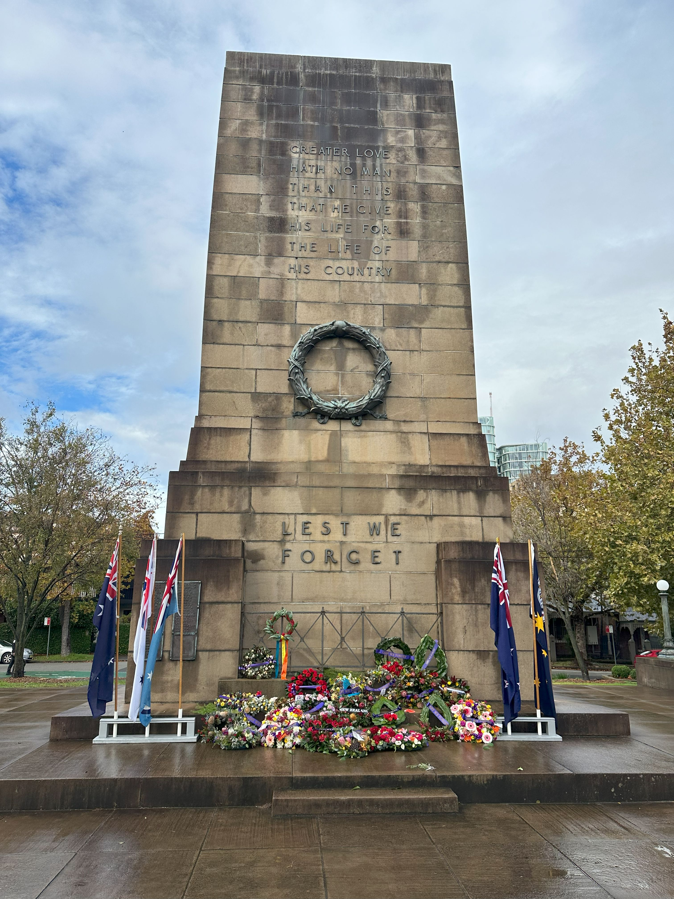

+++
author = "Sathyajith Bhat"
categories = ["Life"]
tags = ["weekly-notes", "gaming", "travel", "concert"]
places = "Sydney"
type = "post"
series = ["Weekly notes"]
url = "/weekly-notes-17-2025/"
title = "Weekly notes 17/2025"
date = 2025-04-27T12:00:00Z
summary = "Week 17 summary - a long weekend, a trip to the Northern Beaches and a fabulous concert."
images = ["/weekly-notes-17-2025/thumb-war-memorial-anzac-day.jpg"]
+++

_Thumbnail image: Tributes from the Dawn Service on Anzac Day at the North Sydney War Memorial. A Dawn Service is a ceremony typically held on Anzac Day, to commemorate the sacrifices of those who have served in the military._

### What's been happening

This week was a short week for us. Monday was off thanks to Easter Monday and then Friday was off thanks to Anzac Day.

In between the two holidays, I had a couple of days of work. I ended up working from home on Tuesday as I had gym Tuesday morning and I wouldn't have had time to get ready and be in the office for my morning meetings. I was invited to be a guest speaker on a podcast on AWS News, so that was another reason why I decided to work from home. The podcast went well, I had lots of fun talking to my hosts Jon & Karl on Logicast. The recording of the podcast is now available on [the podcast site](https://logicast.podbean.com/e/season-4-ep-16/).

Work was okay - I ended up extending my sprint by a week as many people were away on vacation. Along the week, I also ended up rotating the TLS certificates for our bidding servers (which always gives me the heebie jeebies). Last year, I built a service that helps automate the process of rotating the TLS certificates for our bidding servers. The service is now in production and is working pretty well. I should probably write a blog post about it sometime.

I'll be working on a new project to roll out Tailscale to some of our internal servers, but I'll need to do some research and plan the work for that.

I also received an invite from AWS to attend the AWS Hero Summit that's happening later in August. Ordinarily, I would have been excited to attend the summit, but given the current climate I am not sure if I will attend or not.

With the Friday off, Jo and I started our day with a walk to St Leonards Park and breakfast at Venn. As we were returning, the clouds had cleared and Jo asked if we could go somewhere. I checked that our usual GoGet car (GoGet is a car rental service that lets us rent a car by the hour) was available and thus we decided to do a day trip to the Northern beaches. I've published a blog post on the day trip with some pictures and video from the trip. We had a day off and decided to go on a [day trip](categories/travel/) to the Northern Beaches. I have written a blog post about the trip and you can check it out [here](/northern-beaches-day-trip/).

  

And on Saturday, we went to see Hans Zimmer Live at Qudos Bank Arena. The concert was a 3-hour extravaganza of amazing lights, music and some fabulous dance. The concert started with the sound of Dune and he played a suite of music from some popular movies such as Dune, Gladiator, Man of Steel, The Dark Knight, Interstellar, Pirates of the Caribbean, Inception and many more. For me the highlight of the concert was the Interstellar set piece - I love the movie because of the music and to see it live was quite an experience. Music aside, the great orchestra, lighting, singing and how he put the spotlight on all the musicians made it such an awesome experience.

  

  

  

  

  

  

  

### What I've been playing

I started the new season of Last Epoch. I ended up picking one of the strongest classes and thus the campaign was pretty much a walk in the park. Even the boss fights which troubled me the last time when I played were completely trivial. I'm now playing through the endgame and so far that's been okay. While Last Epoch gets a lot of kudos for its crafting, the moment-to-moment gameplay and combat is still pretty lackluster and is not quite satisfying so I am not really enthralled to try it out. I'll try for a few more hours and see how it goes. Meanwhile, the new season of Diablo IV starts the upcoming week and has brought in some changes and new bosses, so I will be playing that as well.

### What we watched

The Amazing Race Season 37, Episode 7: The teams continue their journey in Bulgaria and in this episode, the teams are instructed not to use taxis, which a team completely misreads and ends up using taxis everywhere. While they would have gotten penalties if they did not end up in the last place, they however were slow enough to not catch up and thus were eliminated. With this, the teams are now down to 5 and would be good to see how the race progresses. All the teams are quite good and should be a close race. 

### What we ate

[Moon Phase, St Leonards](https://maps.app.goo.gl/kCqiTvak1wnHA7Gt5) - A small minimalist cafe in St Leonards, Moon Phase are known for their baked goods. We ordered Wagyu Bulgogi and Spicy Korean Pork and was amazed by how crispy the pastry was. The meat was pretty good too. The place is pretty pricy, so probably not a place we would go to often.

  

  

  

  

  

  

[Sir Manong, Chatswood](https://maps.app.goo.gl/DeYjZQEQLGWzD6oE7) - A Filipino restaurant in Chatswood, Sir Manong is a small restaurant that serves some really good food. I had never tried Filipino before and looking at the menu I was really keen to get the Tinapa Fish (smoked fish) which is an April special, but sadly when we reached there, it had been sold out already. I had the beef brisket kare kare and Jo ordered the pork belly adobo rice bowl. The food quantity was pretty good and we ended up taking about half the brisket home. The food quality and taste was good, particularly the peanut sauce in the kare kare.

  

  

  

  

  

  

  

### Music of the Week

Since I have been playing a lot of Path of Exile 2 in the past few weeks, I have been listening to a lot of the music from the game. The music is composed by [Kamil Orman-Janowski](https://www.youtube.com/@KamilOrmanJanowski) and he does a fabulous job with the music. Here's a song from the first town, and you can feel how sad the town is.



### Link of the week

Jeff Geerling lays out a challenge asking people to de-censor the blurred out parts of his video and people rise to the occasion. Great read on why you shouldn't rely on blur/checker boarding to hide sensitive information. [Read more](https://www.jeffgeerling.com/blog/2025/its-easier-ever-de-censor-videos).

### Thanks for reading.

Thanks for reading and have a great week ahead.

Subscribe to my weekly notes:

- [Email newsletter](https://sathyabhat.substack.com/)
- [RSS feed for the weekly notes](https://sathyabh.at/series/weekly-notes/index.xml)
- [RSS feed for my site](https://sathyabh.at/index.xml)
