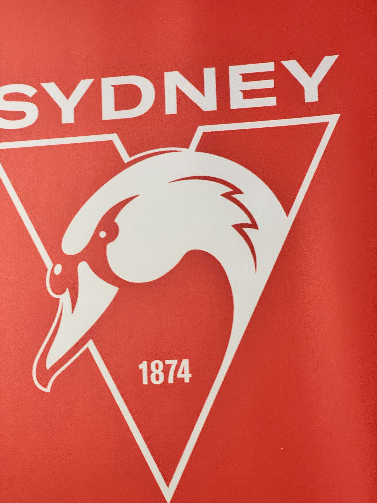

+++
author = "Sathyajith Bhat"
categories = ["Life"]
tags = ["weekly-notes", "gaming"]
places = "Sydney"
type = "post"
series = ["Weekly notes"]
url = "/weekly-notes-18-2025/"
title = "Weekly notes 18/2025"
date = 2025-05-04T12:00:00Z
summary = "Week 18 summary - game day."
images = ["/weekly-notes-18-2025/thumb-sydney-swans.jpg"]
+++

_Thumbnail image: The Sydney Swans are a professional Australian rules football club based in Sydney, New South Wales._

### What's been happening

It's been a cold and miserable week here in Sydney. The clouds are back and it has been raining non-stop. The temperatures have also dropped pretty considerably and I got my AWS Hero Hoodie out, wearing it when going to the office. Jo's been bundling up as well. The view from my office workspace which overlooks Barangaroo Wharf is usually a really pretty sight and all I could see this week was drab grey fog.

My work's been going ok. I started with a new project, have planned it out and look forward to start implementing it.

It's also Election week here in Australia with Saturday being the Federal Election Day. Having a sausage("snag") after casting a vote is [election-day tradition](https://www.moadoph.gov.au/explore/democracy/the-sizzling-history-of-the-democracy-sausage) and as we walked over to the Community Center, we saw a few people returning with their sausages. Anthony Albanese was re-elected with a landslide margin. 

We had our first guitar class of this term with our new instructor, Joseph Zarb. Joseph teaches music at couple of schools nearby and has his band “Marsala” that he’s been playing with since the past 30 years. The first class was also quite interesting. It was more of a learn couple of notes - do some improvisation/jam by individuals with him playing the backing track while he was also looking us to improve our technique. It certainly didn’t feel like your average music class but new things are always interesting. We also had a few new faces apart from regulars from our previous term. We’ll see how the next set of classes goes.

On Sunday, we went to the Sydney Cricket Ground (SCG) but not to watch cricket - rather to watch an AFL match. Australian Football League (AFL) is a professional competition for Australian rules football (or "footy" as it is more popularly known as here in Australia). It is a sport played between two teams of 18 players on an oval field, often a modified cricket ground (hence the venue being the SCG). Points are scored by kicking the oval ball between the central goal posts or between a central and outer post. AFL is more popular in the Southern and Western states of Australia as compared to the other footy - Rugby. We wanted to catch a live match in a stadium. And I found out that there was going to be a Sydney derby so figured this would be the best match to watch live. And how it was! We got a good seat, and the sun was not too harsh today. The SCG is home to Sydney Swans team and a sea of red and white - Sydney Swans' home colours were everywhere. Jo & I joined the fun with me picking up a bucket hat (which came in very handy when the sun was directly above us) and Jo buying a Sydney Swans merch. An AFL match consists of 4, 20-minute quarters with a break in between and we enjoyed the entire match thoroughly. Sydney Swans took an early lead with the opposition, Greater Western Sydney Giants making a comeback in the second and the third quarters. Ultimately, Swans held off the Giants and won the game, with the entire staidum (with about 40k in audience) erupting into cheers. Despite not having seen an entire game previously (I knew some of the rules though) and a lack of commentary, I was able to follow the game and had a good time. For next, I'm keen to try to watch the other footy - rugby, live in a stadium.

  
  
  
  
  
  
  
  
  

### What I've been playing

I continued playing Last Epoch. I got tired of my sentinel and wasn't very happy with the character, so created a new character. I started with a cold mage but specialized into a spellblade - a dual-wielding mage. The character plays much better but I still maintain the same opinion of the game as I mentioned last week - there's just no weight to combat. Path of Exile 2 got a new patch buffing the loot drops so I might go back to it.

Rushabh, Abhay, Kush and I also played a few hours of Civilization VII and it was fun. I streamed our session live on Twitch. Unfortunately, network issues caused us a lot of issues and after a lot of troubleshooting and changing of hosts, we were able to jump back in.

### What we watched

Foundation Season 2: Jo started watching season two of Foundation and I asked if we could watch together. Season 2 continues from the end of Season 1 and the first couple of episodes we saw were so confusing. I had no idea what was happening. I guess we have to keep watching for things to make more sense.

The Amazing Race Season 37, Episode 8: The teams flew from Sofia, Bulgaria to Naples, Italy. The first 10 minutes of the episode are a big ad for Expedia, kinda weird to see teams with all their fake enthusiasm going "Oh this app is sooo easy" lol. Beyond that, the episode was actually pretty interesting, if a bit stereotypical representation of Italy with tasks like preparing a Neopolitan pizza and (grocery) shopping. The episode ends with a nice twist and look forward to the next episode.

### What we ate

[Lumos, North Sydney](https://maps.app.goo.gl/xPgTgtMWu7QNYQH47) - we wanted to go another coffee shop that was not our usual place. After a quick search of what was open on Saturday, we decided to head to Lumos. Jo decided to get the “Let’s Taco about it” (fish tacos) while I was initially considering the Reuben, decided to get the crab pasta instead. The pasta was nicely done but lacked a bit of flavour. Jo said her tacos were pretty ok but the mango salsa was nice. We also had some coffees - the oat flat white for Jo and cappuccino for me. Lumos uses Campos beans which I like but Jo is not a big fan of.

  
  
  
  
  
  

[A Bowl Of Noodles, Haymarket](https://maps.app.goo.gl/8wtNUrSyEutybRM5A) - We were here heading to the Sydney Swans game and wanted to stop by for lunch first. As we got off Central, we picked the first restaurant that was right outside Central Railway Station - which happened to be a Thai place. Jo didn't feel like it had anything interesting and we spotted this Shanghainese restaurant right next to it and walked in, and boy, what a good decision it ended up being. A Bowl Of Noodles had some killer food at a pretty reasonable cost. We ordered the Spicy Pork Noodle Soup (which was really well done) and some dumplings and scallion pancakes. The quality as I mentioned was really good and given it's right in front of Central, would definitely visit again.

  
  
  
  
  
  
  

### Music of the Week

La Blogothèque has produced [this amazing performance](https://www.youtube.com/watch?v=ixsCO1MyTBc) by Iron & Wine's 'Upward Over The Mountain' & 'Call It Dreaming' at the Yosemite National Park. Highly recommended watch.



### Link of the week

I came across this [news article](https://edition.cnn.com/2025/05/01/business/first-driverless-semis-started-regular-routes) that the first series of driverless trucks are officially running long-haul routes, making roundtrips between Dallas and Houston. It remains to be seen how this will be embraced in the near future.

### Thanks for reading.

Thanks for reading and have a great week ahead.

Subscribe to my weekly notes:

- [Email newsletter](https://sathyabhat.substack.com/)
- [RSS feed for the weekly notes](https://sathyabh.at/series/weekly-notes/index.xml)
- [RSS feed for my site](https://sathyabh.at/index.xml)
