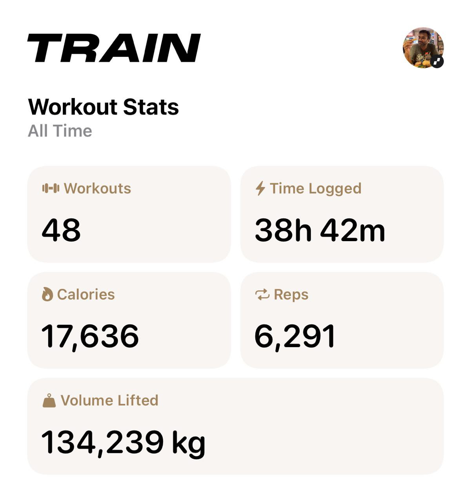

+++
author = "Sathyajith Bhat"
categories = ["Life"]
tags = ["weekly-notes", "gaming", "diablo-iv" ]
places = "Sydney"
type = "post"
series = ["Weekly notes"]
url = "/weekly-notes-19-2025/"
title = "Weekly notes 19/2025"
date = 2025-05-11T12:00:00Z
summary = "Week 19 summary - winter is here. "
images = ["/weekly-notes-19-2025/thumb-.jpg"]
+++

_Thumbnail image: ._

### What's been happening

With the temperatures averaging 15 degrees Celsius mid day and maxing out at low 20s, winter is well and truly here. For most of the year, I wear shorts to office and now it's cold enough that I’m back to wearing jeans pants and a hoodie too because it rains every now and then. Which brings me to my next problem (in a good way..) - since starting my workouts, I've lost about 10 kilos or so and half my t-shirts are too big (I am okay with loose fitting T-shirts) but my jeans are loose that they dropping off. I don’t like low-rise stuff so after lot of coaxing by Jo, we went over to the nearby op shops to find some pants. Most of them were slim fit ones which don’t fit me well so we went over to Chatswood to buy some new pants for me. We bought two new pants for me and couple of flannel shirts as well from Uniqlo.

The work week has been going pretty okay. This week I've been working exclusively on the new project which uses Terragrunt and Terrform and I'm reminded of how bad [HCL](https://developer.hashicorp.com/terraform/language/syntax/configuration) is for anything remotely complex. It’s been a lot of head banging especially to get the variables correctly passing values through multiple nested modules and having Terrgrunt makes things even more annoying. I should be done completing one project that will save us quite a bit of money and then move on to the other project of rolling out Tailscale for the team.

Another milestone for this week is that I completed 50 workouts at BBB Gym. My trainer also got me to switch to barbell for bench press (was doing dumbbell so far). Heading into the gym has become part of my routine now and due credit to Daniel, my trainer who keeps me engaged during our workout sessions with equal parts of encouragement, motivation and also pushing to the next level. My weight loss has stalled and is annoying and need to figure out how to push it to the next level. I also had a follow up appointment with my GP (it'd been about 6 months since my last consultation) and with the changes in diet and weight loss thanks to workouts, I’m in a much better position now. I look forward to the next 50 workouts 😄

Our second guitar class went well. This class, we went back to the ABCs - learning to read sheet music starting with A, B, and C notes. We also learnt how sheet music denotes the length of the note (quarter note, half note, whole note etc.) and how to read the notes for rests. Following that, we learnt how to play these notes on the guitar, following the sheet music with changes to beats, notes etc. Individually, the notes were easy to play when when you combine the notes, along with the beats, rests and trying to make sense of the sheet music, it becomes a bit tricky. As I mentioned [last week](/weekly-notes-18-2025/), Joseph, our instructor, really encourages us to do a lot of improvisation and it feels good when you are let loose to do whatever you want, regardless of how bad it sounds.

### What I've been playing

I got tired with Last Epoch's flighty and lackluster gameplay loop and decided to take a break from it for now. With the new season of Diablo IV in-progress, I have picked it up. Diablo IV still plays good and pushes all the right buttons to keep you pleased when starting off, but there’s not a lot of depth in the endgame. I’ll play for a bit and then jump back to Path of Exile 2, or maybe even to some single player Civilization VII _also totally ignoring the backlog of games that I have_.

I also bought [New Star GP](https://store.steampowered.com/app/2217580/New_Star_GP/) on my teammate Michael's suggestion. New Star GP is a lovely little arcade-style motor racing game with retro visuals (think 1999~ time frame). The game features a nice career mode where you get to be a new racer in a new team and winning races/getting good place in qualifying/practice grants you money to upgrade your car/get new crew etc. The game plays really well on the Steam Deck and highly recommend if you are craving for a good racing game.

### What we watched

The Amazing Race Season 37, Episode 9: The teams fly to France and have a pretty cheesy time, jousting, driving and quizzing. A fun episode to watch, and the stage is set for a top-3 showdown.

Foundation Season 2: We watched another episode, and the series gets weirder and more confusing. But hey, we can see some light peering in through the clouds!

### What we ate

[St.Honore Bakery, North Sydney](https://maps.app.goo.gl/zpLBFzvksoJoMo1G9): A small little bakery/cafe in North Sydney. We walked in here after a quick walk after our guitar class. We ordered a leek & chicken pie and a lamb pie along with our usual coffees. The pie pastry was pretty ok, but the filling was really rich and creamy and was well worth the visit.






### Music of the Week

I came across “Cause We've Ended as Lovers” by Stevie Wonder/Jeff Beck first on Martin Miller’s channel and then also came across American Music Supply’s [version of the same](https://www.youtube.com/watch?v=Uc4fEB7N5MQ). Both are incredibly well done covers, each with their own subtle tweaks (and Martin Miller and his session band feat. Mark Lettieri really go wild on their [version](https://www.youtube.com/watch?v=y9ZLT7hE5Ic)) and are well worth listening to.





### Link of the week

Road to VR has a nice article on what [makes Beat Saber fun](https://www.roadtovr.com/beat-saber-instructed-motion-until-you-fall-inside-xr-design/). Beat Saber is the only VR game that I truly enjoyed, and for me a large portion of it was because it gave you a really good boost for very little effort (in terms of having to figure out what to do) and combined with the face that it had really good music and you could upload custom music (albeit, wasn't that straightforward) - made it even better.

### Thanks for reading.

Thanks for reading and have a great week ahead.

Subscribe to my weekly notes:

- [Email newsletter](https://sathyabhat.substack.com/)
- [RSS feed for the weekly notes](https://sathyabh.at/series/weekly-notes/index.xml)
- [RSS feed for my site](https://sathyabh.at/index.xml)

