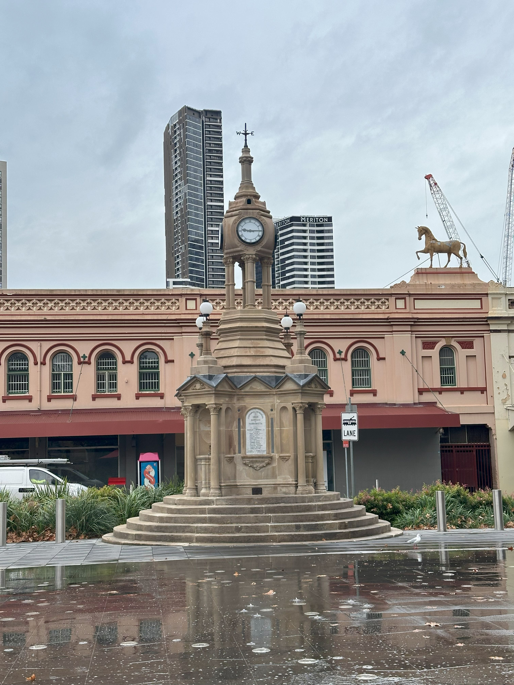

+++
author = "Sathyajith Bhat"
categories = ["Life"]
tags = ["weekly-notes", "gaming"]
places = "Sydney"
type = "post"
series = ["Weekly notes"]
url = "/weekly-notes-20-2025/"
title = "Weekly notes 20/2025"
date = 2025-05-18T12:00:00Z
summary = "Week 20 summary - some new seafood, guitar class, and a Marathi breakfast buffet."
images = ["/weekly-notes-20-2025/thumb-paramtta-centenary-square.jpg"]
+++

_Thumbnail image: Centenary Square is a civic square located in the heart of Parramatta. Parramatta is considered as the secondary central business district of Sydney and is the oldest inland European settlement in Australia._

### What's been happening

This week has been such a blur, feels like yesterday I was writing last week’s notes and here we are.

From a work perspective, most of my time was spent rolling out some of the infrastructure changes to introduce Shield Advanced Protection for our load balancers. The engineering manager asked if we could roll out the changes to smaller regions first - a reasonable ask. Unfortunately, the underlying Terraform module didn’t support this and I had to resort to Terraform hacks to roll this out one region at a time. More reasons why I dislike HCL - as a DSL, it’s fine but as you get to do more and more advanced stuff, the more unreadable it becomes. For now, I have rolled it out to two of the regions and we’ll have a few more left. The other part was the Tailscale deployment - again a fairly easy ask but the use of Terragrunt and its limitations meant that introducing has resulted in a large amount of changes and having two separate interdependent repos makes it even worse. Hopefully, I should be done with this by the next week.

[Jo](https://joshenoy.me) had an eye appointment on Friday and I thought of taking off post mid-day but me being me, I ended up working anyway. Given Jo’s eye appointment, we wrapped up work early and went over to Chatswood. While waiting for Jo’s appointment to be done, I went over to a nearby coffee shop with some funky artwork and waited for her to let me know once she was done.

After her appointment, we walked by an Asian seafood market that looked interesting, and they had silver pomfret - a fish that we used to have quite a bit back in India. We bought couple of these, went over to the nearby butcher, bought some meat and we had enough to last the week. We should have come to these places before; they had some good quality meat & fish available. Jo made a pan-fry with the fish for the night.

  

  

  

  

On Saturday, we had our usual guitar class which went well. We continued practicing reading and playing to the sheet music, some quick improvs and learnt the how to play the second part of the riff of Norah Jones’ [Shoot the Moon](https://www.youtube.com/watch?v=CRSQTC2S-y0).



Post the class, we walked over to the North Sydney Produce market, picked up some mandarins, oranges, and grapes and walked back home.

On her morning walk earlier in the week, Jo had gone to the coffee shop called The North Spoon and said it was nice, so we went over to the coffee shop for some brunch. Post brunch, we walked back home and lazed around for a bit. Jo wanted to watch a movie [The Red Envelope](https://letterboxd.com/film/the-red-envelope/) but I wasn’t in the mood for it, so she went to watch it by herself while I had a round of Civilization VII with Kush & Abhay. Our friends from the guitar class told us they were heading over to a Marathi place for breakfast on Sunday morning and asked us if we’d like to join. We didn’t have anything planned so we said yes. A few hours later, Jo was done with the movie and asked me to join her in the city for dinner and we ended up going to The Momo Hub but not before we stopped by to watch a band busking, playing some 90s emo hits. 

  

So thus, here we were waking up on Sunday morning at 7am, all ready to take an hour long train to Paramatta so that we could reach the venue by the time the venue opens. Well, at least that paid off in the sense that we didn’t have to wait for table and it was available, especially given that there were six of us. We spent an hour here, eating and chatting well. Post this we returned back home for a lazy Sunday afternoon.

### What I've been playing

I continued playing Season 8 of Diablo IV. It's been pretty fun so far. I started with the Rogue's Dancing Knives build as I was leveling up and then switched to the Death Trap build. The Death Trap build absolutely decimates everything but requires high cooldown reduction rolls on items (which I don't have) and didn't like the clunky playstyle. I have now switched to the Sorcerer and building a new Ice Shards build. 

On the weekend, I started a new Civilization VII game with Kush and Abhay as Rushabh wasn't available. I'm playing as Ibn Battuta, focusing on a economic path.

### What we watched

Murderbot, Season 1 - We started watching this series after it premiered this week. Jo was eagerly waiting for this (it’s based on a book). The premise of the series is about a security robot that has broken through its governance module and now has free will. We follow Murderbot’s thoughts as he’s forced to do things that he doesn’t like or want to do to hide his new found ability. Only two episodes of the series are out, I’ll reserve my thoughts once I watch more episodes but for now it is quite interesting, though listening to Murderbot’s thoughts does get a bit droning at times.

Foundation, Season 2 - Things are finally getting more chaotic and action-oriented. The various stories are slowly converging, and there’s a reference to Asimov’s Laws of Robotics which is not surprising as it is set in the same universe. The series continues to amaze me with its production quality, especially how the *spacers* are depicted.

### What we ate

[Ebisu, Chatswood](https://maps.app.goo.gl/QXVW5oAwB6vLhuHn7) - We went here after a restaurant Jo had originally selected was closed for maintenance. We were greeted very warmly with a nice “*Irasshai mase*“ (Japanese for welcome to the establishment!). I initially thought of getting some bbq but it was midday on a Monday and we had to return home to get back to our work so we decided to order the bento boxes which come with some renkon chips and kimchi. The food was again really good - well done meat and the sides were pretty good. The place was quite empty - sure it’s Monday mid-day but was expecting at least a few people. That said, definitely worth revisiting for a BBQ dinner here.

  

  

  

  

  

[The North Spoon, McMahons Point](https://maps.app.goo.gl/SSM3vCVgpbPaWbN39) - A small busy coffee shop. It took them a while to acknowledge and get our orders in, and I was slightly annoyed by that especially since there were people besides us who were getting their orders in while we were like “hello?”. Anyway they apologized for their tardiness and got our orders in. Jo ordered the Roast Pork Focaccia while I ordered a Chilli Crunch Scramble (scrambled egg with chilli oil crunchy bits) along with our usual coffee orders. The Roast Pork Focaccia was quite good, but the scrambled eggs were let down by bland taste. We also ordered a orange poppy cake which made up for the scrambled eggs and was really delicious. While I was definitely annoyed by the initial service (or lack of it), we probably will pay a visit back.  

  

  

  

  

  

 

[Yurica, North Sydney](https://maps.app.goo.gl/ikqTqQbpcXFnCFRK7) - It was Wednesday evening and neither of us felt like cooking something, so went to this Japanese restaurant which was nearby our house. We had the renkon chips and I ordered the ramen for myself. Just as the food was delivered, I was awestruck by the size of it. The ramen had a nice tangy kick and wasn’t as thick as I thought it would be. Jo ordered the katsu curry for herself. Overall, a good place to visit.

  

  

  

  

  

  

  

[The Momos Hub, Sydney CBD](https://maps.app.goo.gl/gNXo743hrh8pCtGh7) - The Momos Hub is easy to miss as it’s actually located in the basement but following the directions takes you down the stairs to the restaurant to reveal a pretty large place. There’s barely any front of the house staff for a restaurant this size but they are pretty efficient. We ordered the egg thukpa, paneer chilli and steamed chicken momos. The momos were really good, the chutney accompanying them was just perfect. The thukpa was exactly what we wanted for a cold Sydney winter evening, and the paneer chilli was incredibly hot, more than I thought it would be. The quantity was also quite good and we ended up packing the thukpa and paneer chilli to take it back home. 

  

  

  

  

  

  

  

  

[Mumbaicha Vadapav, Paramatta](https://maps.app.goo.gl/qb4jER7FBTsaTGEu5) - Probably the first time we’re starting early to reach a restaurant, Mumbaicha Vadapav was suggested by our guitar class friends - they told us that this place has unlimited Marathi buffet for breakfast. We reached there at 9am, just as the restaurant had opened up and had quite a few people already dining. The breakfast buffet gives you a fair bit of food options - misal pav, kothimbir vadi, batata vada, sabudana vada, kachori, kanda poha, fried chillies, kokam sharbat, aam panna and puran poli. We tried all of this (except the sharbat and aam panna) and loved most of the food. They all were done well, quite delicious and the spice/heat levels were quite good. The puranpoli wasn’t as sweet as I thought it would be but was good nonetheless. At $25 per person for the buffet, I think it’s a good value meal and was good enough for us to skip lunch! 

  

  

  

  

### Music of the Week

Corey Taylor, lead vocalist of Slipknot does a [great acoustic](https://www.youtube.com/watch?v=V4Y06DEt3fE) version of “Snuff”. 

  

### Link of the week

Thej has announced the results of the winners of [Nagarathna Memorial Grant](https://thejeshgn.com/2025/05/07/nagarathna-memorial-grant-2025-results/). Congratulations to the grant award winners, and shout out to Thej for running the grant for many years. On a side note, one of the award winners reached out to me and mentioned that they found out about the grant via my weekly notes. I am glad I could play just a tiny little part. Best wishes to all!

Here’s more details about the [grant](https://thejeshgn.com/projects/nagarathna-memorial-grant/)

> I am creating a yearly [micro-grant](https://github.com/nayafia/microgrants) to support something meaningful. Grant is named after my [mother](https://thejeshgn.com/tag/amma/) – Nagarathna. The reason for grant could be anything as long its meaningful to you and people around. Though I prefer free and open source or creative commons projects, It’s not a must. It’s a no strings attached grant.

### Thanks for reading.

Thanks for reading and have a great week ahead.

Subscribe to my weekly notes:

- [Email newsletter](https://sathyabhat.substack.com/)
- [RSS feed for the weekly notes](https://sathyabh.at/series/weekly-notes/index.xml)
- [RSS feed for my site](https://sathyabh.at/index.xml)
