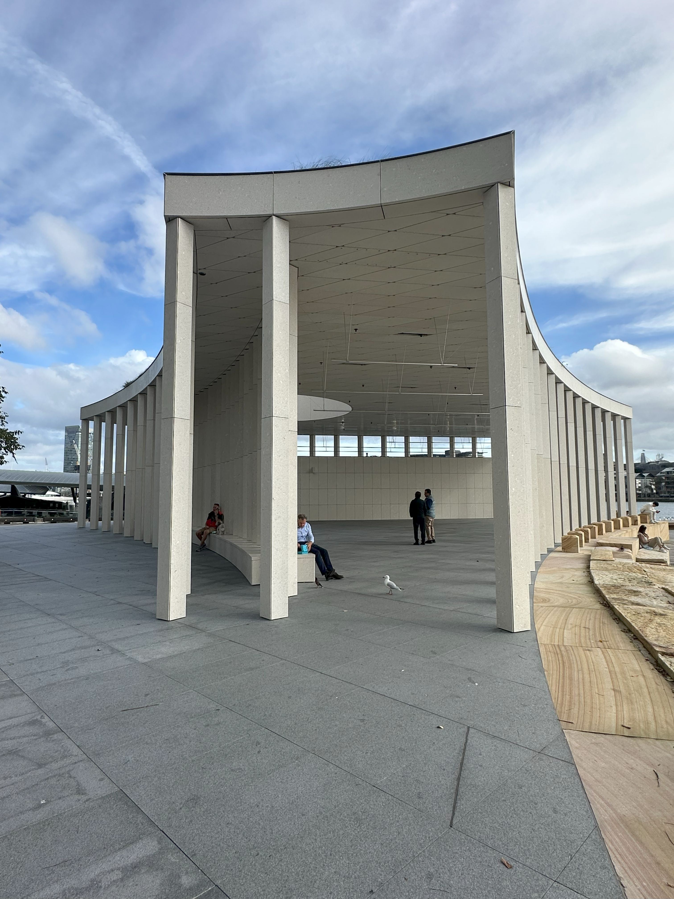

+++
author = "Sathyajith Bhat"
categories = ["Life"]
tags = ["weekly-notes", "gaming"]
places = "Sydney"
type = "post"
series = ["Weekly notes"]
url = "/weekly-notes-21-2025/"
title = "Weekly notes 21/2025"
date = 2025-05-25T12:00:00Z
summary = "Week 21 summary - Floods, Earthquake, Sydney train network meltdown, upcoming travel plans, and more."
images = ["/weekly-notes-21-2025/thumb-barangaroo-pier-pavillion.jpg"]

+++

_Thumbnail image: Barangaroo Pier Pavilion is a [recently opened](https://www.infrastructure.nsw.gov.au/news/barangaroos-newest-landmark-pier-pavilion/) pier by Barangaroo wharf. The pavilion allows for large amounts of natural light to flow in, has 85 structural columnsi. Over 450k Sydney rock oyster shells were recycled to be used as custom cladding._

### What's been happening

It’s been another incredibly wet week. Several parts in/around Central Coast were heavily flooded after receiving [more than 400mm of rainfall](https://en.wikipedia.org/wiki/2025_New_South_Wales_floods) over two days, causing more than 48,000 people to be [stranded and](https://www.smh.com.au/national/nsw/dozens-trapped-as-record-breaking-floods-leave-residents-stranded-20250521-p5m0wy.html) isolated. Closer to home, it was raining non-stop over most of the week and thankfully we were not affected by it.

If the rains were not enough, an earthquake hit about 500km west from Sydney. We didn’t feel it and there were no casualties, so that was good.

Also not related to the above incidents, Sydney train network had a near meltdown because a live wire fell on a train in Strathfield. This caused an emergency response to evacuate the people from the train after shutting down the power. Strathfield is a bottleneck for the train network and having the incident occur during peak afternoon hours caused a domino effect of trains getting delayed or cancelled. While my commute to office was not via that line, I sensed something was off when the Metro was jam packed at my usual departure hours, something that I don’t often see. When I reached home, I caught up with the news. Thankfully, no one was hurt and the trains resumed their normal operating schedule the next day.

My work has been going well. I completed rolling out the Shield Advanced Protection over several regions and it didn’t cause any troubles. The last region I deployed to was our largest region (in terms of traffic) and I’m waiting for a couple of days for the billing data to be processed before I can compile the before/after report and submit a project completion report.

I also completed a few different things that I had been working on for a while:

- I submitted a talk proposal for the upcoming [AWS Community Day, Australia](https://awscommunitydayaus.com/).
- I finished the final pending piece of work for a freelance project brought in by a repeat client and a mutual friend, [Justin](https://www.justinjaideep.in/). I had previously helped Justin migrate his photography site from a shared host to a DigitalOcean Droplet running WordPress a few years ago. Justin reached out a few months back asking I’d open to help him upgrade the existing DigitalOcean droplet. So for this project, I moved over the WordPress install and all data from his existing DigitalOcean droplet to a droplet, with a new WordPress install. I restored the data to this new droplet, set up backups with UpdraftPlus copying them over to a [DigitalOcean Volumes block storage](https://docs.digitalocean.com/products/volumes/), and some caching and other things to make it slightly faster.

- I also finalized plans for my upcoming work travel to San Francisco and decided to combine it with the AWS Hero Summit happening in Seattle in the last week of August.

  I had originally planned to head to San Francisco the week after the Hero Summit, but I ended up adjusting the travel plan so that I head to San Francisco first and then to Seattle. This however meant that I will most likely have to withdraw my talk proposal for [AWS Community Day, Australia](https://awscommunitydayaus.com/) as it’ll be a pain to travel from Sydney to Brisbane and then back to Sydney for the long haul flight. Once my travel tickets have been confirmed, I will make a final decision.

- Vibe coded a CSS fix for my blog images using GitHub Copilot and VS Code agent mode.

  I wasn't a big fan of the way images were shown on a post on my [blog](https://sathyabh.at). If you clicked on it, you would get a gallery but each image was posted in a new line and that made posts really long and I was really annoyed by it. But my CSS skills are poor, so trying to fix it went nowhere. With [vibe coding](https://threadreaderapp.com/thread/1886192184808149383.html) and [agentic AI](https://hbr.org/2024/12/what-is-agentic-ai-and-how-will-it-change-work) all the rage these days, I tried to fix this using GitHub Copilot & [VS Code agent mode](https://code.visualstudio.com/blogs/2025/04/07/agentMode) by providing a prompt of what I want to fix. And after a few tries, I got something that I was happy with. You can see the results in my [last week’s post](/weekly-notes-20-2025/) as well as [this post](/weekly-notes-20-2025/). I’m still not a 100% happy with the results but for now, this will do.

Continuing on the topic of shaking up tech, I gave up on [Arc Browser](https://arc.net/) for Windows. I had switched to Arc long back after a quick run with it left me really impressed. Arc had some amazing features that are still not present in browser like Chrome/Firefox - for example features like Tidy Tabs (automatically re-arrange tabs per topic), split view (have multiple tabs show side-by-side on the same window). Unfortunately, Arc’s developers have more or left abandoned it. This would not have been so much of a problem (heck they abandoned it like a year ago) if things worked well - which it does on the Mac. The Windows version however is not at feature parity with the Mac version and last week’s “minor” release brought in some horrendous regressions in terms of performance, especially when the hotkey to open a new tab is invoked. After trying a bunch of things (disable extensions, exit/open again, restart) - nothing worked so I gave up on it. Given the current state of browsers, I will be going back to Firefox soon but for now, I am trying out [Zen Browser](https://zen-browser.app/) which mimics Arc’s UI but not necessarily the overall experience. Zen syncs data using Mozilla accounts, so moving data should not be a problem.

For the weekend, we had invited our friends over for lunch and stay the night over. We hadn’t met [since a year](https://sathyabh.at/2023/05/22/weekly-notes-20-2023/) due to various reasons and it was really nice to catch up. They had returned from a nice holiday to Japan & South Korea and we went a chunk of time discussing the trip, a bunch of other things and watched a movie, [Exterritorial](https://www.imdb.com/title/tt30876483/). The movie sucked, but we had a good time otherwise.



Jo also made some nice food - ghee rice with red chicken curry for lunch, our own pizza based on Coles’ pizza dough for dinner & aloo poha for breakfast and it was all really good. Probably added a couple of kilos after all of that eating!

   

   

### What I've been playing

I continued playing Season 8 of Diablo IV. After switching to the Sorcerer’s Ice Shards build, I’ve been having a lot of fun. The season itself is pretty poor. The boss powers barely add to anything and the fact that you can only get them in the open world content while all sorts of character progress is via dungeons means there is very little incentive to do the boss powers content. It’s a shame because Diablo has probably the best combat feedback but just about sucks in everything else.

### What we ate

[Brewmance, Crow’s Nest](https://maps.app.goo.gl/1oDHPRbSFXVo1d3m9) Jo found this cafe on her daily morning walks and absolutely loved it, so I joined her on a Friday morning walk (despite the rains) to Brewmance. We ordered our usual coffees and I had the breakfast burrito while Jo had the Ham & Cheese Toastie. I loved how they wrote my name on the coffee as latte art, which Jo got a “queen” - presumably because we had ordered by the QR code and only my name was there in the order. The breakfast burrito was interesting - it had baked beans which is an unusual choice, but it went well, balancing out with the bacon, eggs and avocado. Jo tells me her ham and cheese toastie was good too. They had other toasties but they were available post 12pm, so we’ll have to check that out some other time.

  

  

  

  

  

  

### Music of the Week

Our guitar instructor during our first class played and sang a song that I really loved and he shared the song later. That’s how I found out about [Buena Vista Social Club](https://en.wikipedia.org/wiki/Buena_Vista_Social_Club)

> Buena Vista Social Club was a musical ensemble primarily made up of Cuban musicians, formed in 1996. \[…\] They named the group after the members' club of the same name in the Buena vista quarter of Havana, a popular music venue in the 1940s. To showcase the popular styles of the time, such as son, bolero and danzón, they recruited a dozen veteran musicians, some of whom had been retired for many years.

Enjoy the song!



### Link of the week

Mozilla is shutting down Pocket - a bookmarking and read-it-later service that they had acquired back in 2017. I used to use pocket a fair bit, although majority of it was automated saves from twitter/reddit. I was able to export my [data from Pocket](https://getpocket.com/export) - which is available as a CSV file. I’ve been using [Raindrop.io](https://raindrop.io/) for a while now, and I will probably export the data from Raindrop, clean up both Pocket and Raindrop data and import it into a self-hosted install of [Karakeep](https://karakeep.app/) in a few months.

### Thanks for reading.

Thanks for reading and have a great week ahead.

Subscribe to my weekly notes:

- [Email newsletter](https://sathyabhat.substack.com/)
- [RSS feed for the weekly notes](https://sathyabh.at/series/weekly-notes/index.xml)
- [RSS feed for my site](https://sathyabh.at/index.xml)
