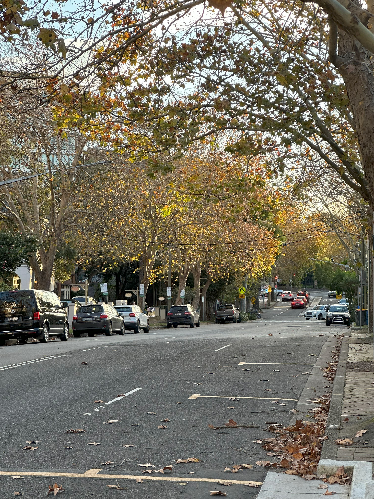

+++
author = "Sathyajith Bhat"
categories = ["Life"]
tags = ["weekly-notes", "gaming"]
places = "Sydney"
type = "post"
series = ["Weekly notes"]
url = "/weekly-notes-22-2025/"
title = "Weekly notes 22/2025"
date = 2025-06-01T12:00:00Z
summary = "Week 22 summary - tax season, a new game and more."
images = ["/weekly-notes-22-2025/thumb-winter-north-sydney.jpg"]

+++

_Thumbnail image: Autumn leaves along McLaren Street in North Sydney. To my best knowledge, there is nothing common between this street and the supercar!_

### What's been happening

Another week has gone by so fast. Weather wise it hasn’t rained as much but has been so cold, we’re truly in winter times. From work perspective, it’s been a good week. I finally finished and closed out the Shield Advanced roll out project and that’s yielded some good cost savings. I’m pretty happy how this turned out - the technical changes weren’t a lot but had to do a fair amount of research, analysis, digging into AWS Billing Reports and some what-if analysis to confirm my hypothesis and my predictions for cost savings were pretty spot on. I have another project to finish off for this team and then we’ll see if there’s more projects they need help on.

It’s also tax season. My CA in India reached out to me requesting for all the necessary paperwork. Meanwhile here in Australia, my taxes are due next week so I’ll have to finish paying off the taxes before then. The tax was actually due last October, but here in Australia, if you have an Accountant who takes care of your taxes, then the due date is extended by another 6 months, so you can take advantage of this time frame to get some extra savings in. The rest of the week went by pretty fast. On Friday, Jo had a doctor appointment at Lane Cove, so I accompanied her and after her appointment, we walked around the suburb a bit to check it out and stopped by a coffee shop to have a coffee. 

The weekend was pretty slow as well - we had our usual guitar class. In this weekend’s guitar class, we were introduced to the EFG notes on the guitar (whatever happened to the D note 🤔). I had a really hard time trying to read the symbol and map it to what it means and then get my hands to make the corresponding shape on the fret board. And when you add the practice sheet which adds in all these notes, combined with different beats and rests for each note - all meant that my brain was fried trying to make sense of them all. Post the class, we went over to Cammeray - another residential suburb just nearby to have brunch at Maggio’s Cafe, and then to a butcher to buy some meat and then to Harris Farm Markets to buy some fruits. Sunday was another lazy day - we were supposed to go for a walk in the morning but pushed it to later and that later never came. Bad us. I played some RoadCraft with Aman and uploaded a video of the Chinese Garden of Friendship to YouTube - I had recorded some footage when we went there [a few weeks ago](/weekly-notes-12-2025/).

  

### What I've been playing

Path of Exile 2 - I went back to Path of Exile 2 after getting to Torment 3 on Diablo IV. Any further progress would have required a lot of grinding, and didn’t want to start a new character given that the season is short and will be ending soon. I’m back to my Grenadier Witch on Path of Exile 2, doing the endgame maps and building out my character. Path of Exile 2 is still quite hostile to new players, has a lot of one shot kills and is even more gear dependent than Diablo but for now is keeping me entertained. I might switch to a new character since the current play style is quite hard on my wrist. 

Roadcraft - I bought this new game [Roadcraft](https://store.steampowered.com/app/2104890/RoadCraft/) which is a sequel to the hugely popular off-road simulation games SnowRunner and MudRunner. Roadcraft is more of a spinoff than a true sequel - Roadcraft focuses more on building infrastructure (read: clearing debris, using cranes to move concrete slabs, building roads etc) as compared to SnowRunner/MudRunner which was more focused on cargo delivery. Roadcraft also forgoes many painful aspects of SnowRunner such as fuel management and damage which made SnowRunner such a frustrating game. Aman & I used to play these games quite a bit back in COVID times and had lots of fun till we got frustrated by one of the extremely punishing maps in SnowRunner - we got so annoyed that we dropped the game. 

In contrast, Roadcraft is looking good so far, and in our first session ever already had a lot of laughs.

  

  
  
  
  
  
  
  
  
  
    
  

  

### What we ate

[Kagoshima Master](https://maps.app.goo.gl/Prf784MR3vTfUL6SA) - We went over to Yakitori Yurippi initially for some Japanese BBQ, but they were fully booked. We walked slightly ahead and found this unassuming place, but ended up being such an incredible place to visit. They had mostly the raw meat cuts, so we ended up getting the set menu which had lots of really good food including edamame, oyster with salmon caviar, Australian flap meat, rib finger more. We enjoyed the food quite a bit and is definitely worth visiting again.

  

    
  
  
  
  
  
  
  
  
  
  
  
  
  
  
  
  
  
    
  

[Maggio’s Cafe, Cammeray](https://maps.app.goo.gl/Nq5DNET2An3nbFt26) - Maggio’s is a really nice outdoorsy cafe in Cammeray. The cafe was pretty busy on Saturday mid-day but we didn’t have to wait for long to get a table. We ordered our usual coffees - a large cappuccino for me & almond flat white for Jo and  Maggio’s Eggs (poached eggs in tomato sauce) and panckes for Jo. The coffee was delicious. We found they have their own roast just as we left - should get it soon to try. The food was really good as well. The eggs came with ciabatta that was incredibly light. Jo’s  pancakes were equally good - fluffy, light and just the right amount of sweetness. Definitely worth a revisit to check out their other food options.

  

  
  
  
  
  
  
  
  
  
  
  
  
  
  
  

While not outdoor eating, Jo baked a really nice  gluten free, low carb, high protein sugar free lemon pound cake. It was really yummy. 

Also, we've been trying to cut down snacking and my guilty pleasure has been masala peanuts, which was substituted by roasted cashews. I asked Jo if she could do some masala roasted cashews with the airfryer and she did a really good job. Loved this.

  

   

   

   

   

  

### Music of the Week

Just as I mentioned Buena Vista Social Club [last week](/weekly-notes-21-2025/), I saw that NPR has a Tiny Desk Concert with the cast of Buena Vista Social Club musical (TIL moment that there’s a musical!). The only problem I have with this video is it’s only 20 minutes long! Crank up the volume, enable captions/subtitles then enjoy the performance.

  

### Link of the week

Real Engineering has a really [nice video](https://www.youtube.com/watch?v=8jQzwxS8vxA) that covers India’s space evolution. 

  

### Thanks for reading.

Thanks for reading and have a great week ahead.

Subscribe to my weekly notes:

- [Email newsletter](https://sathyabhat.substack.com/)
- [RSS feed for the weekly notes](https://sathyabh.at/series/weekly-notes/index.xml)
- [RSS feed for my site](https://sathyabh.at/index.xml)
