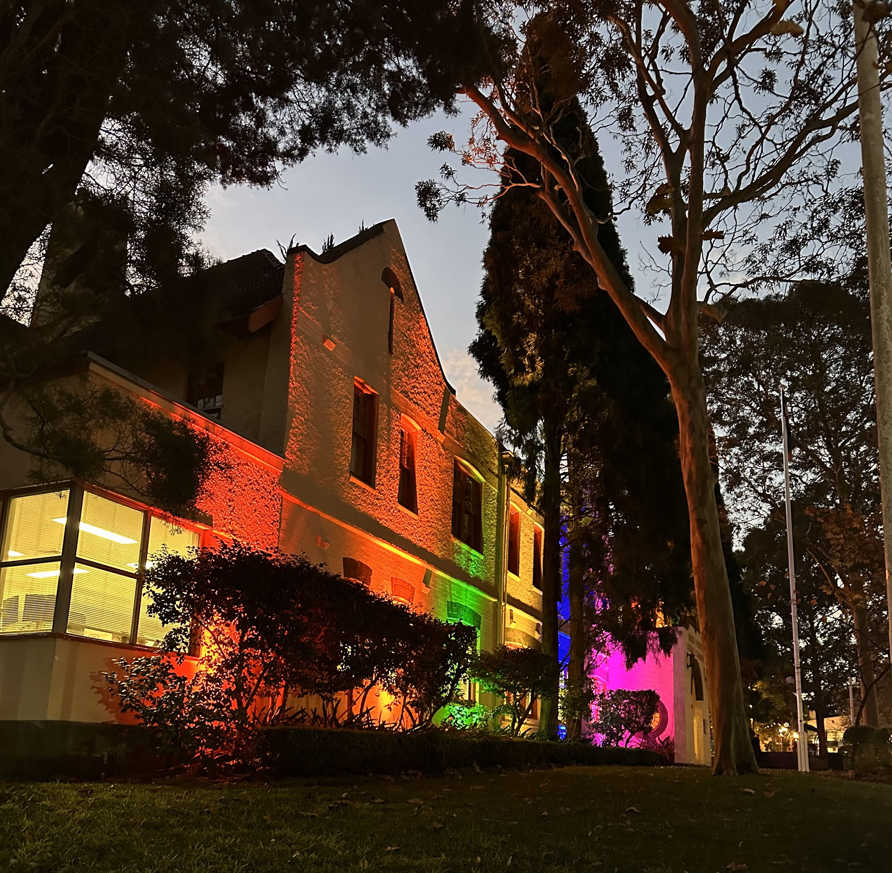

+++
author = "Sathyajith Bhat"
categories = ["Life"]
tags = ["weekly-notes", "gaming"]
places = "Sydney"
type = "post"
series = ["Weekly notes"]
url = "/weekly-notes-23-2025/"
title = "Weekly notes 23/2025"
date = 2025-06-08T12:00:00Z
summary = "Week 23 summary - Winter is here, Cat adoption day, Ambi's Chai Bar, and more."
images = ["/weekly-notes-23-2025/thumb-north-sydney-council-pride.jpg"]
+++

_Thumbnail image: North Sydney Council Building lit up with pride colours._

### What's been happening

I was complaining it was cold last week. Well, now I’m complaining we’re now in phase 2 of Sydney winter. What’s phase 2, you might ask? Here’s my breakdown:

- Phase 1: Switch from shorts to pants, wear hoodie to the office
- Phase 2: Switch to pants in house, start wearing socks in house
- Phase 3: Wear hoodie in house too 🥶

I’m sure we’ll switch to phase 3 soon as well.

Work was pretty good. After completing the Shield work last week, I managed to get some focus time on the Tailscale project. I had several blockers for that, including having to reconfigure the subnets where the EKS (Amazon Elastic Kubernetes Service) control plane exists, to avoid IP conflicts. Rolling that out was pretty seamless but required some prep work including checking for downtime etc. I’ll be rolling that out to our production clusters next week. 

My gym sessions have been going pretty well. I’m back to doing some tempo dead lifts and back squats. The barbell bench press has been progressing well. Overall, I’ve been pretty happy in improving my form and strength. My weight loss however has completely stalled and it’s pretty frustrating - especially when it increases or decreases by half a kilo or so. My trainer has suggested me to join in the group classes and I might consider doing that in the upcoming week.

We also have a long weekend as Monday is a holiday here in Australia. We thought of going somewhere but decided against it. It’s been nice to sit and relax! We had our guitar class on Saturday where we practiced a lot more of the ABC/EFG notes (still no D...). Along with that, we played the chords for Tequila! 

  

Post the guitar class, we did some grocery shopping at the North Sydney Produce Markets. From there, we went over the Lost and Found Cafe, had some brunch, went over to the library picked up a couple of books and came home.

On Sunday morning, we went for a nice walk to Crow’s Nest for some coffee. After the coffee (at Cavalier), we wanted to head back to Woolworths’ to pick up some groceries. Jo found out that there is a cat adoption drive at the nearby Crows Nest Community Center and we went over to check it out. We can’t adopt a cat in our current house right now, but wanted to check it out anyway. There were a mix of kittens, cats, older cats and even rabbits - some quietly sitting down, others more eagerly rubbing against the netting, getting people to come closer and pat and rub them. We also saw some majestic Bengal kittens, and there was this set of four kittens who seem to be moving in unison. 

  
  

  

  

  

  

  

  

  

  

We left the Community Center, went to Woolworths to get some pending groceries (mainly pantry supplies) and then got back home. On the way back, we picked up a bag of coffee from Cavalier and a record of Englebert from the op shop and got back home.

  
  

  

In the evening after my weekly call with my friends, I joined Jo at Ambi’s Chai Bar for some nice spiced chocolate tea and a haraka roti and then came back home and played some more Civilization VII.

### What I've been playing
  
I suppose mini crossword is a game?! I’ve been doing the Sydney Morning Herald Mini Crossword everyday while going to the office. They don’t take more than a couple of minutes, so it’s a quick win. I don’t particularly care about streaks being broken but it’s nice to have this for now 

  

Roadcraft - Aman & I played some more Roadcraft and we’re still thoroughly enjoying it. We had two long-ish [streams on twitch](https://twitch.tv/sathyabhat) (3+ hours on Saturday, an hour and half today) and we’ve finally unlocked being able to pave roads. It sounds strange to play hours, going arduously slow with a tipper to drop sand, use the bulldozer to smooth out the sand, then drop the asphalt using the asphalt paver and then use the roller to finally smooth out the road. It’s supremely therapeutic and relaxing!  

Path of Exile 2 - I mentioned creating a new [character last week](/weekly-notes-22-2025/) and that’s exactly what I did - created a new Witch minion build. And it’s been pretty good - having the extra materials and gems means that I could easily breeze through early game. I’m playing the Raging Spirits build which summons lots of fire-spirits that do a lot of damage. So far it’s pretty good to play, we’ll see how it goes as I get into cruel difficult and endgame.

### What we watched

Murderbot - After a brief pause, we’re back to watching the series. And the past two episodes were pretty incredible to watch. Alexander Skarsgård does a fantastic job as a bot who can’t be bothered to do his job as a SecUnit but is forced to, for the sake of not being discovered. The mission seems to get more and more dangerous and just as we were getting ready to see the next episode (we saw three episodes back-to-back), we realized the next episode was not yet available, and thus the wait continues.

### What we ate

[Cafe Lost and Found, North Sydney](https://maps.app.goo.gl/QCZkGXSY7vnx4Bg39) - A lush, nice looking cafe hidden in North Sydney, Cafe Lost and Found has lots of greenery in the cafe and some interesting decor. The food was pretty average, but the coffee was good. My sweet chili prawn wrap was average - prawns were deep fried and the sweet chili sauce seemed like more like spicy mayonnaise sauce. Jo tells me her salad was good. Worth revisiting to try out something else.

  

  
  
  
  
  
  
  

  

  
[Cavalier Specialty Coffee, St Leonards](https://maps.app.goo.gl/zRsadRF39Y6hg8pJ7) - A small little speciality coffee shop in St Leonards, Cavalier are apparently well known for their jaffles and toasties - particularly their unique Japanese Pulled Pork toastie which had a really nice flavour on the sizzle featuring yakiniku glaze and wasabi coleslaw and pork as the meat. The meat was a bit dry but the sizzle and the coleslaw made up for the dryness. Jo had a ham & cheese jaffle that was pretty good too. And the coffee was really good - so good that I ended up buying a bag of beans to have at home.

  

  

  

  
  

[Ambi’s Chai Bar, North Sydney](https://maps.app.goo.gl/xHLKqji9JpkxruAv5) - Founded by a Kenya-born Indian, Ambi’s Chai Bar has lots of different varieties of tea - starting with the humble desi chai, masala chai and a lot of other varieties of tea - and pairs the tea with a lot of East African food items. Nice little place to hangout late evenings with good food and tea to match. Jo and I had the Maddy’s Mzungo - a nice little spicy milk chocolate chai that was perfect for the cold outside, and had the aforementioned haraka roti that was like a spicy-sour roti wrap with chole. Overall, loved this combo for the weather.

  

  

  

    

### Music of the Week

I was blown away by Girish And The Chronicles and had referenced them in one of my previous [weekly notes](https://sathyabh.at/weekly-notes-38-2024/). It turns out that they flew to the US to audition at [America’s Got Talent](https://www.youtube.com/watch?v=uBnTrlE5w1w), covering Adele’s “Set Fire to the Rain” and they did well! 



### Link of the week

Back in my college days (and even after - up to a year or two into my working career - so circa 2006-ish) I used to use Opera Mini browser quite heavily. Opera Mini had really clever solution to slow networks - they had some proprietary tech that would fetch the destination website, compress and resend it as a smaller, custom format page that Opera Mini would render, as opposed to being a full-featured browser. And for the dead-slow networks from those days, it worked really well. Hell, it was one of the reasons why I could participate in tech forums that I was known for. This website has a nice [feature on](https://www.spacebar.news/the-flip-phone-web-browsing-with-the-original-opera-mini/) and apparently still works to this date. Pretty incredible.  

### Thanks for reading.
Thanks for reading and have a great week ahead. 

Subscribe to my weekly notes:
- [Email newsletter](https://sathyabhat.substack.com/)
- [RSS feed for the weekly notes](https://sathyabh.at/series/weekly-notes/index.xml)
- [RSS feed for my site](https://sathyabh.at/index.xml)
 
