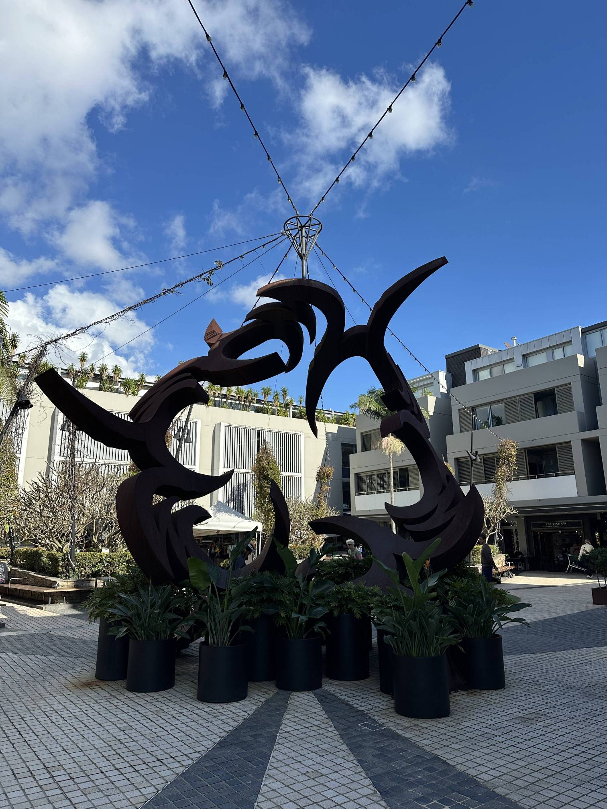

+++
author = "Sathyajith Bhat"
categories = ["Life"]
tags = ["weekly-notes", "gaming", "travel", "crossfit"]
places = "Sydney"
type = "post"
series = ["Weekly notes"]
url = "/weekly-notes-24-2025/"
title = "Weekly notes 24/2025"
date = 2025-06-15T12:00:00Z
summary = "Week 24 summary - first group cross fit class, Kiama day trip, and more."
images = ["/weekly-notes-24-2025/thumb-cammeray-square.jpg"]

+++

_Thumbnail image: Cammeray Square is a shopping mall having some nice shops in Cammeray, a residential suburb on the Lower North Shore region of Northern Sydney._

### What's been happening

Another week around the sun. It’s been a good week. Work-wise, I completed the Tailscale rollout for all clusters. So far it’s been working well - except for a few folks who are on Windows. For reasons I can’t figure out, after sometime after connecting to the tailnet, these Windows devices cannot connect to the private endpoints in the tailnet. Rebooting Windows fixes this. I’ll have to figure out the root cause for these timeouts, but they are so unpredictable. With this, my current engagement with the team is complete. I got some feedback - both good and what can be better. I felt the “what can be better” reflected more like an expectation mismatch between what the team was told v/s what I was told and expected to do. I don’t know how to handle this, but for now, I will be finishing off some of the pending documentation for the projects and then wrap it up.

I also went to my first, group cross fit training session at my gym. My trainer had asked me if I was interested in adding a third session by means of the group class - my weight loss had stalled and I figured the extra session might help boost it a bit. And thus, I woke up bright and early at 6am on Wednesday morning for my first ever class. My trainer was running the class, so there was that comfort knowing not everything will be an unknown. The group sessions are run with a group of up to 14 people, with a mix of strength training/lifts and some metabolic conditioning (MetCon). For Wednesday’s class, the strength training we had to do dead lifts, and for MetCon we had a mix of row & running. Of course, we didn’t get right into the dead lifts, we did some warmups in form of bike for 10 cal, and then glute bridges and then Romanian Dead Lifts (RDLs). Often the group classes are run paired up - basically you team with someone else to save up on time, space and equipment. Being my first class and that I am almost never in morning, I had not met anyone in the class. Nevertheless, I paired up with another person and did my dead lifts - starting with just a plain bar, then progressing to 50kgs and then stopping there, while my partner went till 80kgs. I was always worried about how it’d look to have the least weight, or not being able to match or do what the others do - to which my trainer always says - “comparison is the thief of joy”. Do what you can! So glad that I stuck to the 50kg weight, else I’d be in a world of pain for sure. 

For MetCon, I told my trainer I can’t run, so he swapped run over to a farmer’s carry. At the end of the hour, I completed 5 sets of dead lifts and 5 sets of 15 cal rows/farmer’s carry and was pretty tired but felt strangely good. Not having done the rows previously reflected in the next couple of days - the shoulders, hamstrings were sore but not in pain. Overall, happy with what I did and will continue with the class the next week. 

    
  

I also spoke to my best friend from my school after a long time. We’ve been in the same class since the 5th, and even though we went to different colleges for Pre-University and Engineering and being in different continents/countries all these years, we still pick up and left off where we were. He’s a really nice guy and he called me to say he’s getting married and invited to his wedding in Amsterdam. I’ll try my best to attend the wedding, and for that I will have to apply for my Schengen visa and will need a bunch of other paperwork sorted out for this. 

Our weekend was meant to be quiet - we didn’t have guitar class as our teacher, Joseph, had a gig and wouldn’t be able to take our class. We went for a nice walk to Neutral Bay, a suburb we haven’t explored much and went to Ken’s Kissa - a Japanese cafe for brunch. Post brunch we returned home and I played RoadCraft with Aman while Jo went to the city to get some photographs of Vivid (Sydney’s premiere lights festival) on it’s last day. Earlier in the week, we had originally planned to do a day trip to [Kiama](https://www.visitnsw.com/destinations/south-coast/kiama-area/kiama) (a seaside town about 120kms from Sydney) on Saturday, but the car that I wanted to drive to, a Haval Jolion Hybrid wasn’t available and Jo wasn’t feeling like going either, so we cancelled the trip. Having returned from a nice city outing for Vivid photography, Jo was invigorated to head to Kiama on the Sunday, and I found out the car was available as well, so we booked the car on GoGet and made a day trip out of it. We left for Kiama in the morning after grabbing some breakfast and Moon Phase and then stopped by some of Kiama’s popular spots such at the Kiama Blowhole. I’ll have a separate post on our Kiama trip later this week.

We reached back at 6 in the evening and I spent the next couple of hours playing Civilization VII with my usual bunch and wrote this post. 

### What I've been playing

Roadcraft - Aman & I played some more Roadcraft on Saturday. Since we were out on Sunday, I couldn’t play much this week but made some progress in the game. Roadcraft is fun and really shines when multiple people are playing together. I was streaming the game on Twitch and an old friend joined to watch us, and we had some great laughs - he mentioned the game looked supremely therapeutic and relaxing and I said that’s how we feel while playing as well. I look forward to many more hours of the game. 

### What we watched

After a long time, we went back to watching Foundation and honestly I think the episode we saw - “The Last Empress” was potentially one of the best episodes yet. The series finally progresses a lot, answering a lot of questions and revealing some really mind blowing things that I don’t want to mention because it will be a spoiler. Suffice to say, it’s worth watching all episodes till here to see how well this episode has handled a lot of the loose ends of the story so far.

### What we ate

Kori Rotti - A few weeks back when our [friends came home](https://sathyabh.at/weekly-notes-21-2025/) they brought the _rice rotti_ as Jo had mentioned not being able to find it. Jo made _kori rotti_ and we had a few meals with it. _deeeeeeliccioussss_

  
  
  
  

  

  

  
  

[Myeong Dong, Chatswood](https://maps.app.goo.gl/bB949BPQ8g91wQxG9) - This place is fast becoming a favourite to visit, having previously [visited](/weekly-notes-15-2025/) twice [before](/weekly-notes-10-2025/). Again driven by the urge to have kimchi pancake, we went here. Unlike last time where we had ordered a few cuts for BBQ, we unknowingly ordered the full set, not realizing this is *not* what we had previously ordered. The result: we ate so much and were so full, we ended up skipping dinner and only had some fruits. Well worth bringing some friends over!

  

  

  

  

[Ken’s Kissa, Neutral Bay](https://maps.app.goo.gl/2NhvuN4A59fircHA7): We were looking for a new cafe to go to and since we hadn’t explored a lot of Neutral Bay, we went over to this Japanese cafe. Kissa stands for cafe in Japanese and this place was interesting. Instead of numbers as table identifier, they have Japan prefecture names which was unique. I ordered a cappuccino and bacon egg roll for myself while Jo had the breakkie wrap and Houjicha latte. I sneaked in a surprise order of chocolate matcha muffin. The Houjicha latte is a Japanese green tea latte and was interesting - Jo didn’t add any sweetener to it, we could feel it was a bit too harsh. The chocolate matcha muffin was a certified banger and we absolutely loved it. The wrap/egg roll was pretty OK and nothing to write about. They had other Japanese breakfast items that I was not in the mood for so good thing to have for next visit.

  
  
  
  
  
  
  
  

[The Grumpy Baker, Waverton](https://maps.app.goo.gl/Zn7HswuUphEPeRuLA) - We came across this small cafe during our morning walk to Waverton and stopped by while returning. We ordered the Fig/Apple Muffin and the Spicy Chicken Pie, along with our coffees. The muffin was really good and had the perfect mix of sweet and fluffyness. The pie wasn’t too bad either.

  
  
  
  

### Music of the Week

I had first heard of Mister Mister’s Broken Wings when playing GTA Vice City and that [remains to be one of my most sublime](https://sathyasays.com/2016/02/04/some-thoughts-on-grand-theft-auto/) gaming experiences. I came across this fabulous cover of the song and took me back to those days.



### Link of the week

Firmly remaining on the nostalgia train, Raymond Chen of “Old New Thing” writes [about moricons.dll](https://devblogs.microsoft.com/oldnewthing/20250505-00/?p=111143).
  

### Thanks for reading.
Thanks for reading and have a great week ahead. 

Subscribe to my weekly notes:
- [Email newsletter](https://sathyabhat.substack.com/)
- [RSS feed for the weekly notes](https://sathyabh.at/series/weekly-notes/index.xml)
- [RSS feed for my site](https://sathyabh.at/index.xml) 
