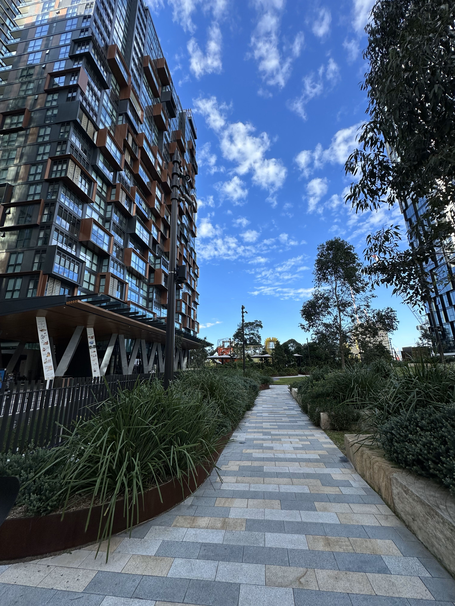

+++
author = "Sathyajith Bhat"
categories = ["Life"]
tags = ["weekly-notes", "gaming"]
places = "Sydney"
type = "post"
series = ["Weekly notes"]
url = "/weekly-notes-25-2025/"
title = "Weekly notes 25/2025"
date = 2025-06-22T12:00:00Z
summary = "Week 25 summary - Dental check up, State of Origin, and more."
images = ["/weekly-notes-25-2025/thumb-st-leonards-wadanggari-park.jpg"]

+++

_Thumbnail image: Wadanggari Park in St Leonards is a vast open space featuring lawn, plaza, passive nooks, and a regional scale adventure playground._

### What's been happening

The week started with a dental check up. I had to head to the dentist to get my regular dental hygiene clean up done. Story time: I come from a family of dentists and yet I’m deathly afraid of them. I had never been to a dentist in close to two decades. I had been avoiding a dentist visit for so long. One of my tooth literally split in half (while in Romania) - I did not visit the dentist. Then the remaining half broke off again and a stub remained - and even after this I did not go. What did trigger me to visit the dentist was a sharp sensation in my tooth when I was eating a _nippat_. Which I ignored couple of times and then finally dragged my butt over to the dentist. I don’t know what made me go to the dentist this time - I suppose it was getting hard for me to bite into anything so I decided better to go now. The whole experience with the dentist was really nice. My dentist first asked me if I had any dental anxiety. They then examined my tooth, in the fabulous condition that it was in, and had to schedule couple of extractions and a clean up. They also recommended some follow up appointments with the oral health specialist to clean up the plaque build up and asked me to keep flossing. Oh as for the tooth pain - guess what, the tooth was _perfectly fine_. Turns out a chili seed had been stuck there and that's what caused the pain. Oh well. At least my teeth are in better shape now and I don’t fear a dentist visit so much! 

The week’s being good. Sydney continues to be cold af. Probably the coldest yet - temperatures on the lower side were regularly in the 5 degree range at night - haven’t seen them drop this low below. Work was okay - I don’t know how the week went by. Feels like I did nothing and yet I was occupied through the week. A lot of time went into the sprint closing/new sprint work and also had to prepare a bit since I decided to switch to a three-week sprint (I am the scrum master for my team). My goal with the extra week is to give people some breathing time to finish off pending work/documentation/prepare for future work while not having to rush through the sprint. And for me, it gives me some time for the same. I also booked my flights and hotel for the upcoming AWS Hero Summit that is happening in Seattle. Prior to heading to Seattle, I will spend a week in San Francisco - will have a team meetup with my team in North America, plus will make some plans to meet some friends and then head over to Seattle for the Hero Summit and then return to Sydney. 

Gym has been going pretty good too. Since Jo’s trainer is out on vacation, my trainer is covering her shift so my session was moved from Monday to Tuesday evening. And then I went to the group class on Wednesday morning - marking the first time I’ve gone to the gym twice in a span of 12 hours. I did decently well. Once again, we had a mix of strength training and cardio - the strength training was deadlifts.  Deadlifts went well and I hit my PB of 80 kg - very happy about that. The cardio however was pretty bad though - the exercises were skipping (which I’ve done once previously and could barely hit handful of them) and then alternating rowing & cycling along with devils’ press. Ultimately, I decided to take it easy during the cardio session and probably did half of what I was supposed to do. The Friday PT session wasn’t so bad but my left elbow was slightly off, prompting my trainer to reduce the weights on the bench press by 10 kilos. That said, I got slightly better at Bulgarian Split Squats and I think we should be adding weights to that exercise soon. 

Wednesday evening was also State of Origin day. The State of Origin series is an annual best-of-three rugby league series between the teams representing New South Wales and Queensland. I don’t generally watch a lot of sports but this is one of the most anticipated sports events in Australia, so both Jo & I watched the game. In the first game, New South Wales won the game, but in the second game New South Wales after couple of early goals started faltering pretty badly and ran into a major deficit. The second half was pretty action packed and New South Wales started mounting a come back and almost won the game, but ultimately Queensland managed to win the game by 2 goals. The final decider will be played in a few weeks in Sydney and look forward to seeing that game!

On Thursday, we received an email from North Sydney Community Center that this week’s guitar class had been cancelled due to a conflict and we will have a make up class later. Jo & I were due to miss the class anyway so that worked well for us. On Friday morning, we did a nice breezy walk to Kirribilli and stopped by a new cafe.

  
  
  
  

By the time were done with breakfast, it was getting late for both of us as we had meetings so we decided to take a bus back home instead of walking as we’d have missed our meetings otherwise.

We didn’t do much on the weekend and just chilled at home as I played more Roadcraft with Aman & Civilization VII with the Kush, Rushabh & Abhay.

### What I've been playing

Roadcraft - Continued playing Roadcraft with Aman. This game is still going strong, and we’re enjoying every moment of it. We finished all the objectives of our second map and now have unlocked a third map. For this, the game gives you an option of two different maps with different objectives, and we chose the second one as it seemed to be different from what we had done before. 

    
  
  
  

Civilization VII - Kush, Rushabh & Abhay were available so we continued the game, completing antiquity age and entering the exploratory age. With the age change comes a new Civilization, so now I am Napolean of Bulgaria! We still continued running into random disconnects. I tried reaching to Firaxis with a detailed report, only to be _supported away_ with the pretty poor response of “`traceroute` shows timeout, pl0x contact ISP” despite the fact that `traceroute` timeouts are due to `ICMP` blocks, and that `pathping` showed no timeouts. I didn’t bother replying, and we will continue bearing the pain of random disconnects with a “unique” strategy - I play my turn the last and before I go to the next turn, I do a quick save so we can load up and continue the game fast if it gets disconnected.

  
  
  
  

### What we watched

Foundation Season 2 - With how the eighth episode ended last week, Jo was really eager to watch and finish season 2 of the series. What an end it was. Foundation requires you to invest a lot in the entire series quite a bit but the reward is pretty sweet. The last two episodes neatly ties in a lot of the open questions that I had as I was watching the season. Thankfully, we won’t have to wait for long for more Foundation action as the new season is starting soon and looking forward to. I’m not sure if they will release all the episodes at once or will do the drip feed way like how they are doing for Murderbot - if it’s the latter I will be very annoyed. 

### What we ate

[Firangi by ASAP Eats, North Sydney](https://maps.app.goo.gl/CizUQBx5G2nrAP5k9): Firangi is an Indian fusion restaurant with some interesting twists on Indian food. We had a rum todi (not _that_ toddy - this one had tea, rum, ginger) and made for a good warm drink in the cold Sydney winter. For food, we had the chicken tikka masala, samosa paratha & paneer paratha. The parathas were pretty good - both of us preferred the samosa paratha while the tikka was nicely grilled, done in the tandoor and had the nice smoky tandoori grilled char.

  
  
  
  
  
  
  
  

[BTB, Kirribilli](https://maps.app.goo.gl/aCumGBYh7wvK2bKC7) - BTB Kirribilli is a quaint little cafe located just besides the Kirribilli Markets. We went here as we were returning from our morning walk to Kirribilli. Looking at the menu, they had some interesting food apart from the usual avo smashes or toasties and I was looking to try out something different. I ordered the Beef Brisket Cornbread with house made cornbread while Jo had the buckwheat porridge. We both liked our breakkie items, with me preferring my brisket over the porridge. The beef was nicely done and extra fatty bits at the ends of the brisket had some nice char on edges what was simply delicious. For coffee, we had our usual coffees - and that was really good too. Jo loved the almond milk with her flat white which is rare as most cafes don’t tend to miss the mark on alternative milk. The cafe had a nice decor and would definitely come back here.

  
  
  
  
  
  
  
  
  
  
  
  
  
  
  
  

[As Usual, Macquarie Park](https://maps.app.goo.gl/J4BkuftrGB9UQBwg6) - A nice little coffee shop in Macquarie Park. We went here for a coffee as we’d already had our breakfast and were fairly full. The loaded chilli cheese fries ended up tempting us and we ordered that, along with orange almond gluten free cake & cherry cheesecake (so much for being full.. lol). The loaded chilli cheese fries were made with a combination of shoestring fries and chilli con carne - I love shoestring fries because they aren’t as thick as the usual ones and end up being quite crispy. The coffee was also really good and the place was pretty packed. Worth a repeat visit!

  

  

  

  

  

### Music of the Week
I came across [this](https://youtu.be/pFqe2VK5ivY) fabulous cover of Phil Collin’s iconic [In the air tonight](https://www.youtube.com/watch?v=YkADj0TPrJA) and absolutely loved it.


  

### Link of the week

I came across [this blog post](https://vermaden.wordpress.com/2024/03/21/tiny-undervalued-hardware-companions/) 

> After playing/working with computers for more then 25 years I started to appreciate small but handy valuable stuff – like adapters or handlers or … yeah – all kind of stuff. With many of them I did not even knew they existed until I find out about them – mostly accidentally or after long searching for some problem solution. Today I will share them with You – so maybe they will end up handy also for you.

As someone who often doesn’t know _what_ to search, or doesn’t realize some niche product exists till I read about it, this is a very timely blog post. Some of these, such as the angle adapters can be really handy especially when building computers - often the ports on the motherboards can go to tiny cramped corners when assembling and this makes it really hard to plug stuff in and these adapters make such ports accessible. Do you have any such handy little trinket? Let me know, I’m [curious](https://sathyabh.at/about/#contact). 

### Thanks for reading.
Thanks for reading and have a great week ahead. 

Subscribe to my weekly notes:
- [Email newsletter](https://sathyabhat.substack.com/)
- [RSS feed for the weekly notes](https://sathyabh.at/series/weekly-notes/index.xml)
- [RSS feed for my site](https://sathyabh.at/index.xml)
 
