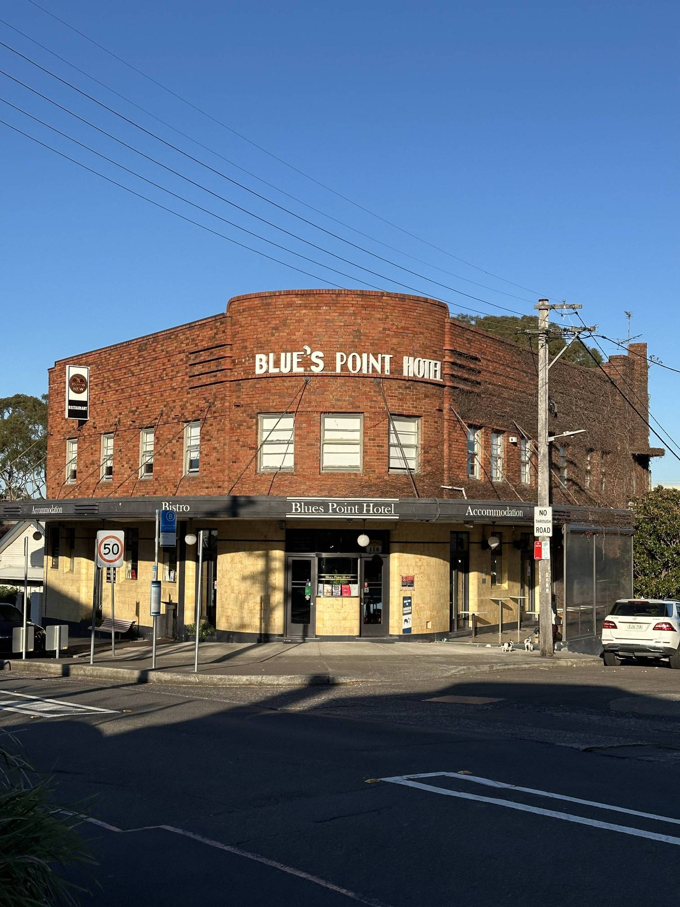

+++
author = "Sathyajith Bhat"
categories = ["Life"]
tags = ["weekly-notes", "gaming"]
places = "Sydney"
type = "post"
series = ["Weekly notes"]
url = "/weekly-notes-26-2025/"
title = "Weekly notes 26/2025"
date = 2025-06-30T12:00:00Z
summary = "Week 26 summary - gym woes, work works, and more."
images = ["/weekly-notes-26-2025/thumb-blues-point-hotel.jpg"]

+++

_Thumbnail image: The Blues Point Hotel was the first licensed premises on Sydney's north shore, and the first refreshment spot for travellers on the original ferry from Central Sydney. It has been a watering hole since 1864._

### What's been happening

Another cold windy week here in Sydney. The week started on a not-so-good note. [Jo](https://joshenoy.me/tag/blog/)
wasn’t feeling too well, and so she had to cancel her gym session for Monday. Since we both have the same trainer (for now), our trainer asked us if we could come in together for a combined session and that was set for Tuesday.

On Tuesday, since mid-day at work, I wasn’t feeling too great. I had some headache and I was feeling a bit lightheaded but I didn’t pay too much attention to it. The afternoon went by and I got home, readying to go to the gym. I still wasn’t feeling the best but I figured a workout might get me better. 

The workout started OK - we did a quick 2 minute warm-up on the bike and then some more warm ups with wall sits and air-squats. We then got into the meat of it, tempo back squats for me while Jo did the front squats - all of this went OK. By the time I was done with all my reps of the squat I was increasingly feeling worse off and after one set of dip hold and a pendlay row, I was feeling very sick and immediately bailed out. It’s a shame because I was doing okay till then and wanted to finish my workout but I know my limits as well, and last thing I want to do is to, uh, _spoil_ the gym floor. That said, I did couple of sets of barbell bicep curls so it wasn’t a complete washout. Once I got home though I just crashed and got some rest and took the day off the next day.

The rest day helped - I was feeling much better by mid day and took a nap again post lunch. I decided against joining the group workout as well. I’m not sure what caused me feel so bad - maybe the diet change as through the weekend we were having a lot of _ganji_ (boiled rice porridge of sorts) made me a bit weaker than the nutrition I get from our usual protein-rich diets. 

Anyway, the rest of the week went by better. Work-wise, I started digging into more avenues to find out ways of how we can improve our cloud costs and that has yielded more savings. Our work has also started a limited-number trial for Cursor. I have signed up for it but I wasn’t able to try it out much. My lead, however, seemed to make good use of it - using it to overhaul the frontend for many of our internal products that we support for our other dev teams. 

Work aside, I managed to keep up my tradition of one blog post a year (😢) on my [tech blog](https://sathyasays.com). I wrote this post that talks about how I have been using Amazon Q Developer’s Chat option to investigate into my AWS resource in natural language queries. Give it a [read](https://sathyasays.com/amazon-q-developer-chat-adhoc-querying/)!

I also published a travelogue on the Kiama trip that we did couple of weeks ago, and compiled the clips I took on my Insta360 Go 3s into a trip video. [Check it out](https://youtu.be/ctmctyMdl34)! 



On Saturday, we had our guitar class again after a two week break. And unlike the previous classes, this class was almost entirely theoretical - we learnt how each notes on a scale are separated on the basis of tones/semitones and knowing the distance helps us forge our own scale. We also learnt how to play chords for each of these notes of the scale and getting those chords involved learning know to barre chord, which was _fun_.

  

After the guitar class, Jo wanted to explore a little bit of the suburb of Lane Cove, so went home to keep our guitars and took the bus to Lane Cove. 

Lane Cove is a nice quiet little residential suburb in the lower North Shore. We got off the bus and walked around for a bit, finding a coffee shop to have brunch in. After brunch, we walked around for a little bit more, finding an Indian grocery store nicely tucked away between couple of buildings. It was pretty easy to miss but I spotted it thanks to a board they had kept outside. We walked into the shop and bought a few essentials such as chilies and brown rice. It’s hard to get the brown rice here. The store had brown rice but it was in 5kilo bad which would have been too much for us. The shop keeper was nice enough to open up the bag and give us only a kilo of the rice. From here, we went over to a book store nearby which had some _interesting_ notes at the top of the bookshelves. Jo bought couple of books for herself and we went back home. 

  
  

  
  
  
  

Our Sunday morning started with a nice walk to the Blues Point Reserve. Blues Point Reserve in McMahons Point features some of the best views of the city, the harbour and the bridge. The walk to the reserve is a nice downhill stroll, which makes for a bit of a challenge while walking back. We reached the reserve at around 9am and saw a few people fishing. After a quick walk around the reserve, we started back to home, stopping by Fiore Bread for a quick coffee and some bread.
 

  
  
  
  

### What I've been playing

Civilization VII - Civilization got a major update with support for new map sizes (large and huge) and a few more changes that have been long awaited. Kush, Rushabh & Abhay were available so we created a new game with the huge maps. The extra space on the larger maps makes for better city sprawls so let’s see how it goes. 

Roadcraft - Continued playing Roadcraft with Aman. We didn’t get a lot of mission objectives done but spent a lot of time exploring the map, clearing out rubble and building roads! Building a road in Roadcraft is a multi-step process of dumping sand, flattening out the dumped sand, laying out asphalt and then paving the asphalt.  It sounds boring but as mentioned before, can be quite relaxing! 

### What we ate

[Lil Lane Eatery, Lane Cove](https://maps.app.goo.gl/AXPDCD4UgsMrKKD5A) - A small cafe in Lane Cove. This place is highi[ly rated, so went to check it out. I ordered the Spicy CHicken salad with quinoa, crunchy corn, and katsu which was pretty average - the greens were a bit dry and the katsu more so. The visit was redeemed by some really good coffee.

  
  
  
  

[Fiore Bread, McMahon's Point](https://maps.app.goo.gl/AXPDCD4UgsMrKKD5A) - A small little bakery near Blues Point, known for their sourdough bread. We bought a seeded bun with ham and salami filling and an orange cake along with some coffee. The seeded bun was really good. We also bought some focaccia as takeaway. There's barely any place to sit, so have to be mindful of that, but the place is pretty active.

 

  
  

### Music of the Week

For the past few weeks, I’ve been listening to a lot of Deep House music. Electronic music is not my preference but I’ve realized I really like Deep House when I want to relax to some nice chill vibes. I came across this 2.5-hour set of Nora En Pure and has been some of the best Deep House that I’ve listened to



### Link of the week

[Pooja Saxena](https://mastodon.social/@matratype@typo.social) has a lovely Kickstarter project - [India Street Lettering](https://www.kickstarter.com/projects/blaft/india-street-lettering-a-book). It’s a 200-page hardcover full-colour book showcasing striking public lettering from the country. I’ve been following Pooja since a while now and found the project interesting, so backed it. Check it out! 

### Thanks for reading.
Thanks for reading and have a great week ahead. 

Subscribe to my weekly notes:
- [Email newsletter](https://sathyabhat.substack.com/)
- [RSS feed for the weekly notes](https://sathyabh.at/series/weekly-notes/index.xml)
- [RSS feed for my site](https://sathyabh.at/index.xml)

