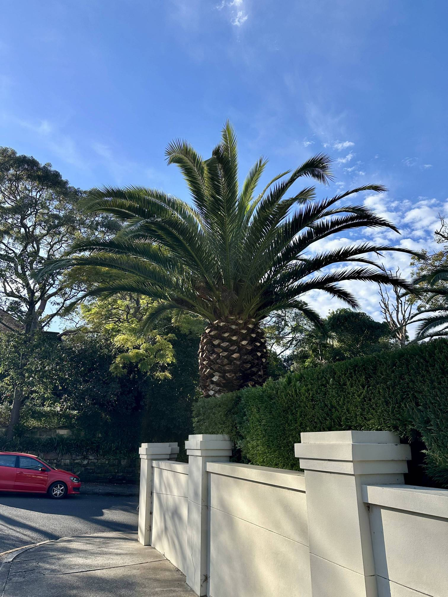

+++
author = "Sathyajith Bhat"
categories = ["Life"]
tags = ["weekly-notes", "gaming"]
places = "Sydney"
type = "post"
series = ["Weekly notes"]
url = "/weekly-notes-27-2025/"
title = "Weekly notes 27/2025"
date = 2025-07-06T12:00:00Z
summary = "Week 27 summary - Sydney weather bomb, Cremorne Reserve walk & more."
images = ["/weekly-notes-27-2025/thumb-pineapple.jpg"]
+++

_Thumbnail image: Came across this "pineapple tree" during our morning walk to Cremorne Reserve!_

### What's been happening

It's been yet another cold, windy week here in Sydney. The week started on a not-so-good note with Sydney being under the effects of a “[bomb cyclone](https://en.wikipedia.org/wiki/Explosive_cyclogenesis)”

> a bomb cyclone forms when a low pressure system rapidly forms into a powerful storm in 24 hours. The word “bomb” is used to describe the storm’s explosive speed of development.
  
The result: some pretty heavy rains and wind gusts. It was so bad that our office provided guidance to stay and work from home. I decided to head to office - I had a doctor appointment near the office anyway, so didn’t make sense to return immediately. Anyway, on Tuesday while returning from the office the effects of the weather bomb intensified, with wind gusts getting more and more intense. That evening, while returning from our joint gym session, the winds were so intense that it was kind of pointless to carry an umbrella, as the picture below shows. 

   

The weather bomb reduced on Wednesday, and by Thursday we were back to ye’ ol’ Sydney weather - nice, calm and pleasant.

The gym sessions went well. On Tuesday, I had the joint PT session with Jo - with me focusing on back squats, pendelay rows and dumbbell walking lunges. On the squats, I haven’t been doing heavy weights - my trainer is focusing on tempo squats so I can dial in on the technique and get my muscle memory in to what depth I should squat to. Still, at 65 Kilos, it was the highest I have reached yet, so quite happy with that. 

My second session was a solo session - focusing on tempo bench press. After two sessions of being really wobbly to get my Bulgarian split squats in, I’m finally getting to being comfortable with it - to the extent that I don’t need to hold on to a pole to keep my balance. And to finish it off, I had a conditioning circuit - a superset of 10 reps of dumbbell push press, 10 reps of body weight squat, ring ropes pull up, and kettle bell swing each - all in under 100 seconds. I’m pretty stoked that I could finish a set of these, and actually completed *five sets* of the exercises - ecstatic! And the doctor appointment - that was a follow up with my sleep physician - my previous consult with him was last year and he had recommended me to lose some weight. A year later, he was pretty happy with my progress and asked me to keep at it.

Our guitar class was pretty good - another heavy theoretical class. We did some more practice on the notes, scales and understand how to get to the right chords, based on the note progression. After the guitar class, produce market was on so we bought some groceries, including some smoked dark chocolate almonds. I really like the almonds coated in dark chocolate - it gives just a little bit of that sweet kick without being overly sweet.

   
   

Our Sunday morning started with a nice walk to Cremorne Reserve. It’s a path we hadn’t tried before and took us through some really pretty, and some seriously steep paths. It wasn’t the most walkable path either with lot of footpaths closing on one side having to cross the road with no pedestrian crossing, having to rush cross through couple of places waiting for traffic to clear. 

   

   

   

   

   

   

   

### What I've been playing

Civilization VII - Kush, Rushabh & Abhay were available so we continued playing the game that we started. The AI is pretty hostile with the latest patch, so we had a pretty large scale war going on. 

Roadcraft - Continued playing Roadcraft with Aman. We started working on a large mission which involved building multiple road patches. Aman saw that this was a lot of effort, so started looking at alternatives and spotted a good place to build a bridge and that saved us a lot of time. We managed to complete two of the objectives in the map before we wrapped up.
  

### What we ate

[SALT & JAM, Crows Nest](https://maps.app.goo.gl/b6PFL6wJAydsSWC88): Salt & Jam is a nice cosy little cafe with good vibes. They had some pleasant jazz music playing when made for a very welcoming stay. I had the volcano wrap with my cappuccino while Jo ordered the bacon & egg wrap with the almond latte. I liked my wrap, it had a nice kick to it, especially the sauce. Unfortunately the sauce was all the way at the end of the wrap, so for a good part I felt like I was eating only lettuce. That said, the coffee was ok, nothing great but nothing bad. I’d revisit just because it was such a cosy place.

   

   

   

   

   

[Venn Cafe, North Sydney](https://maps.app.goo.gl/K3R3Sv7CdzC1wwEcA) - Our favorite cafe in all of North Sydney - we ended up coming here two days in a row! We visited here after picking up groceries from the produce market and this time I spotted the Steak Sandwich and ordered it, while Jo ordered the pancakes. I absolutely loved the sandwich - the meat was really well done, and it came with caramalized onions which was really well done. The pancakes were also well done and had just the right amount of sweetness, without being too sweet. The next day, after returning from our walk to Cremorne Reserve, there were no cafes nearby so we went here again and I ordered the steak sandwich again - and was really good again. Definitely my favorite food of the menu there.

   
   
   
   

### Music of the Week

I came across [this really chill track](https://www.youtube.com/watch?v=4uu9_sVpF_g) called “The Way” by [Sultan + Shepard](https://en.wikipedia.org/wiki/Sultan_%26_Shepard) when trying to find new deep house tracks. Love it! 



### Link of the week

The [IndieWeb](https://indieweb.org/) is a community of independent and personal websites based on the principles of owning your domain and using it as your primary online identity, publishing on your own site first (optionally elsewhere), and owning your content. Back in 2007, during the early days of when I started blogging, I was a big fan of StumbleUpon

> **StumbleUpon** was a website, browser extension that opened a semi-random website or video that matched the user's interests

I found some really amazing sites thanks to StumbleUpon. With the IndieWeb movement slowly gaining more followers, I came across this website by [Andreas Gohr](https://www.splitbrain.org), [IndieBlog](https://indieblog.page/) that does similar to what StumbleUpon did - open a random website but based on people who have registered on IndieWeb. Have been using this to find some really cool personal sites. 

### Thanks for reading.
Thanks for reading and have a great week ahead. 

Subscribe to my weekly notes:
- [Email newsletter](https://sathyabhat.substack.com/)
- [RSS feed for the weekly notes](https://sathyabh.at/series/weekly-notes/index.xml)
- [RSS feed for my site](https://sathyabh.at/index.xml)
