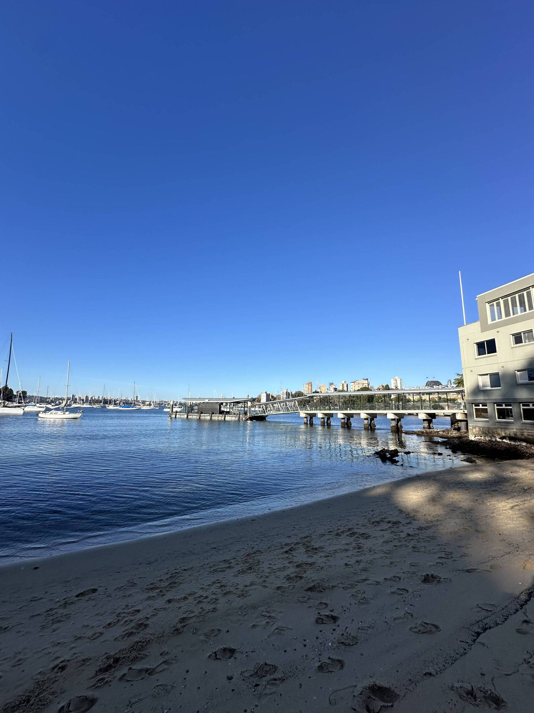

+++
author = "Sathyajith Bhat"
categories = ["Life"]
tags = ["weekly-notes", "gaming", "Civilization VII", "Diablo IV"]
places = "Sydney"
type = "post"
series = ["Weekly notes"]
url = "/weekly-notes-29-2025/"
title = "Weekly notes 29/2025"
date = 2025-07-20T12:00:00Z
summary = "Week 29 summary - on-call pain, office Winter Party, gym pains, and more." 
images = ["/weekly-notes-29-2025/thumb-hayes-street-beach.jpg"]
+++

_Thumbnail image: Hayes Street Beach (also known as Neutral Bay Beach) is the only beach in the suburb of Neutral Bay. It can be accessed from Hayes Street via a small laneway and is 50m long at low tide with a width of 10m._

### What's been happening

Another week’s gone by. This week was a busy one. At work, I picked up what I thought would be an easy pick - add support for Ubuntu 24 to our pipeline that builds golden images for VMs. “It’s simple - just add a new environment variable” - that’s what I thought. Murphy decided otherwise. I ran into a whole of issues, from source image name changes, namespace changes, package incompatibility issues that made this small change a much bigger one. On top of that, I had my on-call shift this week at the last moment as a team mate asked if his shift could be swapped and I agreed. Fun times. That said, we did have our office Winter Party which was actually fun.

The Winter Party happened over a span of three, interconnected venues - a mini golf course ([Holey Moley](https://holeymoley.com.au/)), a challenge room venue ([Hijinx Hotel](https://hijinxhotel.com.au/activities/challenge-rooms)) and an arcade ([Archie Brothers](https://maps.app.goo.gl/6tLT3F8LP7Z44ZQk9)). I didn’t get to do the mini golf or the arcade, but the challenge room venue (Hijinx) was really fun. Hijinx Hotel has multiple sets of 5 challenge rooms, each designed for between 2 and 6 players to work together to complete challenges and score points on the leaderboard. The aim is for the group to score as many points as possible within 4 minutes, before moving on to the next room within your allocated set. The team with the total highest score gets featured on their leaderboard. The games had a good fun of physical, reflex and logic challenges - some being more punishing than the others. My group was particularly competitive so we did pretty good, getting the highest weekly score for one of the rooms. After one set of challenge rooms were done, we were about to head back to the main venue when we realized there was another set of rooms available, so we went in for that as well! One of the games was a variation of “Listen to the tune and recognize the song” - and typically I am pretty good at such games. The twist was that you had to tap on the *single* key on a piano (over a span of keys on the floor) corresponding to the right answer and that wasn’t clearly mentioned - so once we got that right, I did pretty well, answering most of the songs before the others realized haha.

The rest of the week was pretty ok. I’m now back to doing solo PT as Jo’s trainer is back. The first PT session of the week was pretty good - we did some back squats/pendelay rows and since I had the group session the next morning, we swapped leg day for some bench press and hammer curls. The group class had dead lifts for weight and metcon of partnered doubleunders (aka skipping), kettle bell farmer’s carry and synchro burpees. Of course, I couldn’t do all of them, so I scaled to just hopping (no using skipping rope), passing the kettle bell far more often and reduced burpees. The goal for me was just to last through the session and not do it 100%, haha. Friday’s session was pretty poor though - the weights went well (dumb bell bench press & Bulgarian split squat) while I struggled with my shoulders sore, and I couldn’t get through a proper 10-rep push up - I had to split a set 5-rep followed by a 10-second break to complete the workout. Not every workout can be a 100% workout day, so I hope it was just an off-day and I will do better in the next workouts.

On Saturday, the next term of our guitar class started. We had couple of new students in addition to the usual folks. It’s always nice to have some new people - it gives me a chance to reflect how I was at the start and how much further I have come along! Jo helped me understand some sheet music by making me watch some videos that talked about [how to make reading sheet music easier](https://aoyamatomemo.wordpress.com/2013/10/18/sheet-music-every-good-boy-does-fine-i-think/). 



Since I was on-call this week, post our guitar class, stopped by the produce market, picked up groceries and went back home. 

Jo asked me where we should go for our Sunday morning walk. I noticed there was a small beach nearby - the Hayes Street Beach and suggested we walk over there. And that’s what we did - Hayes Street Beach is a pleasant 2.2km walk from home and with a fair bit of climb down. From the beach, we went over to a nearby cafe, had some breakfast and walked about half way back - my on-call shift was starting soon so I had to return home, so we took the bus home.



That was actually a good call as soon as we got onto the bus, I was paged for an ongoing incident. I got paged again a few hours later and spent all of my mid-day and afternoon engaged in the incident till now.

### What I've been playing

Civilization VII - I mentioned Civilization VII getting a new patch [a few weeks ago](/weekly-notes-26-2025/) and I completed a solo game. The patch adds some nice fixes and makes the AI more aggressive. The wars that AI was going at against me slowed down my yield output and didn’t get to the win conditions in time (I was actually short by 6 turns) and because I was lagging by all conditions, I lost the game. It’s a shame, because I didn’t even realize I had the score victory condition on. So I started a new game, this time playing as Ada Lovelace and trying to get a Science victory in! Lets see how it goes.

Diablo IV - The ninth season of Diablo IV started last week and I’ve been playing through the season journey with the Hydra build of the Sorcerer and been pretty fun. After many hours of looting, bossing and gambling, I finally got the last item which enabled me to get into Torment IV. Any more gear upgrades are likely to be a huge grind and will come at a trickle, so I probably will switch to another build or character.

### What we ate

[Thelma & Louise, Neutral Bay](https://maps.app.goo.gl/VrjU3xmVEp9sM8NE8) - A small little cafe just off the Neutral Bay wharf with some fantastic views of the wharf & Mosman Bay. Jo got the Falafel bowl while I ordered the ocean trout croissant along with our standard coffees. The Falafel was really good, and the ocean trout croissant was mixed - the croissant itself was really nice and crispy but the ocean trout was sorta mixed - a bit salty at some places, bland at other places. The cafe was really pricy though - I guess that’s what happens when you have a cafe at a premium venue.



### Music of the Week

Martin Miller with another banger of a cover, this time of Oasis’s [Don’t Look Back In Anger](https://www.youtube.com/watch?v=rGH54IF2w1c)



### Link of the week

Josh travels from [Adelaide to Sydney](https://www.youtube.com/watch?v=FyNeYRHCtiE) using public transport! Wonderful travel log traveling from the Southern tip to the Eastern tip via Broken Hill. 



### Thanks for reading.
Thanks for reading and have a great week ahead. 

Subscribe to my weekly notes:
- [Email newsletter](https://sathyabhat.substack.com/)
- [RSS feed for the weekly notes](https://sathyabh.at/series/weekly-notes/index.xml)
- [RSS feed for my site](https://sathyabh.at/index.xml)
