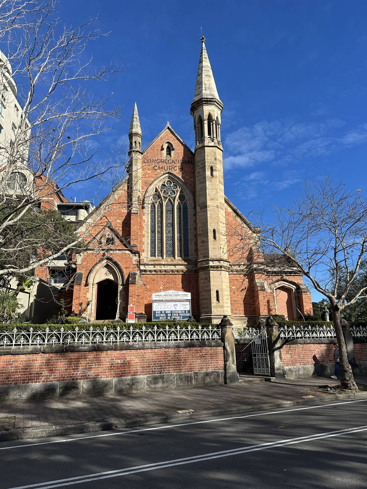

+++
author = "Sathyajith Bhat"
categories = ["Life"]
tags = ["weekly-notes", "gaming"]
places = "Sydney"
type = "post"
series = ["Weekly notes"]
url = "/weekly-notes-30-2025/"
title = "Weekly notes 30/2025"
date = 2025-07-27T12:00:00Z
summary = "Week 30 summary - Celebrating 3 years in Sydney, hardware refresh at work, guitar class struggles, and more."
images = ["/weekly-notes-30-2025/thumb-chinese-christian-church.jpg"]

+++

_Thumbnail image: The Chinese Christian Church building replaced an earlier Congregational church building in Pitt Street, Kirribilli, which apparently had been operating from about 1863._

### What's been happening

It’s a milestone week - this week marks 3 years of us moving to Sydney and me joining The Trade Desk. It's been an amazing ride so far. For whatever reasons (COVID?) it feels like I stayed much longer in [Bucharest, Romania](https://sathyabh.at/places/bucharest/) even though I've been here for 6 months more than my total time spent in Romania. I’ll have a separate post about the past three years in Sydney soon. Is there anything you’d like to know? Let me know! 

As part of my third year anniversary, I’m eligible for my hardware refresh. Most engineers at The Trade Desk get a laptop+desktop bundle - while this makes sense for many developers, for me I barely used the desktop so I opted for a laptop-only refresh. I wanted to get a 14” MacBook Pro with max memory but that spec wasn’t available, so for now I opted for the MacBook 16. The refresher means that I get to take my existing laptop and desktop home. That’s a nice touch. Both the laptop and desktop will be wiped, and I will probably install Linux on the desktop and set it up as my main home server, moving several of the applications running on my [NAS](/nas) to the home server, leaving the NAS dedicated for storage.

Since I took over as the Scrum Master of my team at the start of the year, my IC work has reduced quite a bit. I still take up a few projects every now and then, and with all the AI help, it's been easier than ever to build stuff, especially for things to simplify my life. For example, on Friday, I extended our team’s CLI tool to add a end-of-sprint reporting feature. Previously, I’d spend a chunk of time collating the information from Jira and writing a report on what was done the past sprint. This CLI will make it a lot easier to collect the required data and I will experiment with more _AI goodness_ to see if it can generate the report close to how I’d want it. 

My gym trainer was not available on my usual training day which is Friday, so it was shifted to Tuesday instead. With two back to back sessions on Monday and Tuesday evening, I decided to go to class on the Friday. The training sessions went well. My trainer has been working with me to improve my single/double unders, and that's been a slow work in progress. Apart from this, out first session had Barbell Back Squats and Pendlay rows, both went well. For the Tuesday session, we had dumb bell bench press (hit my personal best of 20kg * 2) and a metcon of 10x wallballs, 10x box step ups, 10x dumb bell snatch and 5x burpees, which I completed within 2 minutes. I’m pretty happy with how the metcons have been coming along. I am no longer afraid of them and been getting to a stage where I can complete 3 sets of them. These metcon training have meant that it’s also easier to be in the group class sessions - which I went to on Friday. 

Friday’s class had snatch squats and back squats. Since I had never done snatch (or snatch squats) my trainer asked me to do barbell strict press instead and followed by back squats. I hit my PB on the strict press as well as the back squats and was able to finish with most of the people. I’m coming to about a month’s worth of training in the group classes and I’m at a stage where I’m looking forward to the next training session and I’m quite happy with my progress. Look forward to a separate post on my fitness journey and progress over the past few months.

This week’s guitar class focused on rhythm, understanding time signatures and how notes are to be played. I struggled with today’s class, especially since I cannot seem to keep track of the basic music notation in the first place. I will be missing the next set of classes as well so I guess I mentally checked out of class today. Our instructor got all of us in class to play a few notes of the song “My Girl” by [The Temptations](https://www.youtube.com/watch?v=y3KJ7d2qBoA) separately, and while the rest of the class were trying to figure out to play, he pulled me and two other new students separately to help relearn the basic notations again. I don’t know why I’m struggling so bad, it’s just too frustrating not to be able to read and forever be couple of bars behind, and then when I understand the note, others are far ahead, and I have lost track of where I am in the song.

A frustrating class aside, after the class, Jo & I were chatting with a couple of folks in the guitar class - reminiscing about college days and such (I can’t remember how we got to that topic) - and we were talking so much that we spent nearly an hour at the parking lot. We decided to head over to a nearby coffee shop and continue our chat. It was pretty nice to chat. After a nice brunch we went back home and I played some Roadcraft with Aman.

For our Sunday morning walk, Jo wanted to go to Cockatoo Island for a loop around there but I asked to change the plan - the reason? Earlier in the week my classmate from Engineering days was visiting Sydney and was set to catch up with her later in the week. She messaged last evening asking if I could meet her today instead, so I obliged. So for our morning walk, Jo & I went to the Kirribilli lookout, stopped by San Antonio Sourdough Bakery for a coffee and then walked back.



Later in the evening, I met up with my classmate at Parramatta and we went to a nearby coffee shop for a quick catch up. It was nice to catch up after so many years. We talked about what we'd been up to, moving to Australia, our families, and how life has been treating us. It was a lovely evening and I’m glad we could meet up. Jo came along with me to Paramatta, walking around the area while I was catching up with my classmate. Post the meetup, Jo & I had a nice dinner at a nearby Indo-Chinese restaurant and then took the train back home.

### What I've been playing

Civilization VII - I had started a new game last week, playing as Ada Lovelace. Ada Lovelace is a [Science-biased leader](https://civilization.2k.com/civ-vii/game-guide/leaders/ada-lovelace/), with her unique ability giving you increased Science per age when you complete a Civic Mastery. I relied on this heavily, combing this with the Antiquity age Roman civilization to get a pretty massive boost to science and culture. I switched to the Abbasid civilization for exploration age, doubling down on the Science, Culture and Gold outputs thanks to [Abbasid](https://civilization.2k.com/civ-vii/game-guide/civilizations/abbasid/)’s bonuses. The snowball affect meant that I was pretty much on cruise control by the time quarter of exploration age was complete, completing an easy Science victory and also experimenting with the combat mechanics to take a Civ out. 



### What we ate

[San Antonio Sourdough Bakery, Kirribilli](https://maps.app.goo.gl/U4EDgdU7YLbg7pYj6) We visited the bakery based on recommendation from our friends from the guitar class. We ordered a sausage roll, ham & cheese croissant and a coffee & walnut scroll along with our standard coffee order. The coffee was really good, very rich and creamy. The sausage roll was pretty average and doughy. In fact all the pastries were similarly doughy so was fairly disappointed.



We had planned to buy some sourdough initially but decided against it. Worth coming back for the coffee & try out the croissant again.

[Dragon House Indian Chinese Halal Restaurant, Paramatta](https://maps.app.goo.gl/3S74JucpUX2FZEzB8) - I saw this Indo-Chinese restaurant while looking for a place to eat at Paramatta. We ordered a couple of dishes - Chicken Lollipop, Chicken Manchurian and a Egg Fried Rice. The food was pretty good. The Lollipop was really nicely done minus the red colouring which was made it look plain but had the right flavour. The egg fried rice had the proper smell and flavour, reminding us of the Indo-Chinese food we got home. The tap-to-pay machine wasn't working, so we had to pay in cash (which thankfully Jo had). Overall, decent place to eat at Paramatta, especially if you are looking for some Indo-Chinese food.



### Music of the Week

[Ozzy Osborne](https://en.wikipedia.org/wiki/Ozzy_Osbourne), the co-founder of Black Sabbath died earlier this week. I’m not the biggest metal head or fan of Ozzy Osborne, but Black Sabbath’s “Paranoid” was the first metal song I had heard during my school days. Knowing that you could get a sound like that from a guitar just blew my mind. So here’s [Paranoid](https://www.youtube.com/watch?v=0qanF-91aJo), a [tribute](https://www.youtube.com/watch?v=6SLh0b1dRYg) played by a bunch of musicians to Ozzy during his induction to the Rock & Roll Hall of Fame, and as a bonus a fabulous cover of Ozzy’s [Changes](https://www.youtube.com/watch?v=oJZmO5mByVY) by YUNGBLUD.







### Link of the week

Mac’s post on [Dear friend, you have built a Kubernetes](https://www.macchaffee.com/blog/2024/you-have-built-a-kubernetes/) is an great post about people who avoid Kubernetes to reduce complexity and end up building something ridiculously complex to achieve the same functionality that Kubernetes provides. 

> *I don't mean to imply that you can never roll your own deployment method that fits your needs better than Kubernetes, or that nothing will ever be better than Kubernetes. I just want to caution you, my friend, to make sure you understand the problems Kubernetes solves before dismissing it as overly-complex.*

### Thanks for reading.
Thanks for reading and have a great week ahead. 

Subscribe to my weekly notes:
- [Email newsletter](https://sathyabhat.substack.com/)
- [RSS feed for the weekly notes](https://sathyabh.at/series/weekly-notes/index.xml)
- [RSS feed for my site](https://sathyabh.at/index.xml)
 
