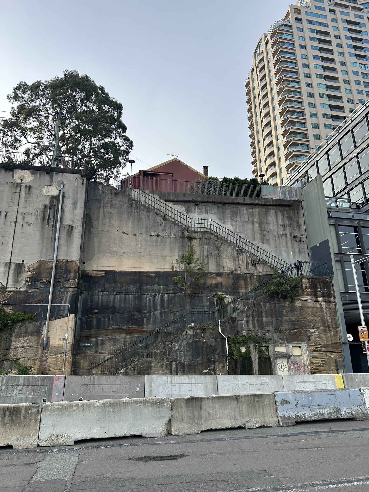

+++
author = "Sathyajith Bhat"
categories = ["Life"]
tags = ["weekly-notes", "gaming", "fitness", "vacation"]
places = ["Sydney", "Hunter Valley", "Polkobin"]
type = "post"
series = ["Weekly notes"]
url = "/weekly-notes-31-2025/"
title = "Weekly notes 31/2025"
date = 2025-08-04T12:00:00Z
summary = "Week 31 summary - A cancelled car rental, a train journey, and more."
images = ["/weekly-notes-31-2025/thumb-barangaroo-stairs.jpg"]
+++

_Thumbnail image: I see this staircase and people climbing up/down every time I go to/return from office and can't help but think how much has taking these stairs improved their fitness levels._

### What's been happening

This week's weekly notes is a bit late, as I was on a short trip to Hunter Valley for Jo's birthday. Her birthday is coming up and we figured we could do a weekend outing.

I also wanted to surprise Jo by renting a car that she did not expect - one of her favorites, the Ford Mustang. I booked the car, and we were all set to take it out this weekend. However, the weather was not the best and it’d been raining towards the end of the week. To make things worse, I found out that NSW had changed the policies for people with temporary visas & foreign licenses. I didn’t want to risk getting caught with an invalid license so ended up cancelling the car rental. Thankfully, I got a full refund for my car rental booking.

The Hunter Valley resort booking was still on and those could not be cancelled or rescheduled, so I looked for options. I found out there’s a regional train that goes from Sydney Central to Singleton and our resort can arrange for a pickup from the train station, so I booked the train tickets and now we’re on the train to Hunter Valley. With the trains and no car, I don’t believe we could get anything done but that’s ok :) 

And as luck would have it, it rained non-stop the entire weekend and we were pretty much indoors, just eating and sleeping. I suppose that’s not a bad way to do a staycation. On Sunday evening, I found out our return train had been cancelled and we’d have to take the intercity trains. And as Murphy would have it, even the intercity trains were cancelled on Monday morning due to floods down south and snow up north, leaving us to totter back to Sydney via a combination of bus, train-replacement bus, train and then metro. I looked up the distance between Singleton and North Sydney and it’s 195km. The fact that we can do about 200 km of travel on public transport (not even private coaches) is just mind boggling to me. I'll publish a more detailed post about the trip later, but for now, here are some photos from the trip:



I have however, booked my driving license test for last week of September, since I will be away for a couple of weeks in August and want to take up some classes before appearing for the driving test.

This week’s gym sessions were pretty good. In the first PT session, we started with some skipping practice going into back squats/Pendlay rows. I’m so uncoordinated while skipping/jumping, so when we did this, I jumped, landing with more weight on my right side, which hurt my knees again. This meant I couldn’t go heavier than 70kg on the back squats. 

I went to a group class on Wednesday. This week was “finals week” where they encourage people to get to their 1 rep max weights, with Wednesday’s focus being deadlift. It’s taken me about 8 months since I first started training but I’m pretty glad that I was able to do a 100 kg deadlift. Getting into the triple digits is always nice but I was just able to hold on to it, proving I need to get a bit stronger to pull it off better. On Friday, we did our usual set of dumbbell bench press (this time the entire working set was 20kg on each) and my trainer’s favorite Metcon of 10 reps of box step ups, dumbbell snatch, wall balls and 5 burpees which I was able to do each set within 1min 50 seconds. Again, pretty happy with the progress, these Metcons have improved my endurance so much and I no longer feel exhausted/fatigued after some simple walks. 

### What I've been playing

Civilization VII - After last week’s [epic snowball game](/weekly-notes-30-2025/#what-ive-been-playing) with Ada Lovelace, I started another random civilization & random leader game, this time selecting Pangaea as my map type. I got [Friedrich the Great (Oblique)](https://civilization.2k.com/civ-vii/game-guide/leaders/friedrich/) as my leader and Rome as my starting Civilization. The game started pretty slow but I capitalized on Friedrich and Rome's unique ability in which we gain an infantry unit when you complete a technology mastery or construct a science building to get a huge military boost. 

Taking advantage of continuity, I switched to Norman civilization for exploration age and with the previous age’s units (taking full advantage of the newly introduced continuity mode), I was able to take over a couple of cities of Jose Rizal, Ashoka, and Hatshepsut. The Norman’s unique building Motte which gives a happiness boost meant that I was able to sustain the military operations and keep things humming even when over the settlement limit (which gives a happiness penalty). I added a religious belief that gives me extra missionaries when I build a wonder and realized that it works when you take over cities - this with all the military conquests meant that I had lots of missionaries for free that I could use to get some extra production. 

This game of Civilization VII has been the most fun by far thanks to a lot of synergies that I was able to take full advantage of. Before I went on the vacation, I completed the exploration age and selected Prussia as my modern age civilization. I’m still not sure which direction I will go in (military, culture or science) but it will be a fun week ahead.



### Music of the Week

Middle Kids, a Sydney based alternative indie rock band brings out this melancholic [version](https://youtu.be/-ksk9cfIoss) of Oasis’ Champagne Supernova.



### Link of the week

Former Top Gear host Chris Harris does a [great interview with](https://youtube.com/watch?v=eY8pQMt8eB4) Max Verstappen, giving some insights into how Max goes into attacking a corner. A really well-done video.



### Thanks for reading.
Thanks for reading and have a great week ahead. 

Subscribe to my weekly notes:
- [Email newsletter](https://sathyabhat.substack.com/)
- [RSS feed for the weekly notes](https://sathyabh.at/series/weekly-notes/index.xml)
- [RSS feed for my site](https://sathyabh.at/index.xml)
