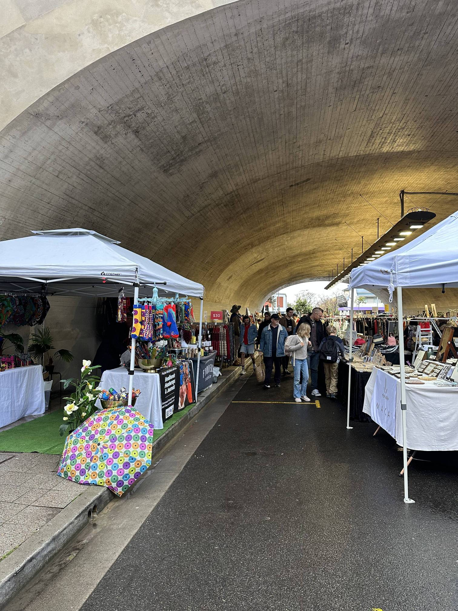

+++
author = "Sathyajith Bhat"
categories = ["Life"]
tags = ["weekly-notes", "gaming"]
places = "Sydney"
type = "post"
series = ["Weekly notes"]
url = "/weekly-notes-32-2025/"
title = "Weekly notes 32/2025"
date = 2025-08-10T12:00:00Z
summary = "Week 32 summary - Jo's birthday."
images = ["/weekly-notes-32-2025/thumb-kirribilli-markets.jpg"]

+++

_Thumbnail image: The Kirribilli Markets is one of Sydney’s oldest and most popular markets, first held way back in 1976._

### What's been happening

After the long train ride back home from [last week](/weekly-notes-31-2025/), this week has been relatively tame. That said, it was an exciting week, for it was Jo’s birthday week. Jo doesn’t like grand celebrations or gifts, so having to do something _interesting_ to surprise her is getting more and more challenging 😅 

We’ve been recording a lot of silly videos/videos of us doing goofy stuff without realizing we’re doing it, so I thought of doing a montage video of such moments. However, since we have a shared library of images, any photos/videos will be visible to both of us and I wanted to surprise her. So I created the video, saved it in my personal library instead of the shared one and for extra safety, hid the video. 

On her birthday, I had my morning group gym session and we usually end up meeting for post-gym coffee at the nearby coffee shop, so that was perfect. Initially, I thought of showing her the video at the coffee shop but it was a bit too crowded, so I decided against it. I realized making the video viewable while we were walking home would be a good idea, and I could tell her to check her gallery for a surprise - and that’s exactly what I did. She loved the video 😄 I am glad about that. Jo had also said she’d be delayed by a few minutes while making her way to the coffee shop, so that gave me some time to sneak-purchase a brownie before I met her and once I reached home, I set it up with a small candle when she was getting ready for work. This wasn’t really planned as such (apart from the video), so I'm happy that it all came together so well. Later in the evening, we went to a Brazilian BBQ *churrascaria* (an all-you-can-eat restaurant), had some gelato and then took a really nice ferry ride back home. 



We were back at our guitar class this week where I did reasonably better when trying to learn and play some major and minor chords. About three-quarters of the way into the class, out came the sheet music and I became a bumbling idiot again. Oh well, at least I won’t be there for the next three weeks. 

On Sunday morning, we decided to head to Kirribilli Lookout for our morning walk. We’d just about reached Kirribilli Markets when it really started to pour. So we decided to cut our walk short, head into BTB for breakfast and coffee. After that, it was still raining, so we walked around the markets a bit. Jo was trying to find a pendant and the one she liked the most she felt was still a bit too big for her, so she didn’t end up buying it. There was a stall from an Indian restaurant so we bought a *[Maddur Vada](https://en.wikipedia.org/wiki/Maddur_vada)* and had it. We took the bus home after that and then I played some Roadcraft with Aman.



### What I've been playing

Civilization VII - I continued my last week’s game with Friedrich as the leader of Prussia. I had mentioned I wasn’t sure in which direction I would go in (military, culture or science). After some initial early conquests, I decided to lean heavily into the military victory and was successful! As with most Civ games, I feel like mid-game is when you can have the most fun - early game can be a bit too slow and late game can be quite a drag.



### What I read

Teenage Mutant Ninja Turtles: The Last Ronin - Jo found this book at the library and rented it out. The original series was a 5-book comic issue spanning over several years, while the one I rented out was an all-in-one compendium. Set in an alternative future, The Last Ronin tells the story of the last remaining turtle who seeks to avenge the death of his brothers. The comic moves quite fast, is a bit heavy on action, and I completed reading the entire 5-set of books in about an hour and a half. I used to watch a fair bit of the TMNT cartoon series as a kid, so returning to this book was a good bit of nostalgia and a bit of confusion, for which there are multiple reasons. The first is because this is set in an alternate universe, some of the characters are not what I thought they were. Also, the comic does a lot of flashbacks and it took me a couple of re-reads to figure out what was happening. All in all, this is a really hard-hitting comic book that you’d appreciate especially if you’re familiar with TMNT.



### What we ate

[Brazico Brazilian Churrasco, Barangaroo](https://maps.app.goo.gl/9Kfsr8j5QdyteKtj8) - We went to this Brazilian BBQ churrascaria for Jo’s birthday. A churrascaria is an all-you-can-eat restaurant featuring grilled meats and unlimited sides. The restaurant staff are constantly bringing different types and cuts of grilled meat to your table and if you accept, they will slice it to your liking. We spent a good amount of time here and really enjoyed ourselves. 

### Music of the Week

BB King & Gary Moore - two legendary jazz & blues musicians performing this amazing song - [Thrill is Gone](https://www.youtube.com/watch?v=iUaevnP1LLg).



### Link of the week

DailyFuelUp has an awesome 30-minute video on why [Kimi Raikkonen is awesome](https://www.youtube.com/watch?v=IRjdBJFXEgU)



### Thanks for reading.
Thanks for reading and have a great week ahead. 

Subscribe to my weekly notes:
- [Email newsletter](https://sathyabhat.substack.com/)
- [RSS feed for the weekly notes](https://sathyabh.at/series/weekly-notes/index.xml)
- [RSS feed for my site](https://sathyabh.at/index.xml)
