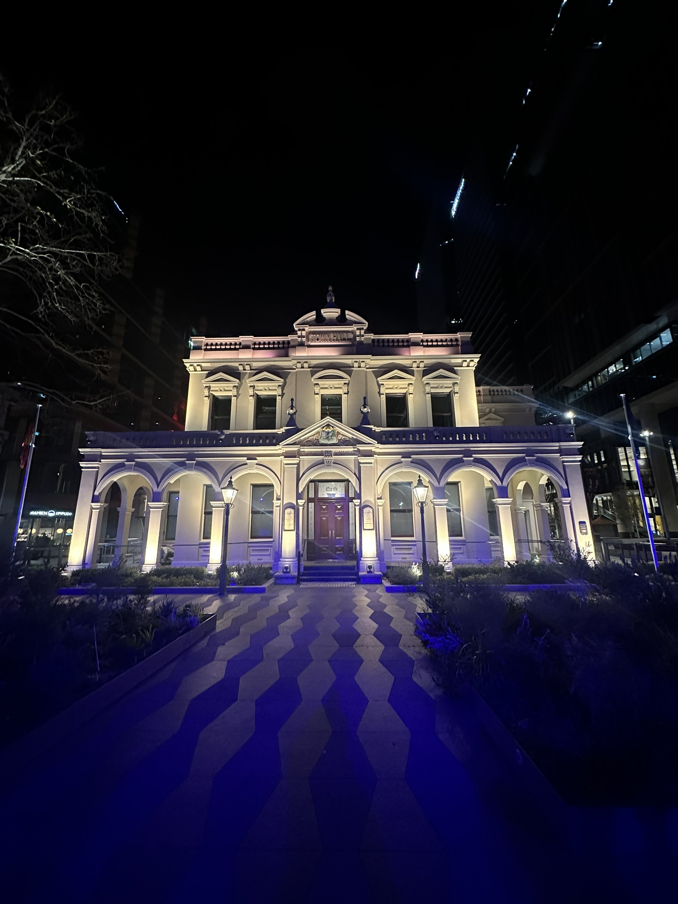

+++
author = "Sathyajith Bhat"
categories = ["Life"]
tags = ["weekly-notes", "gaming"]
places = "Sydney"
type = "post"
series = ["Weekly notes"]
url = "/weekly-notes-33-2025/"
title = "Weekly notes 33/2025"
date = 2025-08-16T12:00:00Z
summary = "Week 33 summary - travel to the US, meeting my team, fitness progress, and more."
images = ["/weekly-notes-33-2025/thumb-paramatta-townhall.jpg"]

+++

_Thumbnail image: The Parramatta Town Hall is a heritage-listed town hall located in the suburb of Parramatta and was completed in 1883._

### What's been happening

It’s been a busy week. Since joining the Trade Desk, I’ve been doing a fair bit of travel to the US, since half my team is there. Last year it was pretty hectic, I think I was averaging one trip to the US per quarter. That was a bit too much, there’s only so many 15+ hour flights you can do on economy. So this year, apart from the [Palooza trip](https://sathyabh.at/weekly-notes-03-2025/), I hadn’t done any travel at all. Well, till now. AWS has invited all the AWS Heroes to Seattle for the Hero Summit. I decided to make use of this trip and make a visit to the Trade Desk’s San Francisco office a week prior to the Hero Summit. I will be meeting all of my US-based team mates and a few other people from different teams, talking about plans, strategy for the next few months. I hope to get some insights on some of their projects and see if we can find better ways to support them. It’ll be a week full of meetings and while tiring, it will also be good to meet them in person.

I’ll be flying to San Francisco via Los Angeles on Saturday and will be in SF till the next Monday. This gives me a chance to try to meet some more people before I leave SF.

The week leading to the travel is hard as both Jo & I feel a bit sad that we’ll be away from each other. After trying office travels for varying periods, I think a 2 or 3 week travel is probably what hits the sweet spot - anything shorter than that is usually too short to get anything done and anything longer I start feeling homesick.

Anyway, apart from a busy planning week, haven’t really done much since most of the “happening” things occur on the weekends. Jo has started going into the office now and earlier in the week, for the first time since many, many years, we went into office and returned home together. Jo usually feels cooped up being at home so I’m happy for her to be in the office, meeting her other colleagues (and I do think she feels the same).

Fitness wise, my gym sessions went well. My Monday PT was cancelled as my trainer was sick, so I decided to go to the Monday classes (I’ve been targeting doing at least 3 workout sessions per week, and have been meeting these targets for the past 6 weeks - yay!). Monday classes featured some movements I’d never done before - muscle snatches, power snatches and overhead squats. It wasn’t easy or the best, but I’m happy to be able to do it. For my Thursday PT, I hit my back squat personal best of 80kg, and I’m super happy about that. When I started working out, I was very scared about my back (had a back injury a decade ago, was very painful) and now to be able to go in, get some good amount of weights in and come out not being tired or needing to lay down to recover is an amazing feeling. As good as this has been, as the weights get heavier, progress will slow down as well - we’ll see how it goes.

### What I've been playing

With the upcoming travels, I didn’t start any new sessions of Civilization VII, so I went back to Diablo IV, building a new druid with basic attacks. I’ve just about gotten enough gear to be able to do Torment 2 easily.

### What we watched

Leviathan - An [anime adaptation](https://www.justwatch.com/us/tv-show/leviathan) based on the [novel](https://www.goodreads.com/series/46550-leviathan) of the same name, the series features some really beautiful artwork, lovely music and fantastic steampunk elements and great action. It also reminded me a lot of [Valkyria Chronicles](https://en.wikipedia.org/wiki/Valkyria_Chronicles).

Clarkson’s Farm Season 4 - Jeremy Clarkson is back, along with the long list of loveable characters from Diddly Squat Farm. This season features a couple of new characters, most notably Harriet who steps in for Kaleb’s absence and does pretty well. Amazon’s production is off the scale as always, capturing some incredible and incredibly picturesque views of the farm and the surrounding Cotswalds areas. Jeremy Clarkson’s flair for storytelling is unmatched as ever, as every episode got me to continue watching the next episode.

### What we ate

Eat Fuh, North Sydney - A new-ish Vietnamese restaurant, Jo & I were walking back home from work and decided to stop by here for dinner. The place was pretty empty. I ordered a noodle salad for myself while Jo got a banh mi. We also ordered a veggie spring roll. Overall, the food was okay, nothing great. There are a lot of better Vietnamese places around the corner so we’ll probably not visit the place again.

### Music of the Week

Elderbrook’s “The End” is a great little ambient track that is almost guaranteed to get you into a supremely relaxed mood.



### Link of the week

[Abort, Retry, Fail](https://www.abortretry.fail/p/the-history-of-windows-xp) has a great article diving into the history of Windows XP. There are many quotable quotes, I found this quote to be the more relatable

> Perhaps more importantly, it[Windows XP] raised people’s expectations of software and of personal computers more generally. No, you did not need to panic save your files to floppies every ten minutes. No, it was not a given that your computer would randomly crash or reboot. No, upgrade treadmills weren’t truly necessary, an OS could be used for more than a decade.

### Thanks for reading.

Thanks for reading and have a great week ahead.

Subscribe to my weekly notes:

- [Email newsletter](https://sathyabhat.substack.com/)
- [RSS feed for the weekly notes](https://sathyabh.at/series/weekly-notes/index.xml)
- [RSS feed for my site](https://sathyabh.at/index.xml)
