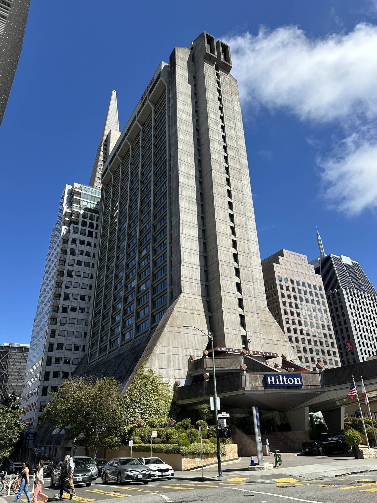

+++
author = "Sathyajith Bhat"
categories = ["Life"]
tags = ["weekly-notes", "gaming", "concert"]
places = "San Francisco"
type = "post"
series = ["Weekly notes"]
url = "/weekly-notes-34-2025/"
title = "Weekly notes 34/2025"
date = 2025-08-24T12:00:00Z
summary = "Week 34 summary - A week in San Francisco, meeting old friends, Dave Matthews Band concert and trying out Waymo"
images = ["/weekly-notes-34-2025/thumb-hilton-building.jpg"]

+++

_Thumbnail image: I was amused to see the China Culture Center in this Hilton Hotel building._

### What's been happening

This is going to be a long note 😅 This week was spent in San Francisco and it went by so fast.

The week started with a long haul flight - I took an American Airlines flight from Sydney to San Francisco, via Los Angeles. The flight was okay, nothing great. Qantas has spoilt me because their long haul flights are on the A380 which seems to have nicer seats as compared to the Boeing 777-300. The American Airlines flight to SFO wasn’t a direct flight and had a layover at Los Angeles. If there’s a layover, I look for flights that offer at least 3 hours of layover especially when arriving at the port of entry because time taken for Immigration can be quite long. Unfortunately, this route had either a two-hour layover or an eight-hour one. Two hours was just too short to risk, so I had to take the eight hour one. Immigration went pretty smoothly, didn't wait too long in the line (only about 30 minutes) and the officer just asked some basic questions like purpose of visit and asked me to show the accommodation booking and cleared me to enter in a minute or so.

That meant that now I had a lot of time to kill. Last year’s extensive travels meant that I attained Qantas Gold status (or an equivalent of OneWorld Sapphire) and that I had access to the lounge facilities. So I went searching for the American Airlines lounge in Terminal 5 of the Tom Bradley International Terminal at LAX. I entered the Admiral lounge and when scanning my boarding pass, the crew told me that I was actually eligible for the Flagship lounge which is much nicer, but I’d have to walk all the way back to Terminal 4 (about a 15-minute walk). Since I had enough time to spare, I figured would be good to check it out. The lounge was pretty good, with lots of seats, recliners, tables, work benches and was pretty quiet. The food spread was pretty good. I picked up some coffee and some fruits and sat down, taking the moment to just watch some YouTube. And just like that the layover time went by fast and it was time for me to head back to terminal 5 to board my next flight to SFO.



When I landed in SFO, I got a notification that my bags had arrived ahead of time (that was new) and that I could pick it up from the baggage office. I picked up the bag and took an Uber to my hotel - The Jay. I tend to stick to Marriott brands to _maximize_ my points, and the Jay was a hotel I hadn’t stayed at before so wanted to try. Once I checked in, I went downstairs to the fitness center. Certainly another first for me - I’ve been training week on week for 6 months now and didn’t want to stop the next couple of weeks, so I had asked my trainer for workout suggestions. He asked me to send a video of the gym so that he can take a look at the equipment and suggest me a few workouts. I am pretty happy that I did end up using his workout suggestions and trained thrice this week.

Once I was back to my room, I had a shower to freshen up and then went out to meet and have dinner with Jo’s sister and her husband. We were to go to an Ethiopian restaurant, but sadly they didn’t have any free tables and didn’t take reservations so after a brief search we went to a nearby Indian restaurant. They had gotten a new dog (Benny) recently, and when they were showing me a live video of the their dog from home, they realized a flytrap had fallen over his head, covering his eye. We wrapped up dinner and rushed to their home, confirming indeed the flytrap had fallen over him, covering half his eye leaving his fur in a mess tangled with the sticky glue from the flytrap. I suggested using coconut oil to remove the glue (we’ve used coconut oil quite a lot especially to remove the sticky residue that comes when cutting jackfruit), and indeed after a bunch of coconut oil application and massage, the fly trap was finally freed from his head, leaving Benny to be very happy. I spent some more time and then the fatigue from the travel started to kick in very hard (I barely slept on the flight, and I’d been up for more than 24 hours) so I went back to the hotel and went to sleep.



Sunday started with a relaxing breakfast at my hotel. I had nothing planned for the day and didn’t want to go back to my room and sleep, so I decided to go for a small walk - I started from my hotel and went towards Pier 1 and walked along the wharf to Pier 39. I had forgotten to get my sun glasses and it was freakishly bright, so I decided to grab a cheap pair of sun glasses. Got this one for $10 - not a bad deal.



I wanted to have some clam chowder and looked for restaurants at Pier 39, but they were all pretty crowded, so decided against eating there. While walking over, I saw a nice little cafe/restaurant at Pier 23 with good views of the ocean, so I decided to head back there and have some lunch.



Lunch complete, I thought of going back to my room but I saw a recommendation for a coffee shop, so I decided to walk over to The Coffee Movement. It was supposed to be just a mile away, but I didn’t realize there was a steep climb... at least it was worth the climb.



Coffee run done, I decided to head back to my room and relax for the rest of the afternoon and evening.



The rest of the week went by pretty fast. For the most part I was in day long meetings with my team and some of the other engineering teams. We discussed several things, have extensive action items and draft plans. Once I'm back in Sydney, I'll have to plan out the delivery timelines.

This week, I also did something I had never done ever - I actually went to the gym of a hotel 😂. I had told Daniel, my trainer that I didn’t want to stop training so he asked me to send a video of the fitness center and he’ll chart out some of workouts for me. I did workouts on alternate days and pretty happy to have got them done. They were pretty short compared to my PT sessions/group classes but nonetheless I’m glad to have stuck to the routine.

For some of the cooler things I did this week - I met Dhruva, aka dkris, one of the first few people I know from early Twitter. I caught up with him for dinner and had a really good time.

I had been meaning to try out a Waymo and returning from dinner with Dkris gave me the chance to do this. I used the Waymo app to request a ride and I got it in 5 minutes. The Waymo stopped about a hundred meters from my pick up point but apart from that minor hiccup, it was an amazing experience. I sat in the front seat and it was surreal to see the steering column turn by itself. From a passenger comfort perspective, it was really smooth. It was like me driving and I didn’t feel uncomfortable at any point. The Waymo cost was about the same as what it would have been for an Uber, but depending on time and demand this might change. Most of Waymo’s fleet at least here in SF is the [Jaguar iPace electric SUV](https://www.jaguarusa.com/all-models/i-pace/index.html) which rides pretty smoothly. Some of the cars have some cool/funky wraps and look really good compared to solid colours. If you get to ride a Waymo, highly recommend trying it out!

For the weekend, Santhosh, aka `neo_natasha` (as was _his_ Chip username from the Chip days), had already reached out to me and had invited me to stay over to his place on Friday, so come Friday afternoon, he picked me up and we went to his house, about 80-something miles away. The drive was pretty nice, we spoke about so many different things. It was also the first time I saw a Tesla Model 3 with Full Self Driving(FSD) in practice, and it was quite cool - it did the job about 95% of the time and was pretty accurate. Once at his home, I met his family and we spoke for a while, reminiscing about different times, meetups, and remembering some of the _interesting_
people from Chip.



The next day I had to return as I had something that came up unexpectedly. I was looking for things to do on the weekend and I saw Dave Matthews Band was performing at the Shoreline Amphitheater in Mountain View. I didn’t think I’d get any tickets but looking up in Ticketmaster I found a resale ticket in the reserved seating section and bought it right away. I still can’t believe I got the ticket. The concert was really good. To be honest, the sound wasn’t that good being an outdoor venue, but watching DMB live, do their improv jams is just unmatched. I really hope they come down to Australia some time.



On Sunday, I met up with Smita, my classmate from my [Engineering college](https://sathyabh.at/2007/06/10/its-all-over/) days. I hadn’t met her since eternity and it was really lovely to catch up with her. We spent like 5 hours easily without even realizing it. I’m glad she came down to SFO to meet me. And in the evening, I met up with my sister-in-law again to have some dosa and tandoori pomfret for dinner!

### What I've been playing

I carried my Steam Deck with me for this trip, and I’ve been playing the new season of Last Epoch. The next season of Path of Exile 2 will start next week and I’ll likely jump to that but Last Epoch still is a nice ARPG to dive in when you have some downtime.

### What we ate

I went to a whole bunch of different restaurants and coffee shops:

- [The Third Floor](https://maps.app.goo.gl/sjR4GVGALCBfZmb1A) - the in-house restaurant of The Jay hotel. I had breakfast here and it was pretty okay. I wouldn’t recommend getting the breakfast package as the options are pretty limited and they don’t have a buffet spread either
- [Pier 23 Cafe](https://maps.app.goo.gl/KcqYfDSiK6QbtLrF9) - Nice little cafe/restaurant by Pier 23. They have a vast outdoor space and is far enough from Pier 39 to not be swamped by the usual tourists and have a decent clam chowder, so would recommend paying a visit if you want a quiet place away from the noise
- [The Coffee Movement](https://maps.app.goo.gl/djeJit5WpmNLnutS6) - A small coffee shop in the middle of Chinatown. Getting here is a climb (literally) and they don’t have any seating space but is worth it!
- [Flywheel Roasters](https://maps.app.goo.gl/d9tduZG2Km3hByDz5) - This coffee shop became my goto place to pick up a cappuccino - the coffee was good and it was close by office so I could pick up a cap during my morning walk to work or post-lunch coffee.
- [Uno Dos Tacos](https://maps.app.goo.gl/fcHG5NmNHzVLN1816) - A lively Mexican restaurant with plenty of indoor and outdoor seating. They even provide blankets so that you can remain warm while being outdoors and the food is really good.
- [Bluestone Lane](https://maps.app.goo.gl/TFhvhS8ijrKqCqBi7) - Another nice coffee shop with decent indoor seating. The coffee was good, but they have limited food options and provide the coffee in takeaway cups, so something to be aware of.
- [La Mar](https://maps.app.goo.gl/VkMdWrErDuyh8ieP9) - A Peruvian restaurant (and probably my first ever?), this is a really good place to visit with a large group and order a bunch of share plates. Literally everything we ordered here was fabulous and really good. My pick of the week among the places we visited. The Black Lava cocktail is fantastic if you love mezcal based drinks
- [Copra](https://maps.app.goo.gl/Q9f5Ft69q5vtNWZC9) - Fancy Indian restaurant with really high ceilings, fancy interiors and not-so-fancy building. The food was pretty decent - the appam was ok, we also ordered the biryani which was really good.
- [Epic Steak](https://maps.app.goo.gl/YY8Mzqav1Vk1Ecx87) - A steakhouse worth the name. We went here as our last team dinner of the week. I ordered the ribeye and it was really good.
- [Aaha Indian Cuisine](https://maps.app.goo.gl/Lu6eAwcjMKTzpNaQ8) - Just had dinner here with my sister-in-law - we ordered the tandoori pomfret, podi dosa, and medu vada. The vada was okay, the chutney wasn’t that great. But the dosa and the pomfret was some of the best that I’ve had so far.

### Music of the Week

One more from my ease-my-anxiety-chill-mix - [Polar Inc’s Regal](https://www.youtube.com/watch?v=lYEYmQYhN3Y) is a really amazing track.



### Link of the week

This week marks a year of Sydney Metro operating the CBD line from Tallawong to Sydenham and Transport NSW has some [interesting stats](https://www.sydneymetro.info/article/sydney-metro-city-celebrates-its-record-breaking-first-year-passenger-services) on the impact of the Metro

> - 6.8 million kilometres travelled since the city line opened, equivalent to 8.85 trips to the moon and back
> - Weekday morning peak average 64,700 metro trips
> - Weekday evening peak average 76,000 metro trips
> - 99.4% on-time running

### Thanks for reading.

Thanks for reading and have a great week ahead.

Subscribe to my weekly notes:

- [Email newsletter](https://sathyabhat.substack.com/)
- [RSS feed for the weekly notes](https://sathyabh.at/series/weekly-notes/index.xml)
- [RSS feed for my site](https://sathyabh.at/index.xml)
