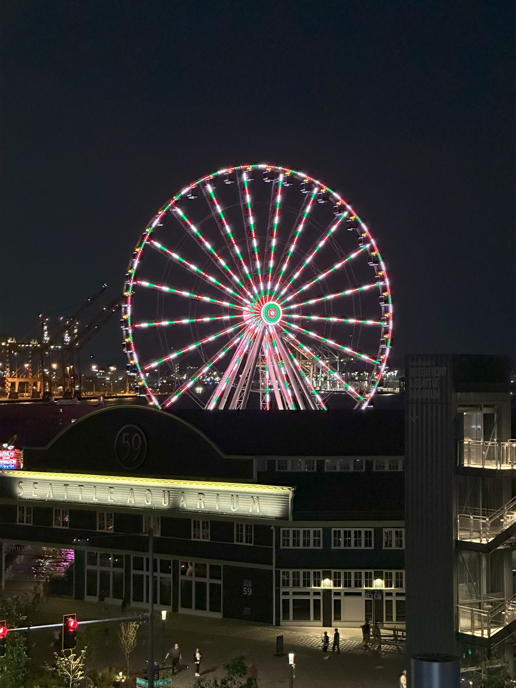

+++
author = "Sathyajith Bhat"
categories = ["Life"]
tags = ["weekly-notes", "travel", "aws-hero-summit" ]
places = ["Seattle, Sydney"]
type = "post"
series = ["Weekly notes"]
url = "/weekly-notes-35-2025/"
title = "Weekly notes 35/2025"
date = 2025-08-31T12:00:00Z
summary = "Week 35 summary - Travels continue with AWS Heroes Summit in Seattle and Australian Permanent Residence granted!"
images = ["/weekly-notes-35-2025/thumb-great-seattle-ferris-wheel.jpg"] 
+++

_Thumbnail image: The Great Seattle Ferris Wheel, located at Pier 57 in Seattle was the largest Ferris wheel on the west coast of US when it opened._

### What's been happening

The travels continue this week. I spent last week in San Francisco busy [with a team meetup](/weekly-notes-34-2025/). This week was spent in Seattle, attending the 2025 AWS Heroes Summit. The AWS Hero is a [program by AWS](https://builder.aws.com/connect/community/heroes) that recognizes worldwide group of AWS experts for their contributions.

Since last year, the Heroes Summit has been a great place for me to meet and catch up with many of the Heroes and learn a lot from them. I also get to know some of the roadmap items for various AWS services, something that helps me plan ahead with various feature requests that come at work or otherwise. 

As with last year, this year’s AWS Summit was well organized and I appreciate the AWS Community/Hero Program team for organizing these. With a jam-packed schedule for the past three days and mixers, dinners and breakfast, I didn’t do much. 



On Tuesday, after I got back to my room, just before I went to sleep, I checked my office email and was shocked to see our [Australian Permanent Residence had been granted!](/australian-permanent-residence-granted/). Yes, we’re now permanent residents of Australia. The blog post linked goes into a lot more details about it, but it is such a relief to have this done.

With most of the week going by on Summit travels, there’s not much that I did. I did get to meet up with my team mate from Sydney who moved to Seattle. I had hoped to catch up with a few more people but that didn’t happen either. Oh well, for next time.

My return flight was via Qantas. I picked an aisle seat all the way at the back of the airplane, and the seat next to me was empty, so I had some extra legroom and stretch. I’d be landing on Sunday morning and Jo reminded me of Sydney Marathon happening the same day. The start line for many batches was in North Sydney and that meant that several streets had been closed off, and with Jo’s suggestion, I decided to return via the train. The train was pretty fast and went better than I thought. The last time I took the train, I had to get off at North Sydney train station which meant an uphill walk back home. Now with the Metro, I could get off at Victoria Cross and take advantage of the shorter route. However, because of the marathon, the road was closed off. I talked to the volunteers and they told me they will open the gate at regular intervals, they just need to get the go-ahead first. A couple of minutes of wait and cheering on the few people who ran by the crowd, I managed to cross over and return home.



### Music of the Week

I learnt of Morcheeba thanks to my Uber driver during my trip to the Sydney airport. She had a great taste in music and was playing some amazing songs. Had a nice conversation with her as well. Here’s [Post Houmous](https://www.youtube.com/watch?v=6FZ4LtPAZ6Y&start_radio=1) by Morcheeba. It’s a small song but there’s a [live extended version](https://www.youtube.com/watch?v=C5hoBEkoa_Y) as well.





### Link of the week

[Vikram has a lovely post](https://vikrchan.substack.com/p/memoirs-of-childhood-ganesha-festivals) on his memories of Ganesha Festival. _Baskis_ can never be forgotten.

### Thanks for reading.
Thanks for reading and have a great week ahead. 

Subscribe to my weekly notes:
- [Email newsletter](https://sathyabhat.substack.com/)
- [RSS feed for the weekly notes](https://sathyabh.at/series/weekly-notes/index.xml)
- [RSS feed for my site](https://sathyabh.at/index.xml)

