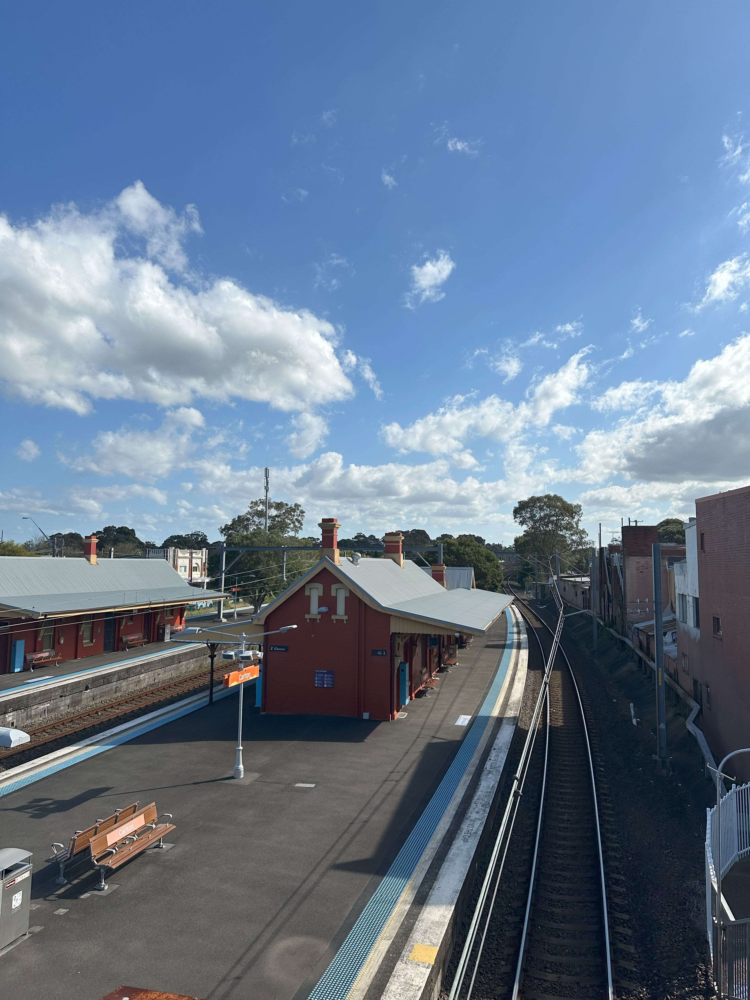

+++
author = "Sathyajith Bhat"
categories = ["Life"]
tags = ["weekly-notes", "gaming"]
places = "Sydney"
type = "post"
series = ["Weekly notes"]
url = "/weekly-notes-36-2025/"
title = "Weekly notes 36/2025"
date = 2025-09-07T12:00:00Z
summary = "Week 36 summary - Schengen visa appointment, exploring Bexley and more."
images = ["/weekly-notes-36-2025/thumb-carlton-station.jpg"]

+++

_Thumbnail image: Carlton railway station is a heritage-listed railway station located on the Illawarra line._

### What's been happening

It’s been nice to be back in Sydney. Landing on Sunday morning meant that I had to push through the whole day without falling asleep so that I don’t get hit by jet lag. That was a successful mission and I slept early and woke up on Monday, feeling pretty good. 

I also went back to gym on Monday - it was good to be back. Having continued with the workouts while I was away meant that getting back in was much easier. That said, having to do squats and at volume after a two week break did mean that I was hobbling for a bit for the next couple of days. I also officially weighed in at double digits - possibly the first time that I’ve been at that weight in over a decade. I’m pretty happy with my progress. Thursday’s workout was dumbbell bench press (which went okay) and followed by a benchmark workout my trainer wanted to me to do. The benchmark to meet was three rounds for time of  

- 12 calories on bike
- 10 reps of skipping
- 10 reps of lunges
- 10 reps of dumb bell snatch & clean and jerk

I completed two rounds of all of the above and the third of the bike before I ran out of time, so improving that will be my next set of goals. I didn’t go in to class and only did two of the PTs, so I hope to get back into my routine of three workouts. 

I also had my Schengen visa appointment this week. I mentioned earlier my best friend is getting married in Amsterdam, and since Schengen visa application requires you to hand over your passport and the current processing time is really, really long (per the official advisory), I had to schedule an appointment to one after the US trip. I don’t really have much time for the wedding either (it’s in another 20 days) but didn’t have any other choice. 

Here in Sydney, VFS handles the paperwork/application process. I also took the VFS Premium Lounge feature which in my opinion was an utter waste, especially if you’re familiar with the visa paperwork required. VFS provides a checklist of what documents are required and lounge feature gives you a “private” room where you can sit, they will verify you have provided all the required documents and then say - feel free to have whatever you want (there’s some drinks/pastries etc) and come to the biometrics room in 5 minutes. The person did tell me 5 times that there’s a high chance visa application won’t be completed by the travel date and asked me a few times if I’m sure I want to opt for the premium lounge feature, so here’s to them for making me aware. That said, it is my friend’s wedding so decided to give it a try. Besides, the flights/hotel are all refundable so if I doesn’t come through by the third week, I will cancel the booking. 

This month also marks the end of the $20 credit that Optus, my ISP gives me (I essentially reached out and asked them a few months back to price match me to a few other providers’ offers) so I went plan shopping again. I saw that SuperLoop is offering the same plan that I have (1000 down/50 up - yep, Aussie ‘net plans suck big time) but at $40 dollars cheaper then what would have been the effective this month so that’s a good chunk of change there. SuperLoop, like most other ISPs, also uses CG-NAT but do provide a static IP for an extra $5 per month. I’m happy to not have the static IP though and Tailscale does swimmingly well to let me connect to my NAS, so I didn’t opt for that. 

I also went for my guitar class this Saturday. Joseph, our guitar teacher had asked me to come in to class half hour early so he could have a quick session to catch me up with what I missed over the pass three classes. The extra time helped, ensuring that I was only a little overwhelmed and confused AF as compared to completely confused AF. Joseph went through how to get to any note at different strings, and a run-through of the FACE method used to read sheet music so it was pretty ok. Till he asked us to play this song (English Country Garden?) at which my brain completely melted. Oh well, next weekend problem. 

After the guitar class, we picked up a few fruits & veggies from the North Sydney Produce market, went home to keep them and started to head towards [Bexley](https://en.wikipedia.org/wiki/Bexley,_New_South_Wales) suburb in South Sydney. With our PRs granted, we’re now looking at buying a house (subject to various things, of course) and wanted to do some recon. We went to a couple of open houses, stopped by for lunch at a Colombian cafe there and then got back home. On Sunday, we went over to the Library, picked up a few books and then spent the afternoon playing RoadCraft with Aman.



### What I've been playing

The new league of Path of Exile 2 started and I started a new minion Witch character. I didn’t like how clunky it felt, so I switched to a Ranger to play a ranged lightning arrow build because it plays much better (though I felt the minion build was much stronger, at least in early campaign). I might return to the Witch character later on, but for now will stick to the ranger.

### What we ate

[Mira Ve Cafe](https://maps.app.goo.gl/iDnaAttwsmjYRng49) - Stopped by this cafe serving Colombian food while exploring Bexley (rather, nearby Carlton). We had the arepas (meat with corn bread) - Jo had the scrambled egg one while I had the steak. The arepas were a bit bland mine came with an extra bit of cheese which made it even more bland. We also had the fried plaintain which was nice.



### Music of the Week

How I have not heard of [Big Todd & The Monsters](https://en.wikipedia.org/wiki/Big_Head_Todd_and_the_Monsters) till now. Bittersweet is such a lovely song at a fabulous venue - the [Red Rocks Amphitheatre](https://en.wikipedia.org/wiki/Red_Rocks_Amphitheatre). Attending a live event at Red Rocks remains on my wish list. 



### Thanks for reading.
Thanks for reading and have a great week ahead. 

Subscribe to my weekly notes:
- [Email newsletter](https://sathyabhat.substack.com/)
- [RSS feed for the weekly notes](https://sathyabh.at/series/weekly-notes/index.xml)
- [RSS feed for my site](https://sathyabh.at/index.xml)
