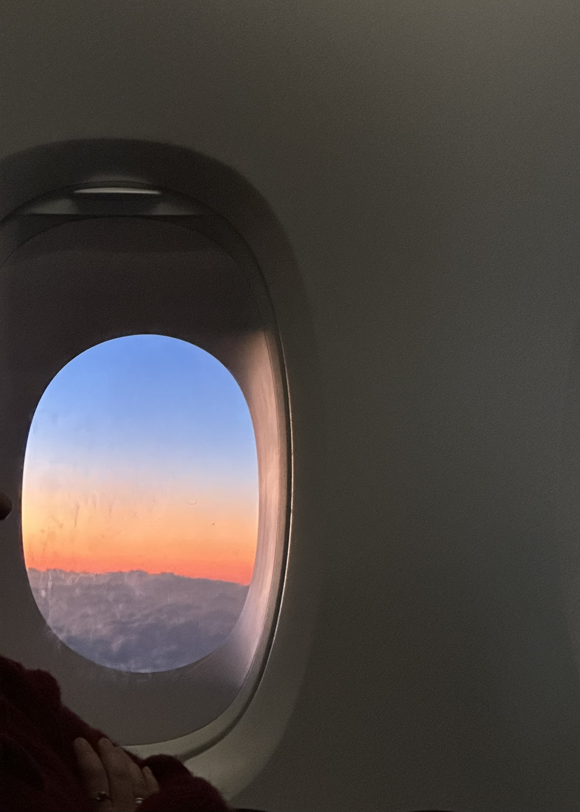

+++
author = "Sathyajith Bhat"
categories = ["Life"]
tags = ["weekly-notes", "gaming"]
places = "Sydney"
type = "post"
series = ["Weekly notes"]
url = "/weekly-notes-37-2025/"
title = "Weekly notes 37/2025"
date = 2025-09-14T12:00:00Z
summary = "Week 37 summary - setting up a home server, a birthday party and more."
images = ["/weekly-notes-37-2025/thumb_sunrise.jpg"]

+++

_Thumbnail image: Sunrise as seen through the airplane window as I was descending down to land in Sydney._

### What's been happening

It’s been a busy week. My manager’s going to be away for the next few weeks and I will be taking over some of his work, particularly on the compliance/auditing side of things. I had a meeting with our internal compliance and then worked on review some of compliance work that I had prepared. Felt like being in the Obama medal meme.

The workouts were pretty decent as well. My trainer’s getting me to do volume work, so all of my squats, presses are going at 12 rep sets instead of 8 rep sets. The 4 extra reps seem minuscule but they add up so much. I was also able to do a lot better on the benchmark workout. The benchmark to meet was three rounds for time of

*   12 calories on bike
*   10 reps of skipping
*   10 reps of lunges
*   10 reps of dumbbell snatch & clean and jerk

Last week, I was able to do two rounds of all of these and only the bike on the third round while this week I was able to finish the third round of bike, lunges and five reps of dumbbell snack & clean and jerk. I was also able to do some resistance band assisted pull ups, starting with three bands first and then with just one. Happy with this! In addition I also managed to get a workout in the group class which was pretty heavy on the legs and feeling the effects of it even today.



I’ve been working on sorting out some of the financial stuff of my accounts in India. I had claimed for withdrawal of my EPFO balance. After putting a claim in I realized that the money from my past employers were still in their member accounts (but in the same UAN) so I applied to transfer them all to the current account. Unfortunately the claim for withdrawal was rejected, claiming previous ids were not linked and asked for employer to reach out with clarification. I wrote to Adobe Payroll who told me to wait for the transfer from other accounts to be completed. So for now, the waiting game continues. 

On the weekend, we went to more house inspections, this time in the suburb of Hurstville & Mortdale. We saw a few houses, one nicer than the other the not-so-nice house had better floorplan. We’re still debating on a whole bunch of things but these visits are helping us figure out what we should be looking out for. Come October 1, there’s likely to be a legislation change that should make the property market accessible to a lot more people, and is likely to drive up demand and prices even higher. For now, all we can do is wait. 

I brought this Lenovo ThinkStation p340 home recently - it’s my office desktop and we get to take home devices after a hardware refresh. I was trying to set it up over the weekend. The desktop comes with a Quadro P400 with mini display ports. And since I didn’t have an adapter I plugged into the onboard display - it’s got a i7 10700K which has a Intel UHD 630 integrated graphics adapter. I did some research and found out if the card is plugged in, when you’re in the BIOS, the output goes only to the external card, not to the onboard adapter. So I decided to remove it. There’s some weird “cover” which wasn’t that straightforward to figure out and I had to lift and pull it out before I could get the card out. It was interesting that the processor doesn’t have a direct fan on it but rather a heat pipe system with a fan and heat sink bolted on to the cabinet. After I removed the external card, I was able to get output on the BIOS setup page and will prepare it for a home server, to complement by [NAS](https://sathyabh.at/nas). I installed ArchLinux on it and now  have installed Docker, Tailscale, setup ssh keys (so I don’t have to use passwords) and shutdown the system. NI can move it to my "network cabinet" and plug it in and start using once I get some extra adapters as the power extension box has no empty sockets available.



On Sunday, we went over to Berowra to visit a friend for their kids birthday party. We’re meeting them the first time after they moved to the area. As I was talking to a few folks,  One of the new acquaintances happens to be a TAM at AWS here in Sydney so we spent some time talking about different things. The party went well and was good to meet some familiar faces. 

### What I've been playing

I’ve been playing the new league of Path Of Exile and finished the 4th Act. It’s kinda crazy how long the campaign is, easily taking 20+ hours, and we’ve not even got the last two acts. I’m still far too annoyed with the game balance - the monsters are often deal way too much damage, are way too overtuned and is just too frustrating. 

### What we ate

[Dhakshin](https://maps.app.goo.gl/CNRmhBk6Apo9gW297) - A nice little South Indian restaurant over at Crow’s Nest. We’d been here last year and been a while since we visited, so went over there again. We had Chicken 65, appam, idiappam, vada sambhar and Kozhi Milagu Chettinad. The food was really good and was wolfed down pretty fast. In fast so fast, we didn’t get to take photos 😂



### Music of the Week

I came across this amazing [version](https://www.youtube.com/watch?v=4VvwP-bPv6E) of Hotel California, performed by a bunch of Sri Lankan folks. Who says you need fancy equipment! 



### Thanks for reading.
Thanks for reading and have a great week ahead. 

Subscribe to my weekly notes:
- [Email newsletter](https://sathyabhat.substack.com/)
- [RSS feed for the weekly notes](https://sathyabh.at/series/weekly-notes/index.xml)
- [RSS feed for my site](https://sathyabh.at/index.xml)
