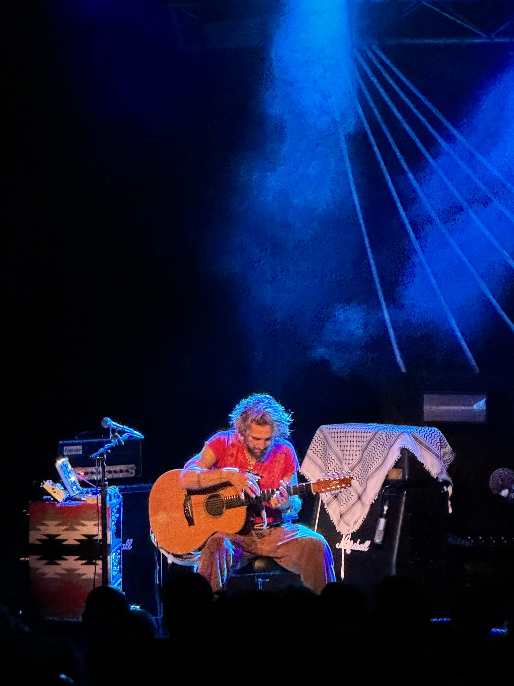

+++
author = "Sathyajith Bhat"
categories = ["Life"]
tags = ["weekly-notes", "gaming"]
places = "Sydney"
type = "post"
series = ["Weekly notes"]
url = "/weekly-notes-38-2025/"
title = "Weekly notes 38/2025"
date = 2025-09-20T12:00:00Z
summary = "Week 38 summary  - Schengen visa approved, John Butler concert, and more." 
images = ["/weekly-notes-38-2025/thumb-john-butler-ocean.jpg"]

+++

_Thumbnail image: John Butler performing "Ocean"._

### What's been happening

What a week. It started with an SMS that the Schengen visa application I had submitted a couple of weeks ago had been decided upon. I got this SMS at 2pm in the afternoon and the collection window closes at 3pm. Thankfully the collection center was near my office. I was also fortunate enough that I had kept a receipt of the application and my ID holder in my bag - I usually keep them at home and that day I had kept it in the bag just in case of moments like these. I quickly walked over to the VFS collection center, collected my passport and saw with a happy face that my visa had been approved. It’s only valid for a month, single entry and for max of 15 days, but that’s enough to make this trip. With that, I let Ray know I’ll be there for his wedding. I also plan to meet a few friends before I head back. 

I cancelled my original hotel booking and rebooked a Marriott with the Marriott Points and Amex points that I had. This also means that I'll have to sort out some of the work stuff prior to heading out as the end of sprint will happen when I'm away. I'll have to decide whether to extend the sprint by a week to accommodate my away time. But that’s for next week. 

It was also concert week - John Butler was performing and we couldn’t miss. Unlike the last time which was a solo, instrumental concert, this time we had Emma Donovan opening for John Butler. Emma Donovan is an [Aboriginal Australian](https://en.m.wikipedia.org/wiki/Aboriginal_Australian "Aboriginal Australian") singer and songwriter and her powerful voice was amazing to hear. John Butler and his band were on stage later, playing all the songs from his latest album, PRISM (and the songs are quite upbeat) and also some of his previous songs, including a rendition of one of my favorites, “Ocean”. It was one of the best concerts I’ve been to this year and quite happy to be able to watch him live. 

My gym trainer is out this week as his brother is getting married and Jo’s trainer is standing in for him. We had one session of joint PT with Jo followed by a PT session on Wednesday. As with last week, I went into class for Friday. Fridays are leg days, so we did some back squats. The other exercise was front rack reverse lunges, but I was struggling to get my elbow up to the front rack position, so the instructor asked me to do standard barbell reverse lunges. One of the conditioning exercises was single leg calf raises and I realized no matter how hard I tried I just couldn’t do the raise with my left leg at all. My left leg is also visibly much weaker than the right one. That’s something to work on and improve. 

We completed our last class of guitar for the term last week and the folks from the batch wanted to catch up over coffee after class - but since we had to head out we asked it to be pushed to this week and thus we met 63 Degrees cafe. We spent a couple of hours getting to know each other, talking about different topics: family, music, pets, etc. It was nice to meet! After that, we went over to Chatswood as I had to do some shopping for the wedding. The wedding has a cocktail attire dress code and I don't really have any fancy clothes apart from my t-shirt and jeans 😂 We went over to Oxford and the rep there was quite helpful in picking the right attire. I ended up buying a shirt, chinos, a blazer and boots as well. I wore the boots today to break them in and I'm surprised how comfortable they are - I always thought they would be quite stiff. 

### What I've been playing

I finally completed the campaign of Path of Exile 2 and now into the end game mapping. Grinding Gear Games have done some work on improving the mapping experience but it’s still pretty lacklustre. Maps are often tedious and tediously large and take too long. This league's abyssal mechanics make it a bit more interesting than usual. GGG have mentioned they’re working on an endgame revamp and that potentially is coming out in the next patch. We’ll see how it goes. For now I might continue with a few maps and maybe switch to a new character. 

### What we ate

[Lilong by Taste of Shanghai](https://maps.app.goo.gl/gAthpK4r3i4sHepLA) - This place was recommended by a person in our guitar class when we asked for recommendations for some good Chinese restaurants, so we went here. We ordered the stir fry pork noodles and the golden buns. We thought the golden buns would be savoury, it turned out to be sweet. Oh well, it was pretty good, the buns were pretty crisp and the noodles had a nice smoky flavour to it. 



[Caffe Cherry Beans](https://maps.app.goo.gl/8KEjMKbUu3PoHrNW7) - A small little coffee shop at Rouse Hill Town Center, we stopped by here just as we got off the Rouse Hill Metro station. We ordered our usual coffees, a jalapeno cheese fold (sort of like a small cross-section of a croissant with jalapeno and cheese) and a BLAT (bacon, lettuce, avocado, tomato) for myself and a breakkie wrap for Jo. Both the coffee as well as food was good.



[Veranda, Rouse Hill](https://maps.app.goo.gl/j3SvFb9xtaYuhziq9) - A Modern Indian restaurant at Rouse Hill, we stopped by here after walking around Rouse Hill. We weren't too hungry as we had breakfast a couple of hours before, so we ended up ordering the Mixed Kebab Platter (a platter of Chicken Cafreal, Lucknow Shami Kebab, Kalonji Paneer Tikka & Palak Shikampuri Kebab (2 pieces each) along with nimbu soda and Barबार, a drink from mango/pineapple with chilly/salt on the rim of the glass. The drinks were good, the food was ok but pretty expensive for what we had. Worth a visit though.



### Music of the Week

I came across this wonderful [version](https://www.youtube.com/watch?v=-rM3xn2JXGU) of Colours by Black Pumas (previously covered in an earlier weeknote, featuring musicians across the world)



### Link of the week

Thanks to Saurabh for sharing [this article](https://bogdanthegeek.github.io/blog/projects/vapeserver/) on the work he did to serve the article off a disposable vape. Who knew they came with such capable hardware!

### Thanks for reading.
Thanks for reading and have a great week ahead. 

Subscribe to my weekly notes:
- [Email newsletter](https://sathyabhat.substack.com/)
- [RSS feed for the weekly notes](https://sathyabh.at/series/weekly-notes/index.xml)
- [RSS feed for my site](https://sathyabh.at/index.xml)
