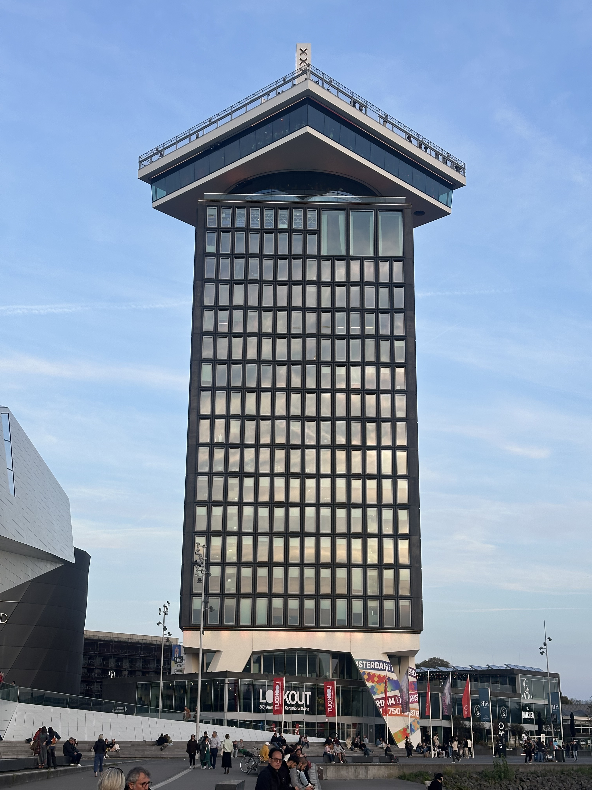

+++
author = "Sathyajith Bhat"
categories = ["Life"]
tags = ["weekly-notes", "gaming"]
places = ["Sydney", "Amsterdam"]
type = "post"
series = ["Weekly notes"]
url = "/weekly-notes-39-2025/"
title = "Weekly notes 39/2025"
date = 2025-09-29T12:00:00Z
summary = "Week 39 summary - Amsterdam trip for a wedding, doctor visit, movies and more"
images = ["/weekly-notes-39-2025/thumb-adam-building.jpg"]

+++

_Thumbnail image: Shell's Overhoeks Tower was rebranded as A’DAM Toren (‘Amsterdam Dance And Music’). The tower was redeveloped into a mix of offices, entertainment venues, a hotel, a revolving restaurant and an observation deck that features Europe's highest swing._

### What's been happening

It’s wedding week! I mentioned earlier my [Schengen visa](https://sathyabh.at/weekly-notes-38-2025/) had come through so I had to pack up for the trip. Before that, however, I had a doctor appointment. I’ve been suffering from a chronic cough for a while now and it got tiring enough that I went to the GP, who referred me to an immunologist. At the immunologist's office, I talked about the symptoms and such. He did a quick allergy skin test. The allergy skin test involved putting a drop or two of various things that might trigger the allergy, including a control test to ensure there were no false positives. I didn’t feel anything except for the control test (indicating the test was working as expected) and another mysterious drop which had the most visible effect. It turned out this was the trigger for dust mites, essentially confirming I am allergic to dust mites and the cough might be triggered from those.

I have a follow-up appointment to do a lung function test and a chest X-ray to rule out any other issues. The immunologist also prescribed some antihistamines to help with the symptoms. Once I am back in Sydney, I will be doing the tests and following up with him. 

I was also supposed to give my driving test on Monday. When I read the fine details of the email from Roads and Maritime Services (RMS), I found out that I need to be accompanied by a licensed driver for the test. Since I was travelling alone, that wasn’t possible and there were no available driving instructors to accompany me. So I had to cancel the test and reschedule it for a later date. Bummer, but what can you do. Anyway, this will give me some time to practice a bit more before the test. 

I flew out from Sydney to Amsterdam on Wednesday night on Emirates. The flights were long - a 14-hour flight to Dubai followed by another 9-hour flight to Amsterdam. Both the flights were on A380-800s, so even in economy seats with people next to me, I had plenty of space. The food was great, and they even gave silverware. Who does this nowadays?! I got a good amount of sleep on the flight, watching some YouTube videos I had downloaded along with Mission Impossible 2 and Brooklyn 99. I had a layover of about 2.5 hours in Dubai, which was enough to exit the plane at a leisurely pace, go through transit security, and check out the Emirates Business Class lounge. The lounge was pretty good, with a good selection of food and drinks. I had a quick bite and a drink before boarding the next flight to Amsterdam. The flight to Amsterdam was uneventful, and I reached Amsterdam on Thursday afternoon. Of course, immigration in Schiphol was a royal pain - I stood nearly 2 hours in the queue before I could get to the counter. The officer was pretty nice, didn't ask anything apart from where I was visiting and even said a nice "Shukriya" when he handed back my passport.

Having cleared immigration and collected my bag, I took the NS Sprinter InterCity train to Amsterdam Centraal station. The journey was pretty quick and pain-free. From Centraal station, I took a bus to the hotel. Google Maps disappointed me by telling me to get off one station earlier than I should have, so I had to walk a bit more than I expected. Raylen, in the meantime, added me to the group chat and told me they were planning to meet at a local beer garden later in the evening. I had no plans to sleep early (it was only 6 pm and I didn't want to be affected by jetlag), so I freshened up at the hotel and headed out to meet them. The beer garden was pretty cool, with a good selection of beers and food. I had a beer and met up with my schoolmates, Raylen and some of his Dutch friends. After a few hours, I headed back to the hotel to get some rest.

The next day was the wedding day. The wedding was in a small cafe/restaurant near their house, which was about an hour's worth of travel from my hotel. I had to take a bus to Centraal and then switch over to the Intercity train to get to the venue. The venue was nice and they had decorated it really nicely. 

The wedding was nice, attended by close friends and family. I got to meet a few of my schoolmates, whom I hadn’t met in about two decades. The wedding was a mix of Mangalore Catholic Christian wedding with Dutch regulations. It started with a brief introduction of the bride and the groom, some clips from childhood videos, and some storytelling of how they met. It was followed by the announcement of the witnesses and the official registrar of the wedding. With the vows exchanged, witnesses confirming the “I do’s” were said, the registrar hit the gavel on the desk, proclaiming the marriage to be official. Plenty of drinks, food, and dancing followed. I hung around for a bit till the dancing started after which I made a quiet exit - I’m not really the dancing and party kind of person and a few attempts to get on the dance floor ended with me being a clumsy oaf, so I decided it was a good time to quietly head back.

The next day, I just relaxed in the hotel room. I had kept the weekend free of any plans knowing there’d be something to do with Ray and the gang, so it was good that I kept it free. In the evening, we all met at the Park Frankendael, a 7-acre park on a former estate that reminded me a lot of Herestrau. I hadn’t carried a gift card while going to the wedding (it was too big to fit in my pockets), so figured this would be a great time to hand it over. And of course, giving just a card seemed a bit plain so I bought some flowers as well.

It was BYOB so we all brought some snacks and drinks and shared them around. We spent a few hours just talking about random stuff, watching the kids play with each other and somehow 4 hours went by. No idea how, I guess that’s what happens when you have a good time with some easygoing folks.

Sunday started on a relaxed note with a quiet breakfast at the hotel. I met up with Udit, one of my friends from Chip forums, and we had a conversation for a couple of hours covering various things. It was great to catch up with him - last I had met up with him was at his wedding 6 years ago. Sheesh, how time flies.

I had the afternoon free so Raylen asked me if I wanted to join him and a friend to watch a movie. I agreed and we watched One Battle After Another at Eye Filmmuseum - a movie theatre and a film museum. Post the movie, we walked around the museum and got to see some really cool sights of movie cameras, projectors and techniques of film making, cel-shaded animations and more. Highly recommend a visit if you’re interested in the art and science of how projectors work. From here, Raylen took us to Oedipus Brewing, a brewery. The beer there was good and we ordered a burger and some wings. I had the fried chicken burger which was really good. Would definitely be worth coming back. After that, we walked back to the Centraal station and chatted for some more time, eventually parting ways for a wonderful end to a memorable evening.

### What I've been playing

Been playing more of Path of Exile 2, trudging along into the endgame slowly. With the travel, didn’t go too far ahead. The new season of Diablo IV just started and Hades 2 is now released, so that’s what I will be playing once I’m back home.

### What I watched

**Mission Impossible 2** - The second installment in the Mission Impossible action/spy series featuring Tom Cruise. I had no idea Mission Impossible 2 was set in Sydney. It’s always nice to see some familiar sights on the big (small?) screen. The story itself was pretty eh... the dialogues were corny af but you don’t watch MI2 for the dialogues, but for the action. The action scenes were pretty average IMO (ok _fine_, the bike scenes were cool I admit). MI2 for me is always synonymous with Limp Bizkit’s [Take a Look Around](https://youtu.be/_4b3XGMdpD0?si=-KA3W8T5_0BC8VvC) and Metallica’s [I Disappear](https://youtu.be/ekZTW2r4vb4?si=OFWDmDgTPDDM6io7) - shame there wasn’t more of their tunes in the movie. Overall, a decent watch but the first movie was much better. 

**Brooklyn 99** - A sitcom focusing on the fictional 99th precinct of Brooklyn police station, the first season features the captain who was basically an anything-goes person being replaced by a new, more strict, by-the-book captain and how the various people of the precinct adapt to him. Andy Samberg, who portrays Jake Peralta, reminds me a whole lot of my previous colleague/manager… should have watched this series back then and asked how the reaction would have been!

**One Battle After Another** - Wow, what a movie. Leonardo DiCaprio plays a revolutionary who’s looking to keep his daughter safe after the series of events that occurred 16 years ago. I had no idea what to expect when I walked into the theatre and the movie kept me on the edge by not doing any of the clichéd stuff that I expect from action movies. Sean Penn does a fabulous role as the antagonist and Benicio Del Toro is just amazing. What made the movie for me was the score/background soundtrack. It is so well done and enhances the movie so much. Highly recommend a viewing at your local theatre.

### Music of the Week

Travels mean I always fallback to my [Chillout Lounge playlist](https://open.spotify.com/playlist/37i9dQZF1DWTvNyxOwkztu). “[Almost a lover](https://youtu.be/bAl826wX44w?si=C4FZwAueO2IqBmQN)” by NLSN (feat. Scanta Rose) is a really lovely track (although a bit sad when you read the lyrics) from this playlist.



### Link of the week

When I read the title of the [article](https://www.tomshardware.com/networking/enthusiasts-bond-twelve-56k-dial-up-modems-together-to-set-dial-up-broadband-records-a-dozen-screeching-boxes-achieve-record-668-kbps-download-speeds) - “Enthusiasts bond twelve 56K modems together to set dial-up broadband records — a dozen screeching boxes achieve record 668 kbps download speeds” - I had to verify that this wasn’t one from the archives. Cool read nonetheless, especially if you’re from around the dialup era :D 

### Thanks for reading.
Thanks for reading and have a great week ahead. 

Subscribe to my weekly notes:
- [Email newsletter](https://sathyabhat.substack.com/)
- [RSS feed for the weekly notes](https://sathyabh.at/series/weekly-notes/index.xml)
- [RSS feed for my site](https://sathyabh.at/index.xml)
 
